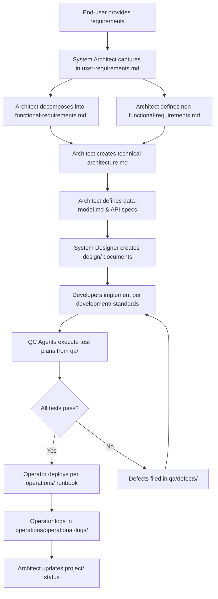

# GateForge Blueprint Repository

<!-- 
  This README is the master guide for the GateForge Blueprint Repository.
  Every AI agent in the pipeline MUST read this file before performing any work.
  It defines the repository structure, ownership rules, workflows, and conventions.
-->

## What Is This Repository?

This repository is the **single source of truth** for a GateForge project. It contains every document that governs the software development lifecycle — from raw user requirements through architecture, design, development standards, QA artifacts, and operational runbooks.

**Key principle:** No agent operates from memory or assumption. Every decision, requirement, design choice, and test result is captured here in structured Markdown documents. If it's not in this repository, it doesn't exist.

**Owner:** End-user  
**Repository Version:** see `/VERSION` (single source of truth)  
**Tech Stack:** TypeScript · React · NestJS · Docker · Redis · PostgreSQL · Kubernetes · React Native  
**Standards:** IEEE 830 · ISO 25010 · C4 Model · OWASP · IEEE 829 · ISTQB · SRE · ITIL · SemVer

> **Mandatory entry point for every agent:** before doing anything in your owned directory, open the `AGENTS.md` file in that directory. It lists the documents you must read first, the Pre-Flight Acknowledgement to include in your PR, and the gates that the Admin Portal will enforce. See § Agent Compliance Enforcement below.

---

## Directory Structure

```
gateforge-blueprint/
├── README.md                          # This file — master guide for the entire repository
├── VERSION                            # Current repo version (managed only by the auto-bump CI)
├── VERSIONING.md                      # Authoritative versioning policy (MAJOR human / MINOR & PATCH agent)
├── CHANGELOG.md                       # Keep a Changelog format; auto-appended on every push
├── .github/
│   ├── workflows/
│   │   └── version-bump.yml           # CI workflow that enforces the versioning policy on every push
│   └── PULL_REQUEST_TEMPLATE.md       # Mandatory PR template (Pre-Flight Acknowledgement + version-bump declaration)
├── requirements/
│   ├── AGENTS.md                      # MANDATORY entry point for the Architect when editing requirements/
│   ├── user-requirements.md           # Raw user requirements captured from the End-user (IEEE 830)
│   ├── functional-requirements.md     # Decomposed functional requirements per module
│   └── non-functional-requirements.md # Quality attributes and performance targets (ISO 25010)
├── architecture/
│   ├── AGENTS.md                      # MANDATORY entry point for the Architect when editing architecture/
│   ├── technical-architecture.md      # System architecture using C4 model with Mermaid diagrams
│   ├── data-model.md                  # Entity-relationship model, schema DDL, indexing strategy
│   └── api-specifications/
│       ├── README.md                  # Guide for API spec files and OpenAPI conventions
│       └── *.openapi.yaml             # Per-service OpenAPI 3.0 specification files
├── design/
│   ├── AGENTS.md                      # MANDATORY entry point for the System Designer
│   ├── infrastructure-design.md       # Cloud infrastructure, networking, resource provisioning
│   ├── security-design.md             # Authentication, authorization, encryption, OWASP controls
│   ├── resilience-design.md           # Circuit breakers, retries, fallbacks, chaos engineering
│   ├── database-design.md             # Query optimization, connection pooling, replication
│   └── monitoring-design.md           # Observability stack, alerting rules, dashboards
├── development/
│   ├── AGENTS.md                      # MANDATORY entry point for Developer agents
│   ├── coding-standards.md            # Language-specific style guides and linting rules
│   ├── git-workflow.md                # Branching strategy, PR process, CI integration
│   └── modules/
│       └── <module-name>.md           # Per-module implementation documentation
├── qa/
│   ├── AGENTS.md                      # MANDATORY entry point for QC Agents (with explicit E2E gate)
│   ├── test-plan.md                   # Master test plan (IEEE 829)
│   ├── ui-auto-test-plan.md           # GateForge UI Auto-Test Standard, instantiated for this project
│   ├── intents.md                     # AI explorer intents for Lane B (one block per critical user journey)
│   ├── playwright.config.ts           # Lane A Playwright config (committed)
│   ├── openclaw.qa.yaml               # OpenClaw profiles for Lane A (`openclaw`) and Lane B (`user`)
│   ├── docker-compose.qa.yml          # Lane B headful Chrome stack (browserless/chrome + mailpit)
│   ├── scripts/
│   │   └── bootstrap-qa-runner.sh     # Idempotent setup for the headless Ubuntu QC runner
│   ├── features/                      # Gherkin .feature files for Lane A
│   ├── steps/                         # Step definitions
│   ├── pages/                         # Page Object Model classes
│   ├── fixtures/                      # Seed scripts, test data
│   ├── visual-baselines/              # PNG baselines for visual regression
│   ├── ai-explorer/
│   │   ├── prompts/                   # System / per-intent prompt templates
│   │   └── generated/                 # AI-proposed tests (PR-reviewed before promotion)
│   ├── test-cases/
│   │   └── TC-<module>-<area>.md      # Test case files per module and area (ISTQB)
│   ├── test-reports/
│   │   └── TEST-REPORT-ITER-<NNN>-<scope>.md  # Test execution reports per iteration
│   ├── defects/
│   │   └── DEFECT-<NNN>.md            # Individual defect reports
│   └── metrics/
│       └── qa-dashboard.md            # Test coverage, defect density, pass rates
├── operations/
│   ├── AGENTS.md                      # MANDATORY entry point for the Operator
│   ├── deployment-runbook.md          # Step-by-step deployment procedures
│   ├── rollback-procedures.md         # Rollback steps for each service
│   ├── incident-reports/
│   │   └── INC-<NNN>.md              # Post-incident reports (ITIL)
│   ├── sla-tracking.md               # SLI/SLO/SLA definitions and compliance (SRE)
│   ├── operational-logs/
│   │   └── OPS-LOG-<YYYY-MM-DD>.md   # Daily operational logs
│   ├── audit-evidence.md             # Audit log export, retention, access-reason logging (description, no raw logs)
│   └── healthcare-readiness.md       # Healthcare readiness overlay (PHI, data flow, BAA, residency, BCP)
└── project/
    ├── AGENTS.md                      # MANDATORY entry point for cross-agent contributions to project/
    ├── backlog.md                     # Product backlog with prioritized items
    ├── iterations/
    │   └── ITER-<NNN>.md             # Iteration plans and retrospectives
    ├── releases/
    │   └── RELEASE-<semver>.md       # Release notes per semantic version
    ├── decision-log.md               # Architectural and project decision records
    ├── admin-portal-validation.md    # Blueprint validation rules & traceability model for the Admin Portal
    ├── compliance-controls.md        # Compliance controls catalog (ownership, status, evidence links)
    ├── release-evidence-pack.md      # Per-release evidence pack guidance and template
    └── status-reports/
        └── STATUS-<YYYY-MM-DD>.md    # Weekly status reports from all agents
```

---

## Document Ownership

<!-- 
  This table defines which agent is the PRIMARY OWNER of each directory.
  The owner has write authority. Contributors may propose changes but the owner (or Architect) merges.
-->

| Directory | Owner Agent | Contributors | Purpose |
|-----------|------------|-------------|---------|
| `requirements/` | System Architect | — | User, functional, and non-functional requirements |
| `architecture/` | System Architect | System Designer | Technical architecture, data model, API specifications |
| `design/` | System Designer | Reviewed by Architect | Infrastructure, security, resilience, DB, monitoring design |
| `development/` | Developers | Reviewed by Architect | Coding standards, module documentation |
| `qa/` | QC Agents | Reviewed by Architect | Test plans, test cases, metrics, defect reports |
| `operations/` | Operator | Reviewed by Architect | Deployment, operation logs, incidents, SLA tracking |
| `project/` | System Architect | All agents report status | Backlog, iterations, releases, decision log, status |

**Rule:** Only the owner agent creates and modifies files in their directory. All other agents read from those directories. The System Architect has merge authority across all directories.

---

## Workflow: From Requirements to Delivery

<!-- 
  This is the canonical flow. Every project follows this sequence.
  Agents must not skip steps or work out of order.
-->



### Step-by-Step

1. **End-user → Architect:** The End-user provides business context, goals, and user stories. The Architect captures everything in `requirements/user-requirements.md`.
2. **Architect decomposes:** The Architect breaks user stories into module-level functional requirements (`requirements/functional-requirements.md`) and defines quality targets (`requirements/non-functional-requirements.md`).
3. **Architect designs architecture:** Using the C4 model, the Architect creates `architecture/technical-architecture.md`, `architecture/data-model.md`, and API specifications under `architecture/api-specifications/`.
4. **Designer details design:** The System Designer reads architecture documents and produces detailed designs in `design/` — infrastructure, security, resilience, database optimization, and monitoring.
5. **Developers implement:** Developers read requirements, architecture, and design documents. They follow `development/coding-standards.md` and document each module in `development/modules/`.
6. **QC validates:** QC Agents create test plans and test cases traceable to functional requirements. They execute tests and produce reports in `qa/test-reports/`.
7. **Operator deploys:** Once QC passes, the Operator follows `operations/deployment-runbook.md` to deploy, then tracks SLA compliance and logs operations.
8. **Architect governs:** Throughout the lifecycle, the Architect maintains `project/` — backlog, iterations, releases, decisions, and status.

---

## How to Use This Repository

### Starting a New Project

1. **Clone this template** into a new repository for your project.
2. **Architect fills requirements first** — start with `requirements/user-requirements.md` after the End-user's briefing.
3. **Cascade through documents** in order: requirements → architecture → design → development → QA → operations.
4. **Never skip a document.** Each downstream document depends on its upstream inputs.

### For Each Agent

| Agent | First Action | Read From | Write To |
|-------|-------------|-----------|----------|
| System Architect | Capture the End-user's requirements | End-user's briefing | `requirements/`, `architecture/`, `project/` |
| System Designer | Read architecture docs | `requirements/`, `architecture/` | `design/` |
| Developers | Read requirements + design | `requirements/`, `architecture/`, `design/` | `development/` |
| QC Agents | Read functional requirements | `requirements/`, `development/` | `qa/` |
| Operator | Read deployment design | `design/`, `operations/` | `operations/` |

---

## Naming Conventions

### File Naming

<!-- 
  Strict naming rules. Agents must follow these exactly.
  File names use UPPER-CASE prefixes with zero-padded sequence numbers.
-->

| File Type | Pattern | Example |
|-----------|---------|---------|
| Test report | `TEST-REPORT-ITER-<NNN>-<scope>.md` | `TEST-REPORT-ITER-001-auth.md` |
| Test case | `TC-<module>-<area>.md` | `TC-auth-login.md` |
| Defect report | `DEFECT-<NNN>.md` | `DEFECT-001.md` |
| Incident report | `INC-<NNN>.md` | `INC-001.md` |
| Iteration plan | `ITER-<NNN>.md` | `ITER-001.md` |
| Release notes | `RELEASE-<semver>.md` | `RELEASE-1.0.0.md` |
| Status report | `STATUS-<YYYY-MM-DD>.md` | `STATUS-2026-04-07.md` |
| Operational log | `OPS-LOG-<YYYY-MM-DD>.md` | `OPS-LOG-2026-04-07.md` |
| API specification | `<service-name>.openapi.yaml` | `auth-service.openapi.yaml` |
| Module documentation | `<module-name>.md` | `authentication.md` |

### Identifiers

| Entity | Format | Example |
|--------|--------|---------|
| User Story | `US-<NNN>` | `US-001` |
| Functional Requirement | `FR-<module>-<NNN>` | `FR-AUTH-001` |
| Non-Functional Requirement | `NFR-<category>-<NNN>` | `NFR-PERF-001` |
| Test Case | `TC-<module>-<NNN>` | `TC-AUTH-001` |
| Defect | `DEFECT-<NNN>` | `DEFECT-001` |
| Architecture Decision Record | `ADR-<NNN>` | `ADR-001` |

---

## Git Commit Message Conventions

<!-- 
  Each agent uses a prefix that identifies them in the git log.
  This makes it trivial to filter commits by agent.
-->

Every commit message follows this format:

```
[<Agent>] <type>: <short description>

<optional body with details>
```

### Agent Prefixes

| Agent | Prefix | Example Commit |
|-------|--------|----------------|
| System Architect | `[Architect]` | `[Architect] feat: add user-requirements for auth module` |
| System Designer | `[Designer]` | `[Designer] feat: add security-design document` |
| Developer | `[Dev]` | `[Dev] feat: implement authentication module` |
| QC Agent | `[QC]` | `[QC] test: add test cases for login flow` |
| Operator | `[Ops]` | `[Ops] deploy: release v1.0.0 to production` |

### Commit Types

| Type | Usage |
|------|-------|
| `feat` | New document or section added |
| `fix` | Correction to existing content |
| `refactor` | Restructure without changing meaning |
| `test` | Test plans, test cases, test reports |
| `deploy` | Deployment actions and runbook updates |
| `docs` | Meta-documentation (README, guides) |
| `chore` | Housekeeping (formatting, typos) |

---

## Version Control Rules

<!-- 
  Critical governance rules. The Architect is the gatekeeper.
  Other agents propose changes; only the Architect merges.
-->

### Merge Authority

- **The System Architect has sole merge authority** for all directories.
- Other agents propose changes by updating their owned files and flagging them in status reports.
- The Architect reviews, validates traceability, and merges.

### Change Proposal Process

1. **Agent updates their document** with proposed changes.
2. **Agent adds an entry** to the document's Revision History table.
3. **Agent reports the change** in their next status report (`project/status-reports/`).
4. **Architect reviews** the change for consistency with upstream documents.
5. **Architect merges** and updates the document version in the metadata table.

### Document Versioning

- Documents use `MAJOR.MINOR` versioning (e.g., `1.0`, `1.1`, `2.0`).
- **MAJOR** increments when the document's scope or structure changes significantly.
- **MINOR** increments for content additions, corrections, or refinements.
- Every version change requires a Revision History entry.

### Branching Strategy

- `main` — Always reflects the latest approved state of all documents.
- `iter/<NNN>` — Working branch for each iteration (e.g., `iter/001`).
- Agents work on the iteration branch. Architect merges to `main` at iteration close.

---

## Template Metadata Standard

Every document in this repository begins with a metadata table in this exact format:

```markdown
| Field | Value |
|-------|-------|
| **Document ID** | e.g., `REQ-USER-001` |
| **Version** | e.g., `0.1` |
| **Status** | `Draft` · `In Review` · `Approved` · `Deprecated` |
| **Owner** | Agent name |
| **Last Updated** | `YYYY-MM-DD` |
| **Approved By** | `—` until approved |
```

Status lifecycle: `Draft` → `In Review` → `Approved` → (optionally `Deprecated`)

---

## Admin Portal Control Tower & Governance

<!--
  This section explains how the GateForge Blueprint Repository is used by the
  Admin Portal Control Tower. The Blueprint is the AUTHORITATIVE LEDGER; the
  Admin Portal is a READ-ONLY dashboard. Agents should not push evidence into
  the portal directly — they update the ledger (this repository), and the
  portal reflects it.
-->

### Blueprint as the Compliance Ledger

This repository is the project's **compliance ledger**. Every validation,
traceability link, release dossier, and compliance/healthcare-readiness record
that the Admin Portal displays is read from the Markdown artifacts here.
Teams update the ledger by committing to this repository; the portal reflects
the state on the next validation pass.

**Rule:** Never put secrets, real PHI, or real PII in any file. The portal
extracts only safe metadata (document IDs, statuses, ownership, traceability
links, control statuses). See `project/admin-portal-validation.md` § 5.

### Governance Documents Index

| Document | Purpose |
|----------|---------|
| [`project/admin-portal-validation.md`](project/admin-portal-validation.md) | Validation rules the Admin Portal enforces: required folders, metadata completeness, revision history, ID regex, ownership matrix, traceability completeness, evidence fields |
| [`project/compliance-controls.md`](project/compliance-controls.md) | Catalog of compliance controls with owner, status, evidence link, and last-reviewed date |
| [`project/release-evidence-pack.md`](project/release-evidence-pack.md) | Evidence bundle every release must carry: linked requirements, test cases, test results, unresolved defects, ADRs, incidents, human approvals, rollback plan, deployment notes |
| [`operations/audit-evidence.md`](operations/audit-evidence.md) | How audit events are captured, exported, and retained (description only — raw logs are never committed) |
| [`operations/healthcare-readiness.md`](operations/healthcare-readiness.md) | Healthcare readiness overlay: PHI classification, data flow, retention, access-reason logging, BAA register, data residency, BCP/DR, incident response, de-identification/synthetic data |

### Traceability Model (authoritative)

```
User Story (US) → Functional Requirement (FR) → Test Case (TC) → Defect (DEF)
    → Release (RELEASE-vX.Y.Z) → ADR (when a decision was needed)
        → Incident (INC, when a defect escaped to production)
```

Every orphan or dangling link fails the Admin Portal's
`blueprint.traceability.completeness` check. Full rules and minimum
up/down links per artifact are documented in
[`project/admin-portal-validation.md`](project/admin-portal-validation.md) § 4.

### Admin Portal Validation Summary

The Admin Portal runs these checks on every push to a project branch:

| Check | Source of Truth |
|---|---|
| Required top-level folders present | `project/admin-portal-validation.md` § 3.1 |
| Metadata complete & versions valid | § 3.2 |
| Revision History tables present & current | § 3.3 |
| All IDs match regex conventions | § 3.4 |
| Ownership matches directory authority | § 3.5 |
| Full US → FR → TC → DEF → Release traceability | § 3.6, § 4 |
| No secrets / PHI / PII leaked into artifacts | § 5.2 |
| Every release has a complete evidence pack | `project/release-evidence-pack.md` |
| Compliance controls catalog is current | `project/compliance-controls.md` |
| Healthcare readiness overlay complete (when in PHI scope) | `operations/healthcare-readiness.md` |

Validation badge states: `green` (all checks pass), `amber` (traceability or
metadata staleness), `red` (structural failure or prohibited content — blocks
release).

### Healthcare Readiness & Compliance Scope

When a project handles PHI, the healthcare readiness overlay
(`operations/healthcare-readiness.md`) is mandatory and is re-verified in every
release evidence pack. The overlay covers PHI classification, data flow,
retention, access-reason logging, vendor/BAA register, data residency, audit
log export, downtime/BCP, incident response, and de-identification / synthetic
data guidance.

**Language guidance:** Use **"healthcare readiness"** and **"compliance
evidence"**. Do not claim HIPAA (or equivalent) certification in any artifact —
formal certification is an external process and requires qualified counsel.

---

## Versioning Principle

<!--
  AGENT INSTRUCTION: This is the summary. The authoritative spec is /VERSIONING.md.
  Every agent must read /VERSIONING.md before their first push. The auto-bump CI
  enforces these rules on every push to every branch.
-->

Every change destined for any environment — Dev, UAT, Production, or even a
documentation-only edit — **must** be pushed to GitHub first. GitHub is the
single audit trail for every change. The version recorded in `/VERSION` lets us
point to the exact state of the blueprint at any moment in time.

**Format:** `v[MAJOR].[MINOR].[PATCH]` — e.g., `v1.0.0`.

| Segment | Controller | Trigger | Reset effect |
|---|---|---|---|
| **MAJOR** | **End-user** (human, explicit instruction only) | The End-user decides the change is large enough | MINOR → 0, PATCH → 0 |
| **MINOR** | **AI agent** (auto) | At least one `feat` commit in the push (or `feat` + `fix` mix) | PATCH → 0 |
| **PATCH** | **AI agent** (auto) | Pure bug fixes / refactors / docs / chores | — |

**Critical rules:**

- The auto-bump workflow runs on **every push to every branch** — including
  doc-only pushes.
- The `VERSION` file is written **only** by the workflow. Manual edits are
  rejected by CI.
- A MAJOR bump requires the trailer `Version-Bump: major` on the last commit,
  authored by the End-user.
- Full spec: [`VERSIONING.md`](VERSIONING.md). ADR record: [`project/decision-log.md`](project/decision-log.md) ADR-005.

---

## Agent Compliance Enforcement

<!--
  AGENT INSTRUCTION: This section addresses a recurring problem — agents
  ignoring documents in their own directory (e.g. QC missing the E2E branch
  of test-plan.md). The four-layer pattern below is mandatory.
-->

Documentation drift is the #1 risk to a multi-agent project. The following
four-layer enforcement pattern is mandatory and applies to every role.

### Layer 1 — One mandatory entry point per role: `AGENTS.md`

Each role-owned directory has an `AGENTS.md` listing every document the
agent must read **before** acting, in order. The agent reads its `AGENTS.md`
first, every time, no exceptions.

| Role | Manifest |
|---|---|
| System Architect (requirements work) | [`requirements/AGENTS.md`](requirements/AGENTS.md) |
| System Architect (architecture work) | [`architecture/AGENTS.md`](architecture/AGENTS.md) |
| System Designer | [`design/AGENTS.md`](design/AGENTS.md) |
| Developers | [`development/AGENTS.md`](development/AGENTS.md) |
| QC Agents | [`qa/AGENTS.md`](qa/AGENTS.md) |
| Operator | [`operations/AGENTS.md`](operations/AGENTS.md) |
| Cross-agent (project/ updates) | [`project/AGENTS.md`](project/AGENTS.md) |

### Layer 2 — Pre-Flight Acknowledgement in every PR

Every PR description (and every test report / deployment log entry) MUST
begin with a Pre-Flight Acknowledgement block listing every doc the agent
read, with the version of each doc at time of reading. The format is
standardized in each `AGENTS.md` and in [`/.github/PULL_REQUEST_TEMPLATE.md`](.github/PULL_REQUEST_TEMPLATE.md).

```markdown
## Pre-Flight Acknowledgement
- Role: QC Agent VM-4
- Task: Execute test plan for ITER-002
- Docs read (with version):
  - qa/AGENTS.md v1.0
  - qa/test-plan.md v1.2
  - requirements/functional-requirements.md v1.4
- Mandatory gates honored:
  - [x] QA-G3 E2E suite executed (coverage 87%)
  - [x] Defect template followed for DEF-042
```

### Layer 3 — Evidence of compliance inside the deliverable

Every downstream artifact (test report, deployment log, ADR, status report)
must cite the source doc + version it followed. Example: "Executed per
`qa/test-plan.md` v1.2 §4.3 E2E suite." Untraced deliverables fail
validation.

### Layer 4 — Admin Portal validation gates

The Admin Portal validation pass enforces:

| Check | Failure mode |
|---|---|
| `agent.preflight.present` | PR has no Pre-Flight Acknowledgement, or the block has empty checkboxes |
| `agent.doc-citation.present` | Deliverables (test report, deploy log, ADR) lack source-doc citations |
| `agent.test-coverage.gates` | A QC report was filed without honoring all mandatory test levels (e.g., E2E skipped without an Architect waiver) |
| `versioning.semver.compliance` | A push lacks valid commit prefixes, so the auto-bumper cannot decide MAJOR/MINOR/PATCH |

These checks are listed in full in
[`project/admin-portal-validation.md`](project/admin-portal-validation.md) §3.7.
A failed check sets the badge to `amber` (recoverable) or `red` (release
blocked). Combined with the auto-bump workflow on every push, this means an
agent who skips its docs gets caught **before** the change can ship.

---

## Quick Reference: Industry Standards

| Standard | Applied To | Key Documents |
|----------|-----------|---------------|
| IEEE 830 / ISO/IEC/IEEE 29148 | Requirements | `requirements/*.md` |
| ISO 25010 | Non-functional requirements | `requirements/non-functional-requirements.md` |
| C4 Model | Architecture | `architecture/technical-architecture.md` |
| OWASP | Security | `design/security-design.md` |
| IEEE 829 | Test documentation | `qa/test-plan.md` |
| ISTQB | Test cases | `qa/test-cases/*.md` |
| **GateForge UI Auto-Test Standard** | Browser-based testing for every UI project | `qa/ui-auto-test-plan.md`, `qa/intents.md`, `qa/playwright.config.ts`, `qa/openclaw.qa.yaml`, `qa/docker-compose.qa.yml`, `qa/scripts/bootstrap-qa-runner.sh` |
| SRE (Google) | SLI/SLO/SLA | `operations/sla-tracking.md` |
| ITIL | Incident management | `operations/incident-reports/*.md` |
| Semantic Versioning | Releases | `project/releases/*.md` |
