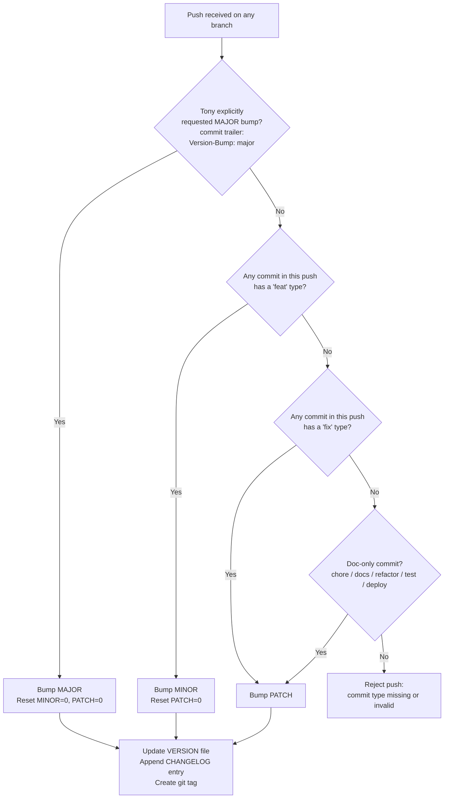

# Versioning Policy

<!--
  AGENT INSTRUCTION: This is the AUTHORITATIVE versioning specification for the
  GateForge Blueprint Repository and every project derived from it. Every agent
  (Architect, Designer, Developer, QC, Operator) MUST read this document before
  pushing to GitHub. The auto-bump CI workflow at .github/workflows/version-bump.yml
  enforces these rules — but the rules below are the source of truth.
-->

| Field | Value |
|---|---|
| **Document ID** | `GOV-VERSIONING-001` |
| **Version** | `1.0` |
| **Status** | `Approved` |
| **Owner** | System Architect |
| **Last Updated** | 2026-05-01 |
| **Approved By** | Tony NG |

---

## 1. Why This Document Exists

Every change destined for any environment — Dev, UAT, Production, or even a
documentation-only edit — MUST be pushed to GitHub first. GitHub is the single
audit trail for every change. The version number recorded in `/VERSION` (and
mirrored in `CHANGELOG.md`) lets us point to the exact state of the blueprint
that was deployed, reviewed, or audited at any moment in time.

This is non-negotiable. Local-only fixes, undocumented hotfixes, and "temporary"
edits that bypass GitHub are explicitly prohibited.

---

## 2. Version Format

```
v[MAJOR].[MINOR].[PATCH]
```

Example: `v1.4.7` — 1st major release, 4th feature batch, 7th patch since the
last feature batch.

The current version always lives in the root `VERSION` file (single line, no
prefix `v`, e.g. `1.4.7`). Git tags use the prefix (e.g. `v1.4.7`).

---

## 3. Who Controls Each Segment

| Segment | Controller | Trigger | Effect on Other Segments |
|---|---|---|---|
| **MAJOR** | **Human (Tony NG)** — explicit instruction only | Tony decides the change is large enough to warrant a major bump (breaking change, architecture pivot, major feature line) | MINOR → 0, PATCH → 0 |
| **MINOR** | **AI Agent — automatic** | Push contains at least one new feature, OR a mix of features + fixes | PATCH → 0 |
| **PATCH** | **AI Agent — automatic** | Push contains only bug fixes or issue fixes (no features) | — |

**Critical rule:** MAJOR is **never** auto-incremented. Even if the AI agent
believes a change is large, it must wait for Tony's explicit instruction. The
auto-bump workflow refuses to bump MAJOR.

---

## 4. Decision Tree (the AI agent runs this on every push)



---

## 5. How the AI Agent Detects Change Type

The agent reads the commit messages in the pushed range. The repository already
mandates the format:

```
[<Agent>] <type>: <short description>
```

Mapping from commit `type` to version impact:

| Commit `type` | Version Impact |
|---|---|
| `feat` | **MINOR** bump (or MAJOR if Tony's trailer present) |
| `fix` | **PATCH** bump (only if no `feat` in the same push) |
| `refactor` | **PATCH** bump |
| `test` | **PATCH** bump |
| `deploy` | **PATCH** bump |
| `docs` | **PATCH** bump |
| `chore` | **PATCH** bump |

If a single push contains both `feat` and `fix` commits → **MINOR** wins
(PATCH resets to 0).

### 5.1 The `Version-Bump:` commit trailer (MAJOR override)

To request a MAJOR bump, Tony adds this trailer to the **last commit** of the
push:

```
Version-Bump: major
```

The auto-bump workflow checks the commit log for this trailer. If found AND the
push author matches Tony's GitHub identity, MAJOR is bumped. Any other identity
attempting this trailer is rejected with a CI failure.

---

## 6. What Counts as "Every Push"

The auto-bump workflow runs on **every push** to **every branch**, including:

- Pushes to `main`
- Pushes to iteration branches (`iter/<NNN>`)
- Pushes to feature branches
- Pushes to hotfix branches
- Documentation-only pushes (e.g. updating `requirements/user-requirements.md`)

**Why doc-only counts:** the goal of this policy is a complete audit trail. A
new requirement, a corrected risk assessment, or an updated runbook is a real
change to the blueprint and deserves a version bump.

### 6.1 Exclusions

The following pushes do NOT trigger a version bump:

- Pushes that only modify `VERSION`, `CHANGELOG.md`, or `.github/workflows/version-bump.yml`
  (these are the workflow's own writes — preventing infinite loops).
- Pushes where every commit is empty or merge-only with no file changes.
- Pushes by the GitHub Actions bot itself.

---

## 7. CHANGELOG Integration

Every version bump appends a section to `CHANGELOG.md`:

```markdown
## [1.4.7] - 2026-05-15

### Fixed
- [DEF-042] Redis connection pool exhaustion under burst load
- [DEF-043] Wrong env-var name in deployment-runbook §2.2

### Pushed by
- Operator (VM-5)
```

Sections (`Added`, `Changed`, `Fixed`, etc.) are derived from commit types in
the push:
- `feat` → **Added**
- `fix` → **Fixed**
- `refactor` → **Changed**
- `deploy` → **Deployed**
- `docs` → **Docs**
- `chore` → **Chore**
- Security-tagged commits (`fix(security):`) → **Security**

---

## 8. Git Tags

For every successful bump, the workflow creates and pushes an annotated tag:

```
v<MAJOR>.<MINOR>.<PATCH>
```

Tags are immutable. The Architect may add release notes in
`project/releases/RELEASE-vX.Y.Z.md` for any tag worth highlighting.

---

## 9. Examples

| Scenario | Before | Push contents | After |
|---|---|---|---|
| Pure bug fix | `1.2.3` | 1× `[Dev] fix:` | `1.2.4` |
| Pure feature | `1.2.3` | 2× `[Dev] feat:` | `1.3.0` |
| Mixed | `1.2.3` | 1× `feat`, 1× `fix` | `1.3.0` |
| Doc-only | `1.2.3` | 1× `[Architect] docs:` | `1.2.4` |
| Tony's MAJOR | `1.2.3` | 1× `[Architect] feat:` with trailer `Version-Bump: major` | `2.0.0` |
| Workflow self-write | `1.2.3` | only `VERSION` + `CHANGELOG.md` | `1.2.3` (no bump) |

---

## 10. Failure Modes and What the Agent Does

| Situation | Agent Action |
|---|---|
| Commit message lacks `[<Agent>] <type>:` prefix | CI fails. Push is rejected. Agent must amend and re-push. |
| `Version-Bump: major` trailer present but author is not Tony | CI fails with explicit message. |
| Multiple `Version-Bump:` trailers conflict | CI fails. |
| Concurrent pushes race on `VERSION` | The workflow uses GitHub's concurrency group `version-bump-${{ github.ref }}` to serialize. |
| Manual edit to `VERSION` outside the workflow | CI rejects the push. Agents MUST NOT edit `VERSION` by hand. |

---

## 11. Migration / First Adoption

When this policy is first introduced (this release, `0.2.0`):
- The repository state is recorded as `0.2.0` in `VERSION`.
- The CHANGELOG entry for `0.2.0` documents the introduction of the policy.
- All future pushes follow the rules above.

---

## 12. Cross-References

- [`README.md`](README.md) — Master repository guide. Includes the Versioning Principle summary.
- [`CHANGELOG.md`](CHANGELOG.md) — Per-version change log (Keep a Changelog format).
- [`.github/workflows/version-bump.yml`](.github/workflows/version-bump.yml) — The CI workflow that enforces this policy.
- [`.github/PULL_REQUEST_TEMPLATE.md`](.github/PULL_REQUEST_TEMPLATE.md) — PR checklist requiring the version-bump declaration.
- [`project/decision-log.md`](project/decision-log.md) — ADR-005 records the decision that established this policy.
- Each role's `AGENTS.md` — Reiterates the rule and the role-specific commit prefix.

---

## Revision History

| Version | Date       | Author            | Change Summary |
|---------|------------|-------------------|----------------|
| 1.0     | 2026-05-01 | System Architect  | Initial versioning policy: human-controlled MAJOR; AI auto-increments MINOR (features) and PATCH (fixes); every push to every environment requires GitHub commit and triggers auto-bump. |
