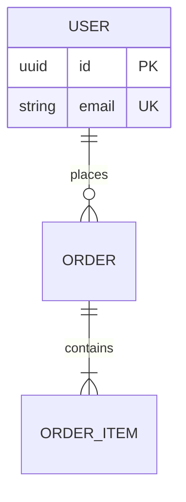

# Architecture — Agent Compliance Manifest

<!--
  AGENT INSTRUCTION: Mandatory entry point for the System Architect (and any
  Designer making contributions to architecture/). Every push that modifies a
  file under architecture/ MUST come with the Pre-Flight Acknowledgement in §3
  and pass the gates in §4.
-->

| Field | Value |
|---|---|
| **Document ID** | `ARC-AGENTS-001` |
| **Version** | `1.2` |
| **Status** | `Approved` |
| **Owner** | System Architect |
| **Read By** | System Architect (primary), System Designer (contributor) |
| **Last Updated** | 2026-05-16 |

---

## 1. Why This File Exists

Architecture is the contract that every downstream role depends on. A drift
between `architecture/data-model.md` and what the Developer actually builds
shows up months later as a defect cluster. This manifest forces every
architectural change through the same reading list and the same traceability
gates so the contract remains coherent.

---

## 2. Mandatory Reading

| # | Document | Purpose |
|---|---|---|
| 1 | [`/VERSIONING.md`](../VERSIONING.md) | Version-bump rules — every architecture change is a versioned change. |
| 2 | [`/README.md`](../README.md) | Master guide. |
| 3 | [`/project/admin-portal-validation.md`](../project/admin-portal-validation.md) | §3 (rules), §4 (traceability), §5 (safe content). |
| 4 | This file (`architecture/AGENTS.md`) | Role-specific compliance. |
| 5 | [`requirements/functional-requirements.md`](../requirements/functional-requirements.md) | The FRs your architecture must satisfy. |
| 6 | [`requirements/non-functional-requirements.md`](../requirements/non-functional-requirements.md) | NFRs drive technology choices. |
| 7 | [`architecture/technical-architecture.md`](technical-architecture.md) | Existing C4 model — read before adding to it. |
| 8 | [`architecture/data-model.md`](data-model.md) | Existing entities, indexes, constraints. |
| 9 | [`architecture/api-specifications/README.md`](api-specifications/README.md) | OpenAPI conventions. |
| 10 | [`/project/decision-log.md`](../project/decision-log.md) | Existing ADRs — your change may invoke a new ADR. |

---

## 3. Pre-Flight Acknowledgement

```markdown
## Pre-Flight Acknowledgement
- Role: System Architect (Architecture task)
- Task: <one-line description>
- Docs read (with version):
  - VERSIONING.md v____
  - README.md v____
  - project/admin-portal-validation.md v____
  - architecture/AGENTS.md v____
  - requirements/functional-requirements.md v____
  - requirements/non-functional-requirements.md v____
  - architecture/technical-architecture.md v____
  - architecture/data-model.md v____
  - architecture/api-specifications/README.md v____
  - project/decision-log.md v____
- Mandatory gates honored:
  - [ ] Every new component / endpoint traces back to ≥ 1 FR
  - [ ] OpenAPI specs validate against OpenAPI 3.0 schema
  - [ ] Every breaking architectural change has a new ADR
  - [ ] C4 diagrams updated where component topology changed
  - [ ] No secrets / production hostnames added
  - [ ] Mandatory diagrams produced as Mermaid (see §5): C4 Architecture Diagrams (L1/L2/L3), ER Diagram for data-model, Sequence Diagram for every cross-service interaction
  - [ ] Every Mermaid block follows repo conventions (`%% Title:` / `%% Type:` headers, `<br/>` not `\n`, quoted subgraph names)
  - [ ] Revision History rows added in every modified file
```

---

## 4. Mandatory Gates

| ID | Gate | Source |
|---|---|---|
| ARC-G1 | Every new component / API endpoint traces to ≥ 1 FR | admin-portal-validation §4 |
| ARC-G2 | OpenAPI files lint clean (Spectral / openapi-validator) | `architecture/api-specifications/README.md` |
| ARC-G3 | Breaking changes (incompatible schema, removed endpoint, contradicting ADR) require a new ADR-NNN merged in the same PR | `project/decision-log.md` |
| ARC-G4 | C4 Container or Component diagram updated when topology changes | `architecture/technical-architecture.md` |
| ARC-G5 | No secrets / non-public hostnames / PHI / PII | admin-portal-validation §5.2 |
| ARC-G6 | Revision History bumped on every modified file | admin-portal-validation §3.3 |
| ARC-G7 | **C4 Architecture Diagrams** (Context L1, Container L2, Component L3) present and current in `architecture/technical-architecture.md` for every system/sub-system | §5 below |
| ARC-G8 | **ER Diagram** (Mermaid `erDiagram`) present and current in `architecture/data-model.md` for every persisted entity set | §5 below |
| ARC-G9 | **Sequence Diagram** (Mermaid `sequenceDiagram`) present for every cross-service synchronous call or async event flow in `architecture/technical-architecture.md` | §5 below |
| ARC-G10 | Every Mermaid block follows repo conventions (`%% Title:` / `%% Type:` headers, `<br/>` not `\n`, quoted subgraph names) | §5 below |

---

## 5. Mandatory Diagrams (Mermaid-only)

> **Universal rule for all roles:** Every diagram in this repository MUST be authored in **Mermaid**. ASCII directory trees are the only exception. The six canonical diagram types adopted across the blueprint are: **Architecture Diagram, Workflow Diagram, State Diagram, Sequence Diagram, ER Diagram, User Journey**.

**This role (System Architect — Architecture) MUST author the following diagrams:**

| Diagram Type | Where it lives | When it is mandatory |
|---|---|---|
| **Architecture Diagram** (C4: `C4Context` + `flowchart` fallback) | `architecture/technical-architecture.md` | C4 L1 Context, L2 Container, L3 Component for every system/sub-system. Updated whenever topology changes (ARC-G4). |
| **ER Diagram** (`erDiagram`) | `architecture/data-model.md` | For every persisted entity set; updated when any entity, key, or cardinality changes. |
| **Sequence Diagram** (`sequenceDiagram`) | `architecture/technical-architecture.md` (or dedicated sub-doc) | For every cross-service synchronous call OR async event flow described in the architecture. |

**Convention reminder** (mandatory for every Mermaid block; full rules in `design/README.md` §Mermaid Conventions):

```text
%% Title: <descriptive title>
%% Type:  <flowchart | erDiagram | sequenceDiagram | stateDiagram-v2 | C4Context>
<diagram-type> <direction>
    ...
```

Additional rules: use `<br/>` (never `\n`) inside labels; quote subgraph names containing spaces; use `[/"PLACEHOLDER: X"/]` parallelograms for template gaps; prepend an HTML-comment Purpose/Audience/Last-reviewed block above non-trivial diagrams.

**Example — ER Diagram skeleton:**



---

## 6. Commit Convention

Prefix: `[Architect]`

| Change | Type | Version impact |
|---|---|---|
| New module / new endpoint / new entity | `feat` | MINOR |
| Tighten / clarify existing spec | `refactor` | PATCH |
| Correct an error in a diagram or spec | `fix` | PATCH |
| Update OpenAPI placeholder values | `docs` | PATCH |

---

## Pre-Work Gate (MUST complete before implementation)

<!--
  AGENT INSTRUCTION: This gate prevents the "code first, document later" anti-pattern.
  Every checkbox below MUST be checked (with evidence) before you write ANY implementation
  code. The CI workflow prework-gate.yml enforces this — pushes with code changes but
  without prior doc commits will be rejected.
-->

Before writing ANY implementation code, the agent MUST have completed and committed:

- [ ] **GitHub Issues created** for all tasks in this iteration/feature
- [ ] **Requirements documented** (user-requirements.md and/or functional-requirements.md updated)
- [ ] **Architecture/design docs written** (technical-architecture.md, data-model.md, or design/*.md as applicable)
- [ ] **Feature spec written or updated** (docs/ specification document, if user-facing)
- [ ] **project/backlog.md updated** with task entries for this work
- [ ] **project/status.md updated** with current phase and iteration
- [ ] **All of the above pushed to GitHub** before the first code commit

**Enforcement:** The Pre-Work Gate CI workflow checks for these artifacts on every push
that includes implementation code. Missing artifacts → `agent.prework-gate.violated` →
`validation: red` → release blocked.

**Exception process:** If a hotfix requires skipping the gate, any agent may add
`Pre-Work-Gate: skip` as a commit trailer with a justification in the commit body.
The CI logs the exception (commit, author, and trailer) in the audit trail for
human review — abuse will be caught downstream and may revoke the agent's authority.


## Revision History

| Version | Date       | Author            | Change Summary |
|---------|------------|-------------------|----------------|
| 1.0     | 2026-05-01 | System Architect  | Initial architecture compliance manifest. |
| 1.1     | 2026-05-15 | System Architect  | Add Pre-Work Gate section (mandatory docs-before-code checklist) aligned with `.github/workflows/prework-gate.yml` and the README Mandatory Work Order. |
| 1.2     | 2026-05-16 | System Architect  | Mandate six canonical Mermaid diagram types repo-wide. Architecture role MUST author C4 Architecture Diagrams (L1/L2/L3), ER Diagram (data-model), and Sequence Diagrams (cross-service flows). Adds §5 Mandatory Diagrams, gates ARC-G7/G8/G9/G10; renumbers Commit Convention to §6. |
