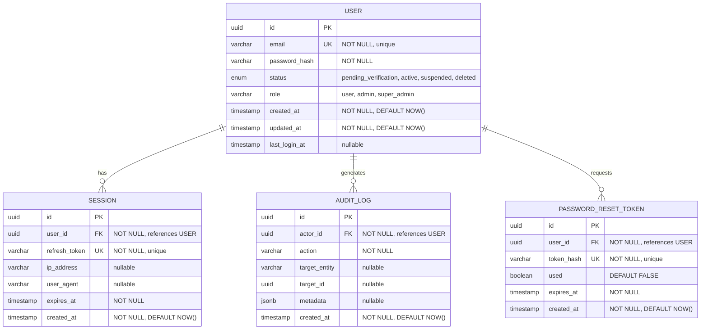

# Data Model Document

<!--
  PURPOSE: Define the complete data model — entities, relationships, schema DDL,
           indexing strategy, migration approach, retention policies, and Redis data model.
  OWNER: System Architect
  CONTRIBUTOR: System Designer (database-design.md refines query optimization and replication)
  
  INSTRUCTIONS FOR THE ARCHITECT:
  1. Derive entities from requirements/functional-requirements.md Section 4 (Data Requirements).
  2. The ER diagram must cover ALL entities — not just the examples below.
  3. PostgreSQL DDL must be production-ready structure (types, constraints, indexes).
  4. Redis key patterns must include TTL and data structure type.
  5. Data retention policies must align with compliance requirements (NFR Section 10).
-->

## Document Metadata

| Field | Value |
|-------|-------|
| **Document ID** | `ARCH-DATA-001` |
| **Version** | `0.1` |
| **Status** | `Draft` |
| **Owner** | System Architect |
| **Last Updated** | `YYYY-MM-DD` |
| **Approved By** | — |
| **Source Documents** | `requirements/functional-requirements.md`, `architecture/technical-architecture.md` |

---

## 1. Entity-Relationship Diagram

<!--
  Purpose: Canonical entity-relationship model for the project's persistent data.
  Audience: Architect / Developer / DBA / QC
  Last reviewed: 2026-05-16 by Architect

  Authoring rules:
   - Use Mermaid erDiagram syntax.
   - Include ALL entities from functional requirements.
   - Show cardinality (||--o{, ||--||, }o--o{, etc.)
   - Replace the placeholder example below with the actual project model.
-->



<!--
  REPLACE the above with the actual ER diagram for this project.
  The example demonstrates: entity attributes with types, PK/FK/UK annotations,
  constraints in descriptions, and relationship cardinality.
  
  Add additional entities as needed:
  - PLACEHOLDER_ENTITY ||--o{ ANOTHER_ENTITY : "relationship_verb"
-->

---

## 2. Entity Definitions

<!--
  High-level definition of each entity: what it represents, who owns it, and its lifecycle.
-->

| Entity | Description | Owner Module | Lifecycle |
|--------|------------|-------------|-----------|
| USER | A registered platform user with authentication credentials and profile. | MOD-AUTH | Created at registration → active after verification → can be suspended/deleted by admin. |
| SESSION | An active refresh token session for a logged-in user. | MOD-AUTH | Created at login → expires after TTL → deleted at logout or token rotation. |
| AUDIT_LOG | An immutable record of a significant system action. | MOD-ADMIN | Created on action → never updated or deleted (append-only). |
| PASSWORD_RESET_TOKEN | A single-use, time-limited token for password reset. | MOD-AUTH | Created on reset request → used or expired → soft-deleted after use. |
| [PLACEHOLDER] | [PLACEHOLDER] | [PLACEHOLDER] | [PLACEHOLDER] |

---

## 3. Attribute Definitions

<!--
  Detailed attribute definitions per entity.
  Include data type, constraints, default values, and description.
-->

### 3.1 USER

| Attribute | Type | Constraints | Default | Description |
|-----------|------|------------|---------|-------------|
| `id` | `UUID` | PK, NOT NULL | `gen_random_uuid()` | Unique identifier |
| `email` | `VARCHAR(320)` | UNIQUE, NOT NULL | — | User's email address (max per RFC 5321) |
| `password_hash` | `VARCHAR(72)` | NOT NULL | — | bcrypt hash of the user's password |
| `status` | `VARCHAR(30)` | NOT NULL, CHECK | `'pending_verification'` | Account status: `pending_verification`, `active`, `suspended`, `deleted` |
| `role` | `VARCHAR(20)` | NOT NULL, CHECK | `'user'` | User role: `user`, `admin`, `super_admin` |
| `created_at` | `TIMESTAMPTZ` | NOT NULL | `NOW()` | Account creation timestamp |
| `updated_at` | `TIMESTAMPTZ` | NOT NULL | `NOW()` | Last profile update timestamp |
| `last_login_at` | `TIMESTAMPTZ` | NULLABLE | `NULL` | Timestamp of most recent successful login |

### 3.2 SESSION

| Attribute | Type | Constraints | Default | Description |
|-----------|------|------------|---------|-------------|
| `id` | `UUID` | PK, NOT NULL | `gen_random_uuid()` | Unique session identifier |
| `user_id` | `UUID` | FK → USER.id, NOT NULL | — | The user who owns this session |
| `refresh_token` | `VARCHAR(512)` | UNIQUE, NOT NULL | — | Hashed refresh token |
| `ip_address` | `INET` | NULLABLE | `NULL` | Client IP at session creation |
| `user_agent` | `VARCHAR(512)` | NULLABLE | `NULL` | Client user-agent string |
| `expires_at` | `TIMESTAMPTZ` | NOT NULL | — | Session expiration timestamp |
| `created_at` | `TIMESTAMPTZ` | NOT NULL | `NOW()` | Session creation timestamp |

### 3.3 AUDIT_LOG

| Attribute | Type | Constraints | Default | Description |
|-----------|------|------------|---------|-------------|
| `id` | `UUID` | PK, NOT NULL | `gen_random_uuid()` | Unique log entry identifier |
| `actor_id` | `UUID` | FK → USER.id, NOT NULL | — | The user who performed the action |
| `action` | `VARCHAR(100)` | NOT NULL | — | Action identifier (e.g., `user.created`, `user.suspended`) |
| `target_entity` | `VARCHAR(100)` | NULLABLE | `NULL` | Entity type affected (e.g., `USER`, `SESSION`) |
| `target_id` | `UUID` | NULLABLE | `NULL` | ID of the affected entity |
| `metadata` | `JSONB` | NULLABLE | `NULL` | Additional context (e.g., old/new values, request details) |
| `created_at` | `TIMESTAMPTZ` | NOT NULL | `NOW()` | When the action occurred |

### 3.4 PASSWORD_RESET_TOKEN

| Attribute | Type | Constraints | Default | Description |
|-----------|------|------------|---------|-------------|
| `id` | `UUID` | PK, NOT NULL | `gen_random_uuid()` | Unique token identifier |
| `user_id` | `UUID` | FK → USER.id, NOT NULL | — | User requesting the reset |
| `token_hash` | `VARCHAR(128)` | UNIQUE, NOT NULL | — | SHA-256 hash of the reset token (raw token sent via email) |
| `used` | `BOOLEAN` | NOT NULL | `FALSE` | Whether this token has been consumed |
| `expires_at` | `TIMESTAMPTZ` | NOT NULL | — | Token expiration (e.g., 15 minutes from creation) |
| `created_at` | `TIMESTAMPTZ` | NOT NULL | `NOW()` | Token creation timestamp |

### 3.5 [PLACEHOLDER — Entity Name]

<!-- Copy the attribute table structure above for each additional entity. -->

| Attribute | Type | Constraints | Default | Description |
|-----------|------|------------|---------|-------------|
| [PLACEHOLDER] | [PLACEHOLDER] | [PLACEHOLDER] | [PLACEHOLDER] | [PLACEHOLDER] |

---

## 4. Relationship Matrix

<!--
  Summarize all relationships in a single reference table.
-->

| Parent Entity | Child Entity | Cardinality | FK Column | ON DELETE | ON UPDATE | Description |
|--------------|-------------|-------------|-----------|-----------|-----------|-------------|
| USER | SESSION | 1:N | `session.user_id` | CASCADE | CASCADE | Deleting a user removes all their sessions |
| USER | AUDIT_LOG | 1:N | `audit_log.actor_id` | RESTRICT | CASCADE | Cannot delete a user with audit trail (preserve integrity) |
| USER | PASSWORD_RESET_TOKEN | 1:N | `password_reset_token.user_id` | CASCADE | CASCADE | Deleting a user removes all their reset tokens |
| [PLACEHOLDER] | [PLACEHOLDER] | [PLACEHOLDER] | [PLACEHOLDER] | [PLACEHOLDER] | [PLACEHOLDER] | [PLACEHOLDER] |

---

## 5. Database Schema (PostgreSQL DDL)

<!--
  Production-ready DDL. Include extensions, types, tables, indexes, and constraints.
  This is the authoritative schema — migrations must produce this result.
-->

```sql
-- ============================================================
-- GateForge Database Schema
-- PostgreSQL 16+
-- Generated from: architecture/data-model.md
-- ============================================================

-- Extensions
CREATE EXTENSION IF NOT EXISTS "uuid-ossp";
CREATE EXTENSION IF NOT EXISTS "pgcrypto";

-- ============================================================
-- Custom Types
-- ============================================================
DO $$ BEGIN
    CREATE TYPE user_status AS ENUM (
        'pending_verification',
        'active',
        'suspended',
        'deleted'
    );
EXCEPTION WHEN duplicate_object THEN NULL;
END $$;

DO $$ BEGIN
    CREATE TYPE user_role AS ENUM (
        'user',
        'admin',
        'super_admin'
    );
EXCEPTION WHEN duplicate_object THEN NULL;
END $$;

-- ============================================================
-- Tables
-- ============================================================

-- USER
CREATE TABLE IF NOT EXISTS "user" (
    id              UUID PRIMARY KEY DEFAULT gen_random_uuid(),
    email           VARCHAR(320) NOT NULL,
    password_hash   VARCHAR(72) NOT NULL,
    status          user_status NOT NULL DEFAULT 'pending_verification',
    role            user_role NOT NULL DEFAULT 'user',
    created_at      TIMESTAMPTZ NOT NULL DEFAULT NOW(),
    updated_at      TIMESTAMPTZ NOT NULL DEFAULT NOW(),
    last_login_at   TIMESTAMPTZ,

    CONSTRAINT uq_user_email UNIQUE (email)
);

-- SESSION
CREATE TABLE IF NOT EXISTS session (
    id              UUID PRIMARY KEY DEFAULT gen_random_uuid(),
    user_id         UUID NOT NULL REFERENCES "user"(id) ON DELETE CASCADE ON UPDATE CASCADE,
    refresh_token   VARCHAR(512) NOT NULL,
    ip_address      INET,
    user_agent      VARCHAR(512),
    expires_at      TIMESTAMPTZ NOT NULL,
    created_at      TIMESTAMPTZ NOT NULL DEFAULT NOW(),

    CONSTRAINT uq_session_refresh_token UNIQUE (refresh_token)
);

-- AUDIT_LOG
CREATE TABLE IF NOT EXISTS audit_log (
    id              UUID PRIMARY KEY DEFAULT gen_random_uuid(),
    actor_id        UUID NOT NULL REFERENCES "user"(id) ON DELETE RESTRICT ON UPDATE CASCADE,
    action          VARCHAR(100) NOT NULL,
    target_entity   VARCHAR(100),
    target_id       UUID,
    metadata        JSONB,
    created_at      TIMESTAMPTZ NOT NULL DEFAULT NOW()
);

-- PASSWORD_RESET_TOKEN
CREATE TABLE IF NOT EXISTS password_reset_token (
    id              UUID PRIMARY KEY DEFAULT gen_random_uuid(),
    user_id         UUID NOT NULL REFERENCES "user"(id) ON DELETE CASCADE ON UPDATE CASCADE,
    token_hash      VARCHAR(128) NOT NULL,
    used            BOOLEAN NOT NULL DEFAULT FALSE,
    expires_at      TIMESTAMPTZ NOT NULL,
    created_at      TIMESTAMPTZ NOT NULL DEFAULT NOW(),

    CONSTRAINT uq_password_reset_token_hash UNIQUE (token_hash)
);

-- [PLACEHOLDER — Additional tables]
-- CREATE TABLE IF NOT EXISTS [placeholder] ( ... );

-- ============================================================
-- Triggers
-- ============================================================

-- Auto-update updated_at on USER modifications
CREATE OR REPLACE FUNCTION update_updated_at_column()
RETURNS TRIGGER AS $$
BEGIN
    NEW.updated_at = NOW();
    RETURN NEW;
END;
$$ LANGUAGE plpgsql;

CREATE TRIGGER trg_user_updated_at
    BEFORE UPDATE ON "user"
    FOR EACH ROW
    EXECUTE FUNCTION update_updated_at_column();
```

---

## 6. Indexing Strategy

<!--
  Define indexes for query performance.
  Every index must have a justification tied to a query pattern.
-->

| Table | Index Name | Column(s) | Type | Justification |
|-------|-----------|-----------|------|---------------|
| `user` | `uq_user_email` | `email` | UNIQUE B-tree | Login lookup by email; registration duplicate check |
| `user` | `idx_user_status` | `status` | B-tree | Admin dashboard filtering by status |
| `user` | `idx_user_created_at` | `created_at` | B-tree | Admin dashboard sorting and date range filtering |
| `user` | `idx_user_role` | `role` | B-tree | Role-based queries (list all admins) |
| `session` | `idx_session_user_id` | `user_id` | B-tree | List all sessions for a user; cascade delete lookup |
| `session` | `idx_session_expires_at` | `expires_at` | B-tree | Cleanup job: find expired sessions |
| `audit_log` | `idx_audit_log_actor_id` | `actor_id` | B-tree | Admin audit trail: find all actions by a user |
| `audit_log` | `idx_audit_log_created_at` | `created_at` | B-tree (DESC) | Audit log pagination (newest first) |
| `audit_log` | `idx_audit_log_action` | `action` | B-tree | Filter audit logs by action type |
| `password_reset_token` | `idx_prt_user_id` | `user_id` | B-tree | Find pending reset tokens for a user |
| `password_reset_token` | `idx_prt_expires_at` | `expires_at` | B-tree | Cleanup job: find expired tokens |
| [PLACEHOLDER] | [PLACEHOLDER] | [PLACEHOLDER] | [PLACEHOLDER] | [PLACEHOLDER] |

<!--
  Index Types:
  - B-tree: Default. Best for equality and range queries.
  - Hash: Equality-only lookups (rarely preferred over B-tree in PostgreSQL).
  - GIN: Full-text search, JSONB queries.
  - GiST: Geometric/range queries.
  - BRIN: Large tables with naturally ordered data (e.g., time-series).
-->

---

## 7. Data Migration Strategy

<!--
  Define how schema changes are managed and applied.
-->

### 7.1 Migration Tooling

| Aspect | Approach |
|--------|---------|
| **Migration tool** | [PLACEHOLDER — e.g., TypeORM migrations / Prisma Migrate / node-pg-migrate] |
| **Migration directory** | [PLACEHOLDER — e.g., `src/database/migrations/`] |
| **Naming convention** | `<timestamp>-<description>.ts` (e.g., `20260407100000-create-user-table.ts`) |
| **Execution** | Applied automatically on deployment via CI/CD pipeline |

### 7.2 Migration Rules

1. **Forward-only in production.** Never edit or delete an existing migration; create a new one.
2. **Every migration must have a rollback.** The `down()` method must fully reverse the `up()` method.
3. **No data loss migrations without explicit approval.** Dropping columns or tables requires Architect sign-off and a data backup.
4. **Test migrations on staging first.** All migrations run on a staging environment with production-like data before production deployment.
5. **Lock-safe migrations.** Avoid `ALTER TABLE ... ADD COLUMN ... DEFAULT` on large tables without `CONCURRENTLY` or batched backfill.

### 7.3 Migration Checklist

- [ ] Migration file created with `up()` and `down()` methods
- [ ] Tested on local database
- [ ] Tested on staging with production-sized dataset
- [ ] Rollback tested successfully
- [ ] Performance impact assessed (table locks, rewrite time)
- [ ] Architect approved (if destructive)

---

## 8. Data Retention Policy

<!--
  Define how long data is kept and when it is purged.
  Must align with compliance requirements (NFR Section 10).
-->

| Entity | Retention Period | Purge Method | Justification |
|--------|-----------------|-------------|---------------|
| USER (active) | Indefinite | N/A — retained while account active | Core business data |
| USER (deleted) | [PLACEHOLDER — e.g., 30 days after deletion request] | Hard delete + anonymize audit logs | [PLACEHOLDER — e.g., GDPR right to erasure] |
| SESSION | Until expiry + 24 hours | Cron job: `DELETE FROM session WHERE expires_at < NOW() - INTERVAL '24 hours'` | No value in expired sessions |
| AUDIT_LOG | [PLACEHOLDER — e.g., 2 years] | Archive to cold storage, then delete | Compliance audit trail; balance storage cost |
| PASSWORD_RESET_TOKEN | Until expiry + 1 hour | Cron job: `DELETE FROM password_reset_token WHERE expires_at < NOW() - INTERVAL '1 hour'` | Single-use tokens have no value after expiry |
| [PLACEHOLDER] | [PLACEHOLDER] | [PLACEHOLDER] | [PLACEHOLDER] |

---

## 9. Redis Data Model

<!--
  Define all Redis key patterns, data structures, and TTLs.
  Redis is used for caching, session management, rate limiting, and Pub/Sub.
-->

### 9.1 Key Patterns

| Key Pattern | Data Structure | TTL | Description | Example |
|------------|---------------|-----|-------------|---------|
| `auth:session:{userId}:{sessionId}` | STRING (JSON) | [PLACEHOLDER — e.g., 7 days] | Stores refresh token metadata for session validation | `auth:session:550e8400:a1b2c3d4` → `{"refreshToken":"...","ip":"1.2.3.4"}` |
| `auth:blacklist:{jti}` | STRING (`1`) | [PLACEHOLDER — e.g., 15 min (matches access token TTL)] | Blacklisted JWT IDs (logged-out tokens) | `auth:blacklist:abc123` → `1` |
| `rate:login:{ip}` | STRING (counter) | 15 minutes | Login attempt counter for rate limiting | `rate:login:192.168.1.1` → `3` |
| `cache:user:{userId}` | STRING (JSON) | [PLACEHOLDER — e.g., 5 min] | Cached user profile to reduce DB reads | `cache:user:550e8400` → `{"id":"...","email":"...","role":"user"}` |
| `cache:users:list:{hash}` | STRING (JSON) | [PLACEHOLDER — e.g., 30 sec] | Cached paginated user list (admin dashboard) | `cache:users:list:abc123` → `{"users":[...],"total":150}` |
| `pubsub:notifications` | Pub/Sub channel | N/A | Real-time notification broadcast channel | Published: `{"userId":"...","type":"welcome","payload":{...}}` |
| [PLACEHOLDER] | [PLACEHOLDER] | [PLACEHOLDER] | [PLACEHOLDER] | [PLACEHOLDER] |

### 9.2 Redis Data Structures Reference

<!--
  Quick reference for which Redis data structure to use for each pattern.
-->

| Use Case | Recommended Structure | Rationale |
|----------|---------------------|-----------|
| Session tokens | STRING (JSON) | Simple key-value with TTL; atomic GET/SET |
| Rate limiting | STRING + INCR + EXPIRE | Atomic counter with automatic reset |
| Token blacklist | STRING + TTL | Existence check only; auto-expires with token |
| Cached entities | STRING (JSON) | Fast serialization; simple invalidation |
| Sorted leaderboards | SORTED SET (ZADD/ZRANGE) | Score-based ordering with range queries |
| Real-time notifications | Pub/Sub | Fire-and-forget broadcast to connected clients |
| Distributed locks | STRING + SET NX EX | Mutual exclusion for cron jobs and critical sections |
| [PLACEHOLDER] | [PLACEHOLDER] | [PLACEHOLDER] |

### 9.3 Cache Invalidation Strategy

| Pattern | Strategy | Trigger |
|---------|---------|---------|
| `cache:user:{userId}` | Write-through invalidation | DELETE key on any user profile update |
| `cache:users:list:*` | TTL-based expiry | Short TTL (30s); no active invalidation |
| `auth:session:*` | Explicit deletion | DELETE on logout; DELETE all for password change |
| [PLACEHOLDER] | [PLACEHOLDER] | [PLACEHOLDER] |

---

## 10. Revision History

| Version | Date | Author | Changes |
|---------|------|--------|---------|
| 0.1 | YYYY-MM-DD | System Architect | Initial template created |
| | | | |

---

<!--
  DOWNSTREAM DEPENDENCIES:
  - design/database-design.md reads this for query optimization, connection pooling, and replication design.
  - architecture/api-specifications/ uses entity definitions for request/response schemas.
  - development/modules/ uses the DDL and entity definitions for ORM model implementation.
  - qa/ uses the schema to design data-driven test cases.
-->
