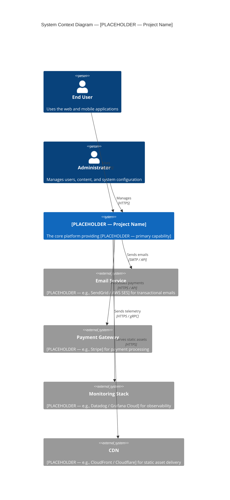
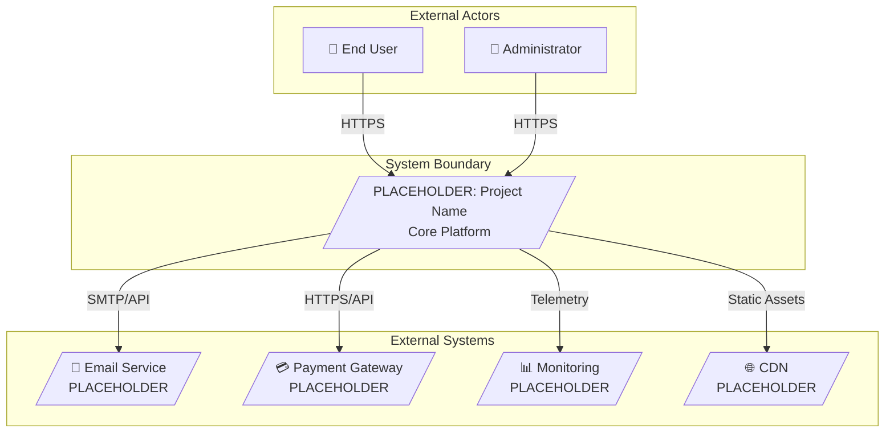
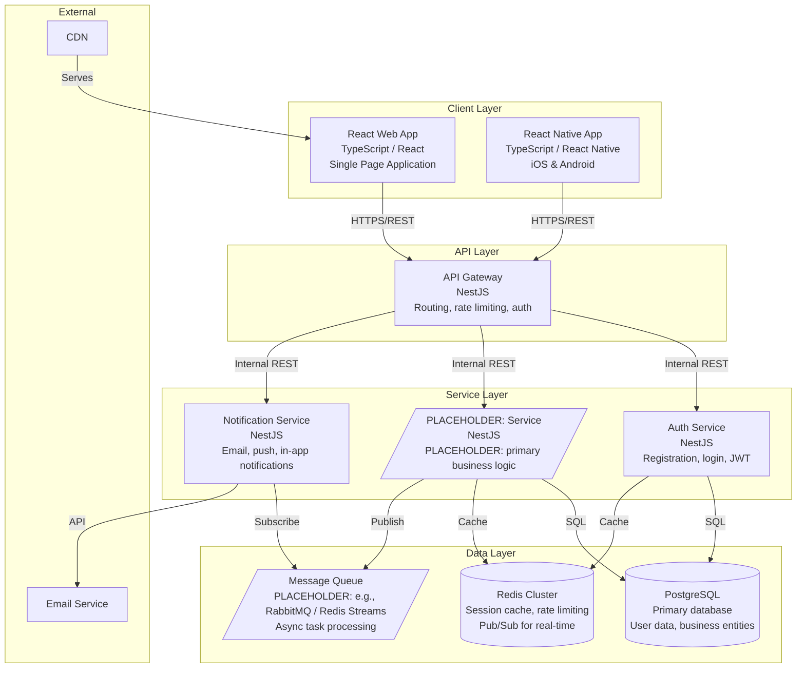
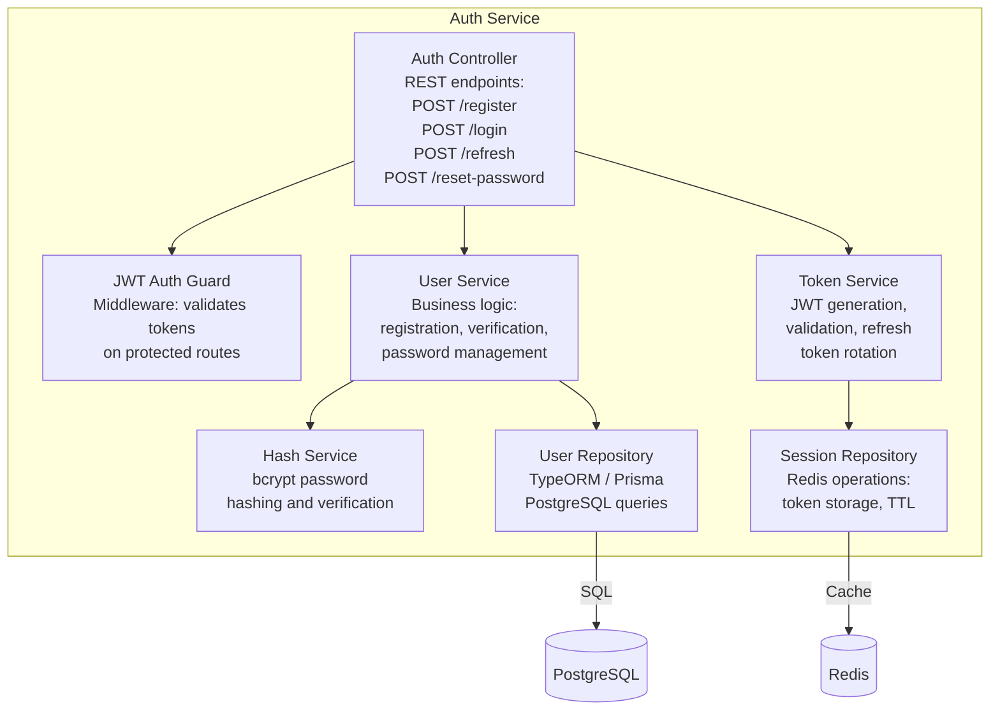
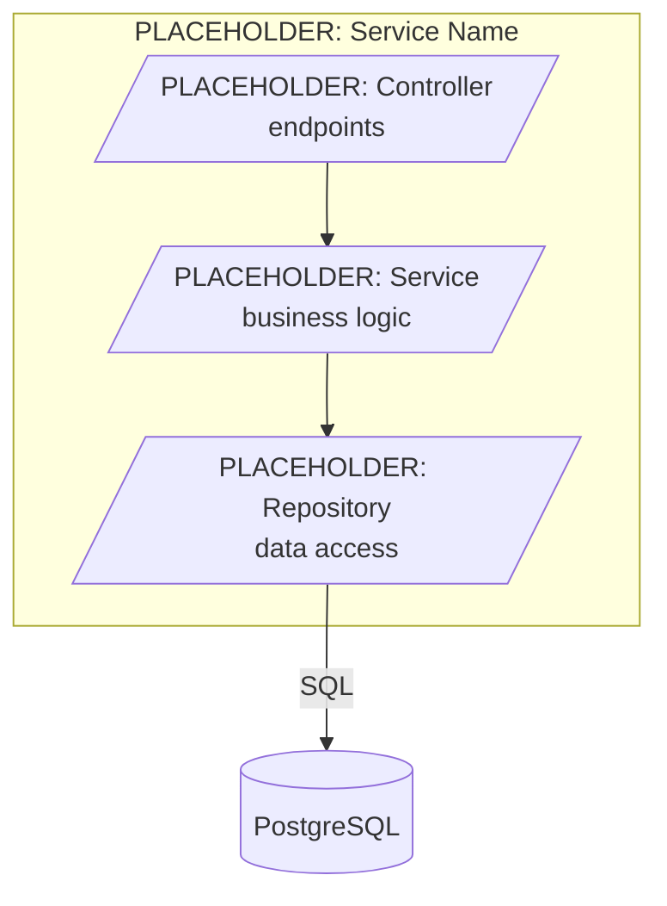
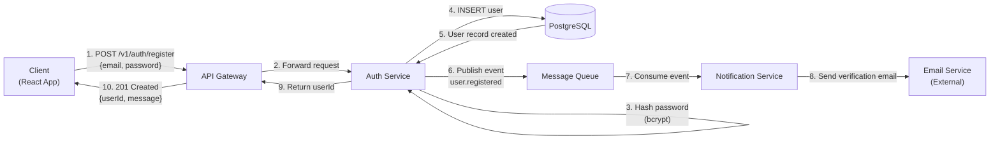
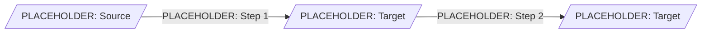
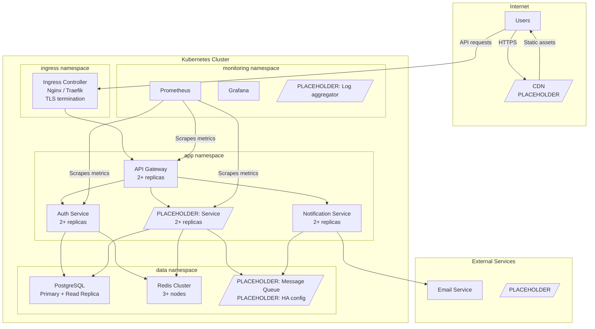

# Technical Architecture Document

<!--
  STANDARD: C4 Model (Context, Container, Component, Code)
  PURPOSE: Define the system architecture using hierarchical diagrams from the broadest
           context down to component-level detail, plus technology decisions, communication
           patterns, deployment topology, and cross-cutting concerns.
  OWNER: System Architect
  CONTRIBUTOR: System Designer
  
  INSTRUCTIONS FOR THE ARCHITECT:
  1. Start from the System Context level and work downward.
  2. Every Mermaid diagram must be self-explanatory — include labels on all relationships.
  3. Technology choices must include version and justification.
  4. ADRs capture the "why" behind significant decisions — create one for each contested choice.
  5. This document feeds into design/ (Designer) and development/ (Developers).
-->

## Document Metadata

| Field | Value |
|-------|-------|
| **Document ID** | `ARCH-TECH-001` |
| **Version** | `0.2` |
| **Status** | `Draft` |
| **Owner** | System Architect |
| **Last Updated** | `YYYY-MM-DD` |
| **Approved By** | — |
| **Source Documents** | `requirements/functional-requirements.md`, `requirements/non-functional-requirements.md` |
| **Standard** | C4 Model |

---

## 1. System Context Diagram (C4 Level 1)

<!--
  Purpose: Highest-level abstraction — the system as a single box, surrounded by
  the users and external systems it interacts with.
  Audience: Architect / Designer / Developer / Stakeholders
  Last reviewed: 2026-05-16 by Architect

  Authoring rules:
   - Replace [PLACEHOLDER] elements with actual actors and systems.
   - Keep both the C4Context diagram and the flowchart fallback (some renderers
     do not support the C4 extension; the flowchart guarantees rendering everywhere).
-->



<!--
  Flowchart fallback — same content as the C4Context diagram above, expressed in
  plain flowchart syntax for renderers that lack the C4 extension (e.g., some
  legacy GitHub Enterprise versions, older VS Code Mermaid previews).
-->



---

## 2. Container Diagram (C4 Level 2)

<!--
  Purpose: Zoom into the system boundary. Show the major deployable units —
  applications, services, databases, message queues, caches. Each container is
  a separately running process or deployable artifact.
  Audience: Architect / Designer / Developer
  Last reviewed: 2026-05-16 by Architect
-->



<!--
  REPLACE placeholder services with actual services from Module Decomposition
  (requirements/functional-requirements.md Section 1).
  Add or remove services as the architecture evolves.
-->

---

## 3. Component Diagrams (C4 Level 3)

<!--
  Zoom into individual containers to show their internal components.
  Create one diagram per key service. Focus on services with complex internal structure.
-->

### 3.1 Auth Service — Component Diagram

<!--
  Purpose: Internal components of the Auth Service (C4 Level 3).
  Audience: Developer (Auth module owner) / Architect
  Last reviewed: 2026-05-16 by Architect
-->



### 3.2 [PLACEHOLDER — Service Name] — Component Diagram

<!--
  Purpose: Component template — duplicate for each complex service.
  Audience: Developer (module owner) / Architect
  Last reviewed: 2026-05-16 by Architect
-->



<!-- Add more component diagrams as needed — one per complex service. -->

---

## 4. Technology Stack

<!--
  Every technology choice must include version and justification.
  The justification should reference project requirements or constraints.
-->

| Layer | Technology | Version | Justification |
|-------|-----------|---------|---------------|
| **Frontend — Web** | React | [PLACEHOLDER — e.g., 18.x] | Industry-standard SPA framework; large ecosystem; team familiarity |
| **Frontend — Mobile** | React Native | [PLACEHOLDER — e.g., 0.73.x] | Code sharing with React web; single TypeScript codebase |
| **Language** | TypeScript | [PLACEHOLDER — e.g., 5.x] | Type safety across full stack; reduces runtime errors |
| **Backend Framework** | NestJS | [PLACEHOLDER — e.g., 10.x] | Modular architecture; TypeScript-native; built-in DI, guards, interceptors |
| **API Protocol** | REST (OpenAPI 3.0) | — | Standard protocol; broad client support; tooling ecosystem |
| **Primary Database** | PostgreSQL | [PLACEHOLDER — e.g., 16.x] | ACID compliance; JSON support; proven scalability; rich indexing |
| **Cache / Session Store** | Redis | [PLACEHOLDER — e.g., 7.x] | Sub-millisecond latency; built-in TTL; Pub/Sub for real-time |
| **Message Queue** | [PLACEHOLDER — e.g., RabbitMQ / Redis Streams] | [PLACEHOLDER] | [PLACEHOLDER — justification] |
| **ORM** | [PLACEHOLDER — e.g., TypeORM / Prisma] | [PLACEHOLDER] | [PLACEHOLDER — justification] |
| **Containerization** | Docker | [PLACEHOLDER — e.g., 24.x] | Reproducible builds; consistent environments |
| **Orchestration** | Kubernetes | [PLACEHOLDER — e.g., 1.28+] | Production-grade orchestration; auto-scaling; self-healing |
| **CI/CD** | [PLACEHOLDER — e.g., GitHub Actions / GitLab CI] | — | [PLACEHOLDER — justification] |
| **Monitoring** | [PLACEHOLDER — e.g., Prometheus + Grafana] | — | [PLACEHOLDER — justification] |
| **Logging** | [PLACEHOLDER — e.g., ELK / Loki] | — | [PLACEHOLDER — justification] |
| [PLACEHOLDER] | [PLACEHOLDER] | [PLACEHOLDER] | [PLACEHOLDER] |

---

## 5. Communication Patterns

<!--
  Define how services communicate with each other.
  Mix of synchronous and asynchronous patterns is typical.
-->

### 5.1 Synchronous Communication (REST)

| Caller | Callee | Protocol | Endpoint Pattern | Use Case |
|--------|--------|----------|-----------------|----------|
| API Gateway | Auth Service | HTTP/REST | `/internal/auth/*` | Authentication, token validation |
| API Gateway | [PLACEHOLDER] Service | HTTP/REST | `/internal/[PLACEHOLDER]/*` | [PLACEHOLDER] |
| [PLACEHOLDER] | [PLACEHOLDER] | [PLACEHOLDER] | [PLACEHOLDER] | [PLACEHOLDER] |

### 5.2 Asynchronous Communication (Message Queue)

| Publisher | Event | Consumer(s) | Queue/Topic | Use Case |
|-----------|-------|-------------|-------------|----------|
| Auth Service | `user.registered` | Notification Service | `user-events` | Send welcome email after registration |
| [PLACEHOLDER] Service | `[PLACEHOLDER]` | [PLACEHOLDER] | `[PLACEHOLDER]` | [PLACEHOLDER] |
| [PLACEHOLDER] | [PLACEHOLDER] | [PLACEHOLDER] | [PLACEHOLDER] | [PLACEHOLDER] |

### 5.3 Real-Time Communication

| Technology | Use Case | Protocol | Notes |
|-----------|----------|----------|-------|
| [PLACEHOLDER — e.g., WebSocket via Socket.IO] | [PLACEHOLDER — e.g., Live notifications, real-time updates] | WSS | [PLACEHOLDER — e.g., Redis Pub/Sub as backend for horizontal scaling] |
| [PLACEHOLDER] | [PLACEHOLDER] | [PLACEHOLDER] | [PLACEHOLDER] |

---

## 6. Data Flow Diagrams

<!--
  Show how data moves through the system for key operations.
  One diagram per critical data flow.
-->

### 6.1 [PLACEHOLDER — Flow Name, e.g., User Registration Data Flow]

<!--
  Purpose: Step-by-step data flow for a critical operation. Each edge label
  numbers the step so the diagram reads like a runbook.
  Audience: Architect / Developer / QC
  Last reviewed: 2026-05-16 by Architect
-->



### 6.2 [PLACEHOLDER — Flow Name]

<!--
  Purpose: Template for a second critical data flow.
  Audience: Architect / Developer / QC
  Last reviewed: 2026-05-16 by Architect
-->



---

## 7. Deployment Architecture

<!--
  Purpose: Kubernetes cluster topology — namespaces, pods, and external service
  connections. This feeds directly into design/infrastructure-design.md.
  Audience: Architect / Designer / Operator
  Last reviewed: 2026-05-16 by Architect
-->



---

## 8. Cross-Cutting Concerns

<!--
  These concerns span all services and must be implemented consistently.
  Each concern should reference the design/ document where it is detailed.
-->

### 8.1 Authentication & Authorization

| Aspect | Approach | Details |
|--------|---------|---------|
| Authentication | JWT (access + refresh tokens) | See NFR-SEC-001; detailed in `design/security-design.md` |
| Authorization | RBAC with guards | NestJS `@Roles()` decorator + `RolesGuard`; roles stored in JWT claims |
| Service-to-service auth | [PLACEHOLDER — e.g., Internal API keys / mTLS] | [PLACEHOLDER] |

### 8.2 Logging

| Aspect | Approach | Details |
|--------|---------|---------|
| Log format | Structured JSON | `{ timestamp, level, service, traceId, message, metadata }` |
| Log levels | `error`, `warn`, `info`, `debug` | Production: `info`+; Staging: `debug`+ |
| Correlation | Distributed trace ID | Injected at API Gateway; propagated via `x-trace-id` header |
| Aggregation | [PLACEHOLDER — e.g., Loki / ELK] | See `design/monitoring-design.md` |

### 8.3 Monitoring & Alerting

| Aspect | Approach | Details |
|--------|---------|---------|
| Metrics | [PLACEHOLDER — e.g., Prometheus] | RED metrics (Rate, Errors, Duration) per service |
| Dashboards | [PLACEHOLDER — e.g., Grafana] | Service health, latency percentiles, error rates |
| Alerting | [PLACEHOLDER — e.g., Alertmanager → PagerDuty/Slack] | See `design/monitoring-design.md` |

### 8.4 Error Handling

| Aspect | Approach | Details |
|--------|---------|---------|
| Error response format | Standardized JSON | `{ statusCode, error, message, traceId }` |
| Exception filters | NestJS global exception filter | Catches unhandled exceptions; logs; returns sanitized response |
| Retry policy | Exponential backoff with jitter | Max 3 retries; inter-service calls only |
| Circuit breaker | [PLACEHOLDER — e.g., Custom / opossum] | Open after 5 consecutive failures; half-open after 30s |

---

## 9. Architecture Decision Records (ADRs)

<!--
  Document significant architectural decisions using the ADR format below.
  Create one ADR for each contested or non-obvious choice.
  ADR-IDs are sequential: ADR-001, ADR-002, etc.
-->

### ADR Template

```
### ADR-<NNN>: <Title>

| Field | Value |
|-------|-------|
| **Status** | Proposed / Accepted / Deprecated / Superseded |
| **Date** | YYYY-MM-DD |
| **Decision Makers** | System Architect, [others] |

**Context:**
[What is the issue or question that needs a decision?]

**Decision:**
[What was decided and why?]

**Alternatives Considered:**
1. [Alternative 1] — [Why rejected]
2. [Alternative 2] — [Why rejected]

**Consequences:**
- Positive: [Benefits of this decision]
- Negative: [Trade-offs and risks]
- Neutral: [Implications that are neither good nor bad]
```

---

### ADR-001: Use NestJS as the Backend Framework

| Field | Value |
|-------|-------|
| **Status** | Accepted |
| **Date** | [YYYY-MM-DD] |
| **Decision Makers** | System Architect |

**Context:**
The project requires a TypeScript backend framework that supports modular architecture, dependency injection, middleware, and built-in support for REST APIs. The team needs a framework that scales from MVP to production without rewrites.

**Decision:**
Use NestJS as the backend framework for all API services.

**Alternatives Considered:**
1. **Express.js (raw)** — Rejected because it lacks built-in module system, DI, and decorators. Would require extensive boilerplate for a structured multi-service architecture.
2. **Fastify (raw)** — Rejected for the same structural reasons as Express, despite better raw performance. NestJS can use Fastify as its underlying HTTP adapter if performance optimization is needed later.
3. **tRPC** — Rejected because the project requires OpenAPI-documented REST APIs for potential third-party integration. tRPC is better suited for tightly-coupled full-stack TypeScript monorepos.

**Consequences:**
- Positive: Strong module system maps cleanly to domain modules; built-in guards, interceptors, and pipes reduce boilerplate; large ecosystem of NestJS-specific packages.
- Negative: Slightly higher learning curve than raw Express; decorator-heavy code style may feel unfamiliar to developers new to NestJS.
- Neutral: Performance overhead vs. raw Fastify is negligible for most CRUD-heavy applications.

---

### ADR-002: [PLACEHOLDER — Title]

<!-- Copy the ADR template above and fill in for each significant decision. -->

| Field | Value |
|-------|-------|
| **Status** | [Proposed / Accepted] |
| **Date** | [YYYY-MM-DD] |
| **Decision Makers** | [PLACEHOLDER] |

**Context:**
[PLACEHOLDER]

**Decision:**
[PLACEHOLDER]

**Alternatives Considered:**
1. [PLACEHOLDER] — [PLACEHOLDER]
2. [PLACEHOLDER] — [PLACEHOLDER]

**Consequences:**
- Positive: [PLACEHOLDER]
- Negative: [PLACEHOLDER]
- Neutral: [PLACEHOLDER]

---

## 10. Constraints and Assumptions

### 10.1 Architectural Constraints

| # | Constraint | Impact | Source |
|---|-----------|--------|--------|
| 1 | All services must be stateless (state in PostgreSQL/Redis only). | Enables horizontal scaling; no sticky sessions. | NFR-SCAL-001 |
| 2 | All inter-service communication within the cluster uses internal DNS (no external routing). | Reduces latency; improves security. | Architecture decision |
| 3 | [PLACEHOLDER] | [PLACEHOLDER] | [PLACEHOLDER] |

### 10.2 Architectural Assumptions

| # | Assumption | Impact if Wrong | Mitigation |
|---|-----------|----------------|------------|
| 1 | A single PostgreSQL instance (with read replicas) is sufficient for Year 1 data volumes. | Would need to shard or migrate to a distributed database. | Monitor query latency; plan sharding strategy proactively. |
| 2 | Redis Cluster can handle all caching, session, and Pub/Sub needs without a separate message broker. | May need to introduce RabbitMQ/Kafka for complex event routing. | Abstract message publishing behind an interface for easy swap. |
| 3 | [PLACEHOLDER] | [PLACEHOLDER] | [PLACEHOLDER] |

---

## 11. Revision History

| Version | Date | Author | Changes |
|---------|------|--------|---------|
| 0.1 | YYYY-MM-DD | System Architect | Initial template created |
| 0.2 | 2026-05-16 | System Architect | Standardized all 8 diagrams to repo Mermaid conventions: added `%% Title:` / `%% Type:` headers, replaced `\n` with `<br/>` in node labels, quoted all subgraph names, reshaped `[PLACEHOLDER — X]` nodes as parallelograms (`[/"PLACEHOLDER: X"/]`) to visually distinguish them from real nodes. Preserved the existing C4Context + flowchart fallback pattern for the System Context diagram. |
| | | | |

---

<!--
  DOWNSTREAM DEPENDENCIES:
  - architecture/data-model.md derives from Containers (Section 2) and Data Flow (Section 6).
  - architecture/api-specifications/ derives from Communication Patterns (Section 5).
  - design/infrastructure-design.md derives from Deployment Architecture (Section 7).
  - design/security-design.md derives from Cross-Cutting Concerns — Auth (Section 8.1).
  - design/monitoring-design.md derives from Cross-Cutting Concerns — Monitoring (Section 8.3).
  - design/resilience-design.md derives from Cross-Cutting Concerns — Error Handling (Section 8.4).
  - development/ uses Technology Stack (Section 4) and ADRs (Section 9).
-->
