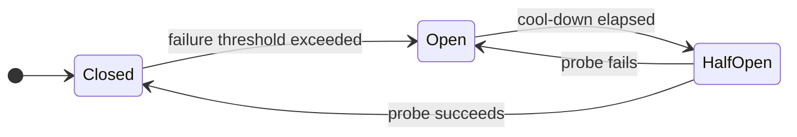

# Design — Agent Compliance Manifest

<!--
  AGENT INSTRUCTION: Mandatory entry point for the System Designer. Every push
  that modifies a file under design/ MUST come with the Pre-Flight
  Acknowledgement in §3 and pass the gates in §4.
-->

| Field | Value |
|---|---|
| **Document ID** | `DES-AGENTS-001` |
| **Version** | `1.2` |
| **Status** | `Approved` |
| **Owner** | System Designer |
| **Read By** | System Designer (primary); reviewed by System Architect |
| **Last Updated** | 2026-05-16 |

---

## 1. Mandatory Reading

| # | Document | Purpose |
|---|---|---|
| 1 | [`/VERSIONING.md`](../VERSIONING.md) | Version-bump rules. |
| 2 | [`/README.md`](../README.md) | Master guide. |
| 3 | [`/project/admin-portal-validation.md`](../project/admin-portal-validation.md) §3, §4, §5 | Validation, traceability, safe-content rules. |
| 4 | This file (`design/AGENTS.md`) | Role-specific compliance. |
| 5 | [`requirements/non-functional-requirements.md`](../requirements/non-functional-requirements.md) | NFRs are the design's measuring stick. |
| 6 | [`architecture/technical-architecture.md`](../architecture/technical-architecture.md) | C4 context — design lives inside this. |
| 7 | [`architecture/data-model.md`](../architecture/data-model.md) | Persistence entities you must support. |
| 8 | All sibling design docs (`design/*.md`) | Avoid contradictions across security / resilience / DB / monitoring / infra. |
| 9 | [`/project/decision-log.md`](../project/decision-log.md) | ADRs that constrain or enable design choices. |

---

## 2. Pre-Flight Acknowledgement

```markdown
## Pre-Flight Acknowledgement
- Role: System Designer
- Task: <one-line description>
- Docs read (with version):
  - VERSIONING.md v____
  - README.md v____
  - project/admin-portal-validation.md v____
  - design/AGENTS.md v____
  - requirements/non-functional-requirements.md v____
  - architecture/technical-architecture.md v____
  - architecture/data-model.md v____
  - design/infrastructure-design.md v____
  - design/security-design.md v____
  - design/resilience-design.md v____
  - design/database-design.md v____
  - design/monitoring-design.md v____
  - project/decision-log.md v____
- Mandatory gates honored:
  - [ ] Every design choice references the NFR or FR it serves
  - [ ] OWASP Top-10 controls listed for any new attack surface
  - [ ] Resilience pattern (circuit breaker / retry / fallback) chosen for every new outbound call
  - [ ] Monitoring SLI/SLO defined for every new component
  - [ ] No secrets / hostnames / PII in design docs
  - [ ] Mandatory diagrams produced as Mermaid (see §4): Sequence Diagram for every inter-component flow, State Diagram for every component/feature lifecycle, Workflow Diagram for every operational flow
  - [ ] Every Mermaid block follows repo conventions (`%% Title:` / `%% Type:` headers, `<br/>` not `\n`, quoted subgraph names)
  - [ ] Revision History rows added in every modified file
```

---

## 3. Mandatory Gates

| ID | Gate | Source |
|---|---|---|
| DES-G1 | Every design choice traces to an NFR or FR (link in the doc) | admin-portal-validation §4 |
| DES-G2 | New attack surface (endpoint, queue, external integration) has OWASP Top-10 controls listed in `security-design.md` | `design/security-design.md` |
| DES-G3 | Every new outbound dependency has a chosen resilience pattern documented in `resilience-design.md` | `design/resilience-design.md` |
| DES-G4 | Every new component has at least one SLI and one SLO in `monitoring-design.md` | `design/monitoring-design.md` |
| DES-G5 | Database changes include index strategy + query baseline in `database-design.md` | `design/database-design.md` |
| DES-G6 | No secrets / production hostnames / real PII in any design doc | admin-portal-validation §5.2 |
| DES-G7 | Revision History bumped per modified file | admin-portal-validation §3.3 |
| DES-G8 | **Sequence Diagram** (Mermaid `sequenceDiagram`) present for every inter-component synchronous call or event flow in the relevant design doc | §4 below |
| DES-G9 | **State Diagram** (Mermaid `stateDiagram-v2`) present for every component or feature with a non-trivial lifecycle (≥ 3 states) | §4 below |
| DES-G10 | **Workflow Diagram** (Mermaid `flowchart`) present for every operational flow (deploy, failover, alerting, runbook trigger) referenced by the design | §4 below |
| DES-G11 | Every Mermaid block follows repo conventions (`%% Title:` / `%% Type:` headers, `<br/>` not `\n`, quoted subgraph names) | §4 below |

---

## 4. Mandatory Diagrams (Mermaid-only)

> **Universal rule for all roles:** Every diagram in this repository MUST be authored in **Mermaid**. ASCII directory trees are the only exception. The six canonical diagram types adopted across the blueprint are: **Architecture Diagram, Workflow Diagram, State Diagram, Sequence Diagram, ER Diagram, User Journey**.

**This role (System Designer) MUST author the following diagrams:**

| Diagram Type | Where it lives | When it is mandatory |
|---|---|---|
| **Sequence Diagram** (`sequenceDiagram`) | The relevant `design/*.md` (security, resilience, infrastructure, monitoring, database) | For every inter-component synchronous call OR event/message flow the design introduces. |
| **State Diagram** (`stateDiagram-v2`) | The relevant `design/*.md` | For every component or feature with a non-trivial lifecycle (≥ 3 distinct states), e.g. circuit-breaker states, session states, document lifecycle. |
| **Workflow Diagram** (`flowchart`) | `design/infrastructure-design.md`, `design/resilience-design.md`, `design/monitoring-design.md` | For every operational flow the design references: deploy, rollback, failover, incident alert escalation, etc. |

**Convention reminder** (full rules in `design/README.md` §Mermaid Conventions):

```text
%% Title: <descriptive title>
%% Type:  <flowchart | sequenceDiagram | stateDiagram-v2 | erDiagram | journey | C4Context>
<diagram-type> <direction>
    ...
```

Additional rules: use `<br/>` (never `\n`) inside labels; quote subgraph names containing spaces; use `[/"PLACEHOLDER: X"/]` parallelograms for template gaps; prepend an HTML-comment Purpose/Audience/Last-reviewed block above non-trivial diagrams.

**Example — State Diagram skeleton:**



---

## 5. Commit Convention

Prefix: `[Designer]`

| Change | Type | Version impact |
|---|---|---|
| Add a new design pattern or component coverage | `feat` | MINOR |
| Refine an existing design doc | `refactor` | PATCH |
| Correct an error or stale reference | `fix` | PATCH |

---

## Pre-Work Gate (MUST complete before implementation)

<!--
  AGENT INSTRUCTION: This gate prevents the "code first, document later" anti-pattern.
  Every checkbox below MUST be checked (with evidence) before you write ANY implementation
  code. The CI workflow prework-gate.yml enforces this — pushes with code changes but
  without prior doc commits will be rejected.
-->

Before writing ANY implementation code, the agent MUST have completed and committed:

- [ ] **GitHub Issues created** for all tasks in this iteration/feature
- [ ] **Requirements documented** (user-requirements.md and/or functional-requirements.md updated)
- [ ] **Architecture/design docs written** (technical-architecture.md, data-model.md, or design/*.md as applicable)
- [ ] **Feature spec written or updated** (docs/ specification document, if user-facing)
- [ ] **project/backlog.md updated** with task entries for this work
- [ ] **project/status.md updated** with current phase and iteration
- [ ] **All of the above pushed to GitHub** before the first code commit

**Enforcement:** The Pre-Work Gate CI workflow checks for these artifacts on every push
that includes implementation code. Missing artifacts → `agent.prework-gate.violated` →
`validation: red` → release blocked.

**Exception process:** If a hotfix requires skipping the gate, any agent may add
`Pre-Work-Gate: skip` as a commit trailer with a justification in the commit body.
The CI logs the exception (commit, author, and trailer) in the audit trail for
human review — abuse will be caught downstream and may revoke the agent's authority.


## Revision History

| Version | Date       | Author            | Change Summary |
|---------|------------|-------------------|----------------|
| 1.0     | 2026-05-01 | System Designer  | Initial design compliance manifest. |
| 1.1     | 2026-05-15 | Designer          | Add Pre-Work Gate section (mandatory docs-before-code checklist) aligned with `.github/workflows/prework-gate.yml` and the README Mandatory Work Order. |
| 1.2     | 2026-05-16 | System Designer  | Mandate six canonical Mermaid diagram types repo-wide. Designer role MUST author Sequence Diagram (inter-component flows), State Diagram (lifecycles), and Workflow Diagram (operational flows). Adds §4 Mandatory Diagrams, gates DES-G8/G9/G10/G11; renumbers Commit Convention to §5. |
