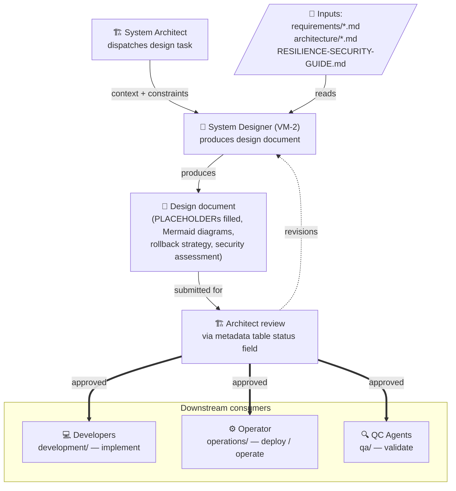

# Design Documents — GateForge Blueprint Repository

<!-- 
  This README provides an overview of the design/ directory.
  It is the entry point for any agent or human navigating the design documentation.
  Keep this file updated whenever a design document is added, removed, or significantly changed.
-->

> **First action for the System Designer:** open [`design/AGENTS.md`](AGENTS.md) and complete the Pre-Flight Acknowledgement before editing any design document. Per [`/VERSIONING.md`](../VERSIONING.md), every push triggers an auto-version-bump.

## Overview

The `design/` directory contains detailed design specifications that translate the System Architect's high-level architecture into implementable infrastructure, security, resilience, database, and monitoring blueprints. These documents are the primary output of the **System Designer** and serve as the bridge between architecture decisions and operational implementation.

All design documents follow GateForge template conventions: metadata tables, Mermaid diagrams, example table rows, and HTML comment instructions for agents.

---

## Document Inventory

| Document                     | Description                                                                                      |
|------------------------------|--------------------------------------------------------------------------------------------------|
| `infrastructure-design.md`   | Kubernetes cluster architecture, namespace design, Docker image strategy, CI/CD pipeline, network and storage design, environment configuration |
| `security-design.md`         | OWASP-aligned threat model (STRIDE), authentication/authorization architecture, network security policies, secrets management, TLS, security headers, incident response |
| `resilience-design.md`       | Circuit breakers, retry policies, health checks, failover architecture, database HA, disaster recovery, chaos engineering test plan |
| `database-design.md`         | PostgreSQL configuration and tuning, schema design, migration strategy, index design, query baselines, backup/PITR, Redis schema, data integrity constraints |
| `monitoring-design.md`       | Prometheus/Grafana/Loki observability stack, metrics taxonomy, dashboards, alerting rules, SLI/SLO definitions, distributed tracing with OpenTelemetry |

---

## Ownership

| Role                | Responsibility                                                          |
|---------------------|-------------------------------------------------------------------------|
| **System Designer (VM-2)** | Owns all documents in `design/`. Creates, updates, and maintains design specifications. |
| **System Architect**       | Reviews and approves all design documents. Dispatches design tasks with context from `requirements/` and `architecture/`. |

---

## Workflow

<!--
  Purpose: End-to-end flow from design task dispatch to downstream consumption.
  Audience: Architect / System Designer / Developer / Operator / QC
  Last reviewed: 2026-05-16 by Architect
-->

---

## Mandatory Sections

Every design document in this directory **must** include:

1. **Document Metadata Table** — ID, version, owner, status, last updated, approved by
2. **Rollback Strategy** — Every design change must have a documented rollback path with RTO targets
3. **Security Assessment** — Risk-level evaluation of all design decisions with controls and status tracking
4. **Change Log** — Audit trail of all significant changes with date, description, impact, and rollback plan

---

## Cross-References

| Reference                        | Purpose                                                       |
|----------------------------------|---------------------------------------------------------------|
| `RESILIENCE-SECURITY-GUIDE.md`   | Detailed resilience and security implementation patterns       |
| `architecture/system-architecture.md` | High-level architecture decisions and C4 diagrams        |
| `architecture/data-model.md`     | Entity relationships and data model definitions               |
| `architecture/api-specs.md`      | API endpoint specifications and contracts                     |
| `requirements/nfr.md`            | Non-functional requirements (performance, availability, security targets) |
| `operations/runbooks/`           | Operational runbooks linked from monitoring alerting rules     |

---

## Conventions

- **Diagrams**: Use Mermaid syntax for all architectural diagrams
- **Placeholders**: Mark incomplete sections with `[PLACEHOLDER — description]`
- **Agent instructions**: Use HTML comments `<!-- -->` for instructions invisible in rendered view
- **Tables**: Include at least one example row to demonstrate expected format
- **Status tracking**: Use metadata table status field: `Draft → In Review → Approved`
- **Versioning**: Follow semantic versioning (MAJOR.MINOR.PATCH) for document versions

<!-- 
  MAINTENANCE NOTE:
  Update this README whenever:
  - A new design document is added to this directory
  - A document is significantly restructured
  - Ownership or workflow changes
-->

---

## Revision History

| Version | Date       | Author              | Changes |
|---------|------------|---------------------|---------|
| 1.0     | [PLACEHOLDER] | System Designer  | Initial design directory overview. |
| 1.1     | 2026-05-01 | System Designer + Architect | Added pointer to `design/AGENTS.md` and `/VERSIONING.md` at top. |
| 1.2     | 2026-05-16 | System Architect | Replaced the ASCII workflow walkthrough with a Mermaid `flowchart` that visualizes the Architect → Designer → Review → Downstream (Developer / Operator / QC) handoff path. |
