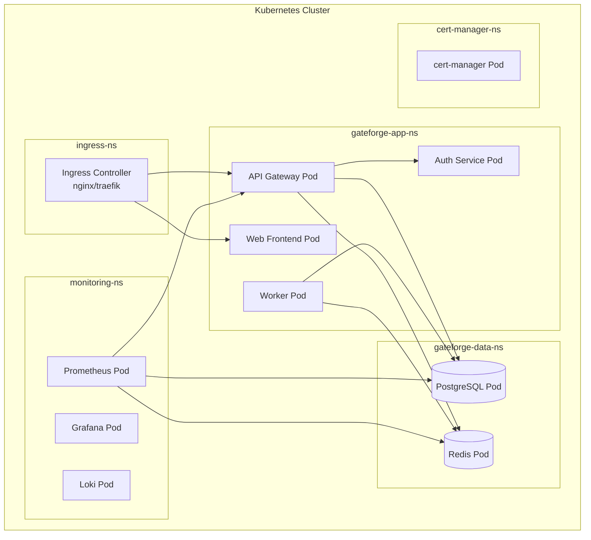
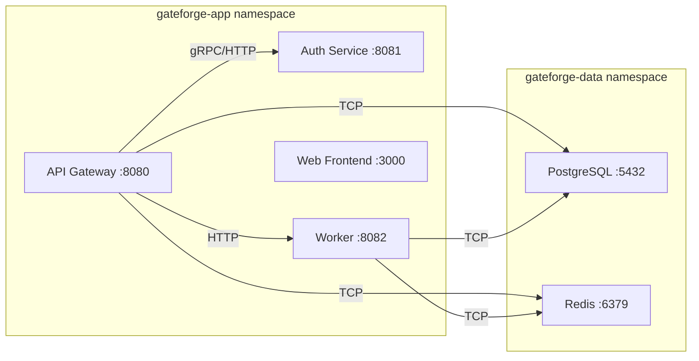
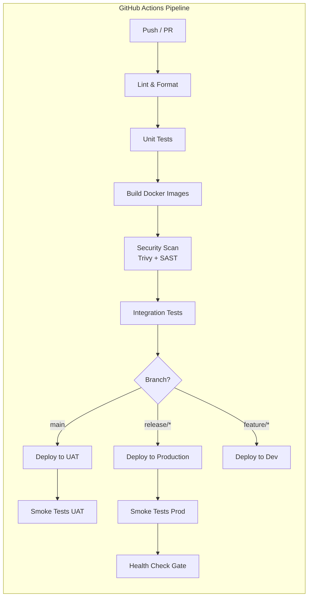

# Infrastructure Design

<!-- 
  TEMPLATE INSTRUCTIONS (System Designer — VM-2):
  This is the primary infrastructure architecture document for GateForge.
  Fill in all [PLACEHOLDER] sections based on the System Architect's architecture docs
  and requirements. Every section must be complete before requesting Architect review.
  Refer to architecture/system-architecture.md for high-level decisions.
  Refer to RESILIENCE-SECURITY-GUIDE.md for resilience and security patterns.
-->

## Document Metadata

| Field          | Value                                      |
|----------------|--------------------------------------------|
| Document ID    | GF-DES-INFRA-001                           |
| Version        | [PLACEHOLDER — e.g., 1.0.0]               |
| Owner          | System Designer (VM-2)                     |
| Status         | [PLACEHOLDER — Draft / In Review / Approved] |
| Last Updated   | [PLACEHOLDER — YYYY-MM-DD]                |
| Approved By    | System Architect                           |
| Classification | Internal                                   |

---

## 1. Kubernetes Cluster Architecture

<!-- 
  Draw a Mermaid diagram showing the cluster topology: namespaces, key pods,
  services, ingress controllers. Show how namespaces isolate workloads.
  Update this diagram whenever a new service or namespace is added.
-->



<!-- Replace the above with the actual cluster topology once services are finalized. -->

## 2. Namespace Design

<!-- 
  Define every Kubernetes namespace. Each namespace must have resource quotas
  and network policies. Add rows as new namespaces are created.
-->

| Namespace          | Purpose                                | Resource Quotas (CPU/Mem)       | Network Policies                                      |
|--------------------|----------------------------------------|---------------------------------|-------------------------------------------------------|
| `gateforge-app`   | Application services (API, web, auth)  | CPU: 4 cores / Mem: 8Gi        | Allow ingress from `ingress-ns`; deny all other inbound |
| `gateforge-data`  | Databases (PostgreSQL, Redis)          | CPU: 4 cores / Mem: 16Gi       | Allow inbound only from `gateforge-app`; deny external |
| `ingress`         | Ingress controller, TLS termination    | CPU: 1 core / Mem: 2Gi         | Allow external HTTP/HTTPS; allow egress to `gateforge-app` |
| `monitoring`      | Prometheus, Grafana, Loki              | CPU: 2 cores / Mem: 4Gi        | Allow inbound from all namespaces (metrics scraping)  |
| `cert-manager`    | Certificate management, Let's Encrypt  | CPU: 500m / Mem: 512Mi         | Allow egress to ACME endpoints; deny all inbound      |
| [PLACEHOLDER]     | [PLACEHOLDER]                          | [PLACEHOLDER]                   | [PLACEHOLDER]                                         |

## 3. Service Mesh / Ingress Configuration

<!-- 
  Document the ingress controller choice, TLS termination strategy, 
  routing rules, rate limiting, and any service mesh (e.g., Istio/Linkerd) decisions.
  If no service mesh is used, explain why and what alternatives are in place.
-->

### Ingress Controller

- **Controller**: [PLACEHOLDER — e.g., NGINX Ingress Controller v1.x]
- **TLS Termination**: At ingress layer via cert-manager + Let's Encrypt
- **Rate Limiting**: [PLACEHOLDER — e.g., 100 req/s per IP]
- **CORS Configuration**: [PLACEHOLDER]

### Routing Rules

| Host                         | Path       | Backend Service       | Port | Notes                    |
|------------------------------|------------|-----------------------|------|--------------------------|
| `app.gateforge.example.com` | `/`        | `web-frontend`        | 3000 | React SPA                |
| `api.gateforge.example.com` | `/api/v1`  | `api-gateway`         | 8080 | NestJS API               |
| `api.gateforge.example.com` | `/auth`    | `auth-service`        | 8081 | Authentication endpoints |
| [PLACEHOLDER]                | [PLACEHOLDER] | [PLACEHOLDER]      | [PLACEHOLDER] | [PLACEHOLDER]     |

### Service Mesh Decision

[PLACEHOLDER — Document whether a service mesh is adopted and rationale. If not, describe mTLS and observability alternatives.]

## 4. Docker Image Strategy

<!-- 
  Define the base image policy, multi-stage build patterns, registry,
  and tagging conventions. Security scanning must be part of the image pipeline.
-->

### Base Images

| Service Type   | Base Image                    | Rationale                                |
|----------------|-------------------------------|------------------------------------------|
| Node.js apps   | `node:20-alpine`              | Minimal attack surface, small image size |
| PostgreSQL     | `postgres:16-alpine`          | Official image, Alpine variant           |
| Redis          | `redis:7-alpine`              | Official image, Alpine variant           |
| Build stage    | `node:20-alpine`              | Full toolchain for compilation           |
| [PLACEHOLDER]  | [PLACEHOLDER]                 | [PLACEHOLDER]                            |

### Multi-Stage Build Pattern

```dockerfile
# Example: NestJS API service
# Stage 1: Build
FROM node:20-alpine AS builder
WORKDIR /app
COPY package*.json ./
RUN npm ci --only=production && npm cache clean --force
COPY . .
RUN npm run build

# Stage 2: Production
FROM node:20-alpine AS production
WORKDIR /app
COPY --from=builder /app/dist ./dist
COPY --from=builder /app/node_modules ./node_modules
USER node
EXPOSE 8080
CMD ["node", "dist/main.js"]
```

<!-- Adapt the above pattern per service. Always use non-root USER. -->

### Image Registry & Tagging Convention

- **Registry**: [PLACEHOLDER — e.g., GitHub Container Registry (ghcr.io)]
- **Tagging Convention**:
  - `ghcr.io/gateforge/<service>:<git-sha>` — immutable build tag
  - `ghcr.io/gateforge/<service>:latest` — latest main branch build
  - `ghcr.io/gateforge/<service>:v<semver>` — release tags
- **Scanning**: [PLACEHOLDER — e.g., Trivy scan on every push, block critical/high CVEs]

## 5. Container Resource Allocation

<!-- 
  Define CPU/memory requests and limits for each service. 
  Requests guarantee minimum resources; limits cap usage.
  Base these on load testing results; update after each performance review.
-->

| Service            | CPU Request | CPU Limit | Memory Request | Memory Limit | Min Replicas | Max Replicas | HPA Metric         |
|--------------------|-------------|-----------|----------------|--------------|--------------|--------------|---------------------|
| API Gateway        | 250m        | 1000m     | 256Mi          | 512Mi        | 2            | 6            | CPU > 70%           |
| Web Frontend       | 100m        | 500m      | 128Mi          | 256Mi        | 2            | 4            | CPU > 70%           |
| Auth Service       | 200m        | 500m      | 256Mi          | 512Mi        | 2            | 4            | CPU > 70%           |
| Worker             | 500m        | 2000m     | 512Mi          | 1Gi          | 1            | 3            | Queue depth > 100   |
| PostgreSQL         | 500m        | 2000m     | 1Gi            | 4Gi          | 1            | 1 (HA: 2)   | N/A (StatefulSet)   |
| Redis              | 250m        | 1000m     | 512Mi          | 1Gi          | 1            | 1 (Sentinel) | N/A (StatefulSet)  |
| [PLACEHOLDER]      | [PLACEHOLDER] | [PLACEHOLDER] | [PLACEHOLDER] | [PLACEHOLDER] | [PLACEHOLDER] | [PLACEHOLDER] | [PLACEHOLDER] |

<!-- Update after load testing. See resilience-design.md for HPA and scaling policies. -->

## 6. Network Design

<!-- 
  Document internal communication (service-to-service), external access patterns,
  and VPN connectivity to the US-based VM. Include port numbers and protocols.
-->

### Internal Service Communication



### External Access

| Access Point           | Protocol | Port | Source               | Destination         | Authentication     |
|------------------------|----------|------|----------------------|---------------------|--------------------|
| Public web traffic     | HTTPS    | 443  | Internet             | Ingress Controller  | TLS + JWT          |
| Admin dashboard        | HTTPS    | 443  | Tailscale network    | Ingress Controller  | TLS + mTLS         |
| SSH (emergency)        | SSH      | 22   | Tailscale network    | VM nodes            | SSH key + Tailscale |
| [PLACEHOLDER]          | [PLACEHOLDER] | [PLACEHOLDER] | [PLACEHOLDER] | [PLACEHOLDER] | [PLACEHOLDER] |

### Tailscale VPN to US VM

- **Purpose**: Secure connectivity between Hong Kong development environment and US-based production/staging VM
- **Tailscale Network**: [PLACEHOLDER — Tailnet name]
- **US VM Address**: [PLACEHOLDER — Tailscale IP, e.g., 100.x.y.z]
- **ACL Rules**: [PLACEHOLDER — define which services/ports are accessible over VPN]
- **DNS Configuration**: [PLACEHOLDER — MagicDNS or custom DNS entries]

## 7. Storage Design

<!-- 
  Define all persistent storage needs. Use StorageClasses appropriate for 
  the workload (SSD for databases, standard for logs/backups).
-->

### PersistentVolume Claims

| PVC Name               | Namespace        | Storage Class | Size   | Access Mode    | Bound To         |
|------------------------|------------------|---------------|--------|----------------|------------------|
| `pg-data-pvc`         | `gateforge-data` | ssd           | 50Gi   | ReadWriteOnce  | PostgreSQL       |
| `pg-wal-pvc`          | `gateforge-data` | ssd           | 10Gi   | ReadWriteOnce  | PostgreSQL WAL   |
| `redis-data-pvc`      | `gateforge-data` | ssd           | 10Gi   | ReadWriteOnce  | Redis            |
| `prometheus-data-pvc` | `monitoring`     | standard      | 50Gi   | ReadWriteOnce  | Prometheus       |
| `loki-data-pvc`       | `monitoring`     | standard      | 30Gi   | ReadWriteOnce  | Loki             |
| `backup-pvc`          | `gateforge-data` | standard      | 100Gi  | ReadWriteMany  | Backup CronJob   |
| [PLACEHOLDER]         | [PLACEHOLDER]    | [PLACEHOLDER] | [PLACEHOLDER] | [PLACEHOLDER] | [PLACEHOLDER] |

### Storage Classes

| Storage Class | Provisioner              | Reclaim Policy | Volume Binding Mode     | Use Case          |
|---------------|--------------------------|----------------|-------------------------|-------------------|
| `ssd`         | [PLACEHOLDER]            | Retain         | WaitForFirstConsumer    | Databases, caches |
| `standard`    | [PLACEHOLDER]            | Delete         | WaitForFirstConsumer    | Logs, metrics     |
| [PLACEHOLDER] | [PLACEHOLDER]            | [PLACEHOLDER]  | [PLACEHOLDER]           | [PLACEHOLDER]     |

### Backup Volumes

- **Database backups**: Stored on `backup-pvc`, rotated daily (keep 7 daily, 4 weekly, 3 monthly)
- **Off-site backup**: [PLACEHOLDER — e.g., S3-compatible storage, rsync to US VM]
- **Encryption**: [PLACEHOLDER — backup encryption strategy]

## 8. CI/CD Pipeline Architecture

<!-- 
  Document the GitHub Actions workflow stages. Each stage must have clear 
  entry/exit criteria and failure handling. See operations/ for deployment runbooks.
-->



### Pipeline Stage Details

| Stage              | Trigger              | Tools                   | Failure Action               | Timeout |
|--------------------|----------------------|-------------------------|------------------------------|---------|
| Lint & Format      | Push, PR             | ESLint, Prettier        | Block merge                  | 5m      |
| Unit Tests         | Push, PR             | Jest                    | Block merge                  | 10m     |
| Build Images       | Push to main/release | Docker, BuildKit        | Notify team, block deploy    | 15m     |
| Security Scan      | Push to main/release | Trivy, CodeQL           | Block on Critical/High       | 10m     |
| Integration Tests  | Push to main/release | Jest + Testcontainers   | Block deploy                 | 20m     |
| Deploy to UAT      | Push to main         | kubectl, Helm           | Auto-rollback, notify        | 10m     |
| Deploy to Prod     | Push to release/*    | kubectl, Helm           | Auto-rollback, page on-call  | 10m     |
| Smoke Tests        | Post-deploy          | Custom health checks    | Auto-rollback                | 5m      |
| [PLACEHOLDER]      | [PLACEHOLDER]        | [PLACEHOLDER]           | [PLACEHOLDER]                | [PLACEHOLDER] |

## 9. Environment Configuration

<!-- 
  Document the differences between Dev, UAT, and Production environments.
  All environment-specific config should be managed via ConfigMaps and Secrets.
-->

| Dimension              | Dev                          | UAT                          | Production                    |
|------------------------|------------------------------|------------------------------|-------------------------------|
| Cluster                | Local / single-node          | Shared cluster (namespace)   | Dedicated cluster / namespace |
| Replicas (API)         | 1                            | 2                            | 2–6 (HPA)                    |
| Database               | PostgreSQL (single, no HA)   | PostgreSQL (single, seeded)  | PostgreSQL (HA, replication)  |
| Redis                  | Single instance              | Single instance              | Sentinel / Cluster            |
| TLS                    | Self-signed                  | Let's Encrypt (staging)      | Let's Encrypt (production)   |
| Log Level              | DEBUG                        | INFO                         | WARN                          |
| Secrets Management     | `.env` files                 | Sealed Secrets               | Sealed Secrets + Vault        |
| Monitoring             | Minimal (Prometheus only)    | Full stack                   | Full stack + alerting         |
| Domain                 | `dev.local`                  | `uat.gateforge.example.com`  | `gateforge.example.com`      |
| [PLACEHOLDER]          | [PLACEHOLDER]                | [PLACEHOLDER]                | [PLACEHOLDER]                 |

## 10. Rollback Strategy

<!-- 
  REQUIRED: Every infrastructure change must have a documented rollback path.
  This section defines the default rollback procedures per change type.
-->

### Per-Service Rollback

| Change Type          | Rollback Method                                     | RTO Target | Automation       |
|----------------------|-----------------------------------------------------|------------|------------------|
| Application deploy   | `kubectl rollout undo deployment/<name>`            | < 2 min    | GitHub Actions   |
| Helm release         | `helm rollback <release> <revision>`                | < 5 min    | Manual / CI      |
| Database migration   | Run down migration: `npm run migration:revert`      | < 10 min   | Manual           |
| ConfigMap change     | Revert commit + re-deploy                           | < 5 min    | GitHub Actions   |
| Infrastructure (IaC) | Revert Terraform/Pulumi state to previous version   | < 15 min   | Manual           |
| [PLACEHOLDER]        | [PLACEHOLDER]                                       | [PLACEHOLDER] | [PLACEHOLDER] |

### Per-Infrastructure-Change Rollback

- **Kubernetes version upgrade**: Cordon/drain → rollback kubelet → uncordon
- **Ingress controller update**: Switch traffic to previous controller deployment via Service selector
- **Storage class change**: Never migrate in-place; create new PVCs, migrate data, switch references
- **Network policy change**: Revert YAML, re-apply; test connectivity immediately

## 11. Security Assessment

<!-- REQUIRED: All design documents must include a security assessment section. -->

| Area                    | Risk Level | Controls                                         | Status        |
|-------------------------|------------|--------------------------------------------------|---------------|
| Container images        | Medium     | Trivy scanning, non-root user, read-only FS      | [PLACEHOLDER] |
| Network policies        | High       | Namespace isolation, deny-all default             | [PLACEHOLDER] |
| Secrets in cluster      | High       | Sealed Secrets / Vault, no plaintext in manifests | [PLACEHOLDER] |
| Ingress / TLS           | Medium     | TLS 1.3, HSTS, cert-manager auto-renewal         | [PLACEHOLDER] |
| CI/CD pipeline          | High       | OIDC auth, least-privilege tokens, audit logs     | [PLACEHOLDER] |
| [PLACEHOLDER]           | [PLACEHOLDER] | [PLACEHOLDER]                                 | [PLACEHOLDER] |

<!-- Cross-reference: See RESILIENCE-SECURITY-GUIDE.md for detailed security patterns. -->

## 12. Infrastructure Change Log

<!-- 
  Log every significant infrastructure change. This is the audit trail.
  Add a new row for each change before applying it.
-->

| Date       | Change                           | Reason                          | Impact                       | Rollback Plan                          |
|------------|----------------------------------|---------------------------------|------------------------------|----------------------------------------|
| YYYY-MM-DD | [Example] Increase API replicas to 4 | High traffic from launch   | Increased resource usage     | Scale back to 2 replicas               |
| YYYY-MM-DD | [Example] Upgrade ingress to v1.10   | Security patch CVE-XXXX    | Brief downtime during rollout| Rollback to v1.9 via Helm             |
| [PLACEHOLDER] | [PLACEHOLDER]                | [PLACEHOLDER]                   | [PLACEHOLDER]                | [PLACEHOLDER]                          |

---

<!-- 
  REVIEW CHECKLIST (System Architect):
  [ ] All namespaces defined with resource quotas and network policies
  [ ] Docker images use multi-stage builds and non-root users
  [ ] Resource allocation based on load testing data
  [ ] Network design includes Tailscale VPN configuration
  [ ] CI/CD pipeline covers all environments with rollback automation
  [ ] Rollback strategy documented for every change type
  [ ] Security assessment completed
  [ ] Change log initialized
-->
