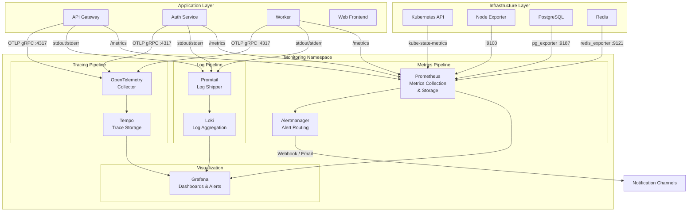

# Monitoring Design

<!-- 
  TEMPLATE INSTRUCTIONS (System Designer — VM-2):
  This document defines the monitoring, logging, alerting, and observability 
  architecture for GateForge. It follows SRE principles for SLI/SLO definitions.
  Fill in all [PLACEHOLDER] sections based on architecture decisions and NFR targets.
  Cross-reference: resilience-design.md for health checks and failover monitoring.
  Cross-reference: infrastructure-design.md for resource allocation of monitoring stack.
  Cross-reference: RESILIENCE-SECURITY-GUIDE.md for security-specific monitoring.
  Cross-reference: operations/ for runbooks linked from alerting rules.
-->

## Document Metadata

| Field          | Value                                      |
|----------------|--------------------------------------------|
| Document ID    | GF-DES-MON-001                             |
| Version        | [PLACEHOLDER — e.g., 1.0.0]               |
| Owner          | System Designer (VM-2)                     |
| Status         | [PLACEHOLDER — Draft / In Review / Approved] |
| Last Updated   | [PLACEHOLDER — YYYY-MM-DD]                |
| Approved By    | System Architect                           |
| Classification | Internal                                   |

---

## 1. Monitoring Architecture

<!-- 
  Show the complete observability stack: metrics collection, log aggregation,
  tracing, dashboarding, and alerting. All components must be deployed 
  in the monitoring namespace.
-->



## 2. Metrics Taxonomy

<!-- 
  Define all custom and key infrastructure metrics. Each metric must have 
  a clear name, type, labels, source, and alert threshold (if applicable).
  Follow Prometheus naming conventions: https://prometheus.io/docs/practices/naming/
-->

### 2.1 Application Metrics

| Metric Name                                | Type      | Labels                                  | Source        | Alert Threshold                    |
|--------------------------------------------|-----------|-----------------------------------------|---------------|------------------------------------|
| `http_requests_total`                      | Counter   | `method`, `path`, `status`, `service`   | API Gateway   | —                                  |
| `http_request_duration_seconds`            | Histogram | `method`, `path`, `service`             | API Gateway   | p99 > 1s                           |
| `http_request_size_bytes`                  | Histogram | `method`, `path`, `service`             | API Gateway   | —                                  |
| `auth_login_attempts_total`                | Counter   | `result` (success/failure), `method`    | Auth Service  | failure rate > 10% in 5min         |
| `auth_token_refresh_total`                 | Counter   | `result`                                | Auth Service  | failure rate > 5% in 5min          |
| `auth_token_blacklist_size`                | Gauge     | —                                       | Auth Service  | > 10,000                           |
| `worker_jobs_processed_total`              | Counter   | `queue`, `status` (success/failure)     | Worker        | failure rate > 5% in 10min         |
| `worker_job_duration_seconds`              | Histogram | `queue`, `job_type`                     | Worker        | p99 > 30s                          |
| `worker_queue_depth`                       | Gauge     | `queue`                                 | Worker        | > 1000                             |
| `circuit_breaker_state`                    | Gauge     | `service`, `target` (0=closed,1=open,2=half) | All Services | state = 1 (open)             |
| [PLACEHOLDER]                              | [PLACEHOLDER] | [PLACEHOLDER]                      | [PLACEHOLDER] | [PLACEHOLDER]                      |

### 2.2 Infrastructure Metrics

| Metric Name                                | Type      | Labels                          | Source             | Alert Threshold                    |
|--------------------------------------------|-----------|---------------------------------|--------------------|------------------------------------|
| `node_cpu_seconds_total`                   | Counter   | `mode`, `cpu`                   | Node Exporter      | usage > 80% sustained 5min         |
| `node_memory_MemAvailable_bytes`           | Gauge     | —                               | Node Exporter      | < 20% available                    |
| `node_filesystem_avail_bytes`              | Gauge     | `mountpoint`, `device`          | Node Exporter      | < 15% available                    |
| `kube_pod_status_phase`                    | Gauge     | `namespace`, `pod`, `phase`     | kube-state-metrics | phase != Running (for expected pods)|
| `kube_pod_container_status_restarts_total` | Counter   | `namespace`, `pod`, `container` | kube-state-metrics | > 5 restarts in 1 hour            |
| `pg_stat_activity_count`                   | Gauge     | `state`, `datname`              | pg_exporter        | active > 80% of max_connections    |
| `pg_replication_lag_seconds`               | Gauge     | `application_name`              | pg_exporter        | > 60s                              |
| `pg_stat_user_tables_n_dead_tup`           | Gauge     | `relname`                       | pg_exporter        | > 100K dead tuples                 |
| `redis_connected_clients`                  | Gauge     | —                               | redis_exporter     | > 80% of maxclients                |
| `redis_memory_used_bytes`                  | Gauge     | —                               | redis_exporter     | > 80% of maxmemory                 |
| `redis_keyspace_hits_total` / `misses_total` | Counter | —                              | redis_exporter     | hit rate < 80%                     |
| [PLACEHOLDER]                              | [PLACEHOLDER] | [PLACEHOLDER]              | [PLACEHOLDER]      | [PLACEHOLDER]                      |

## 3. Dashboard Inventory

<!-- 
  Define all Grafana dashboards. Each dashboard should have a clear audience 
  and purpose. Dashboards should be version-controlled as JSON/YAML in Git.
-->

| Dashboard Name              | Audience              | Panels                                                                              | Data Source        | Refresh Rate |
|-----------------------------|-----------------------|--------------------------------------------------------------------------------------|--------------------|--------------|
| System Overview             | All / On-call         | Request rate, error rate, latency p50/p95/p99, active pods, CPU/memory usage         | Prometheus         | 30s          |
| API Gateway Detail          | Developers / Designer | Per-endpoint latency, status codes, request volume, circuit breaker states           | Prometheus         | 15s          |
| Auth Service Detail         | Developers / Designer | Login success/failure rates, token refresh rates, active sessions                     | Prometheus         | 15s          |
| Worker Queue Dashboard      | Developers / Operator | Queue depth, processing rate, job duration, failure rate, dead letter queue size       | Prometheus         | 15s          |
| PostgreSQL Health           | Designer / DBA        | Connection count, replication lag, transaction rate, cache hit ratio, dead tuples      | Prometheus (pg_exporter) | 30s    |
| Redis Health                | Designer / DBA        | Memory usage, connected clients, hit/miss ratio, evictions, command latency           | Prometheus (redis_exporter) | 30s |
| Kubernetes Cluster          | Designer / Operator   | Pod status, node resources, namespace quotas, persistent volume usage                 | Prometheus (kube-state-metrics) | 30s |
| SLO Dashboard               | Architect / Designer  | SLI measurements vs SLO targets, error budgets, burn rate                             | Prometheus         | 1m           |
| Security Events             | Designer / Architect  | Failed auth attempts, rate limit hits, blocked requests, certificate expiry            | Prometheus + Loki  | 30s          |
| Log Explorer                | Developers            | Log volume by service, error log search, correlation ID lookup                        | Loki               | Live tail    |
| [PLACEHOLDER]               | [PLACEHOLDER]         | [PLACEHOLDER]                                                                        | [PLACEHOLDER]      | [PLACEHOLDER]|

## 4. Log Architecture

<!-- 
  All services must emit structured JSON logs to stdout/stderr.
  Promtail collects logs from pod stdout and ships to Loki.
  Every log entry must include a correlation ID for request tracing.
-->

### 4.1 Structured Log Format

```json
{
  "timestamp": "2026-04-07T10:00:00.000Z",
  "level": "INFO",
  "service": "api-gateway",
  "correlationId": "req-a1b2c3d4-e5f6-7890-abcd-ef1234567890",
  "traceId": "abc123def456",
  "spanId": "span789",
  "method": "GET",
  "path": "/api/v1/users",
  "statusCode": 200,
  "duration": 45,
  "userId": "usr-12345",
  "message": "Request completed",
  "metadata": {
    "ip": "192.168.1.100",
    "userAgent": "Mozilla/5.0..."
  }
}
```

<!-- 
  IMPORTANT: Never log sensitive data (passwords, tokens, PII).
  Use field masking for any potentially sensitive fields.
-->

### 4.2 Log Levels per Environment

| Log Level | Dev   | UAT   | Production | Description                                         |
|-----------|-------|-------|------------|-----------------------------------------------------|
| TRACE     | Yes   | No    | No         | Extremely verbose, function-level tracing           |
| DEBUG     | Yes   | No    | No         | Detailed diagnostic information                      |
| INFO      | Yes   | Yes   | Selective  | Normal operational messages (requests, events)       |
| WARN      | Yes   | Yes   | Yes        | Unexpected but handled conditions                    |
| ERROR     | Yes   | Yes   | Yes        | Errors that need attention but service continues     |
| FATAL     | Yes   | Yes   | Yes        | Service cannot continue, will shut down              |

### 4.3 Correlation ID Propagation

- **Generation**: API Gateway generates `correlationId` (UUID v4) for every incoming request
- **Propagation**: Passed via `X-Correlation-ID` header to all downstream services
- **Logging**: Every log entry from every service includes the correlation ID
- **Tracing**: Correlation ID mapped to OpenTelemetry `traceId` where applicable
- **Client response**: Returned via `X-Correlation-ID` response header for debugging

### 4.4 Log Retention

| Environment | Retention Period | Storage        | Notes                                |
|-------------|------------------|----------------|--------------------------------------|
| Dev         | 3 days           | Loki (local)   | Auto-deleted                         |
| UAT         | 14 days          | Loki           | Available for debugging              |
| Production  | 30 days (hot), 90 days (cold) | Loki + archive | Hot in Loki, cold in object storage |
| Audit logs  | 1 year           | PostgreSQL     | Regulatory compliance                |

## 5. Alerting Rules Summary

<!-- 
  Define all alerting rules. Each alert must link to a runbook in operations/.
  Use severity levels consistently: Critical, Warning, Info.
  Alerts must be actionable — avoid alert fatigue.
-->

| Rule Name                          | Condition                                            | Severity  | Notification Channel | Runbook Link                            | Silence Window |
|------------------------------------|------------------------------------------------------|-----------|----------------------|-----------------------------------------|----------------|
| `HighErrorRate`                    | HTTP 5xx rate > 5% for 5 minutes                    | Critical  | PagerDuty + Slack    | `operations/runbooks/high-error-rate.md` | 15 min         |
| `HighLatency`                      | p99 latency > 2s for 5 minutes                      | Critical  | PagerDuty + Slack    | `operations/runbooks/high-latency.md`    | 15 min         |
| `PodCrashLooping`                  | Pod restarts > 5 in 1 hour                           | Critical  | PagerDuty + Slack    | `operations/runbooks/pod-crash.md`       | 30 min         |
| `DatabaseConnectionExhaustion`     | Active connections > 80% of max_connections           | Warning   | Slack                | `operations/runbooks/db-connections.md`  | 30 min         |
| `DatabaseReplicationLag`           | Replication lag > 60 seconds                         | Warning   | Slack                | `operations/runbooks/replication-lag.md` | 15 min         |
| `DiskSpaceLow`                     | Filesystem available < 15%                           | Warning   | Slack                | `operations/runbooks/disk-space.md`      | 1 hour         |
| `RedisMemoryHigh`                  | Memory usage > 80% of maxmemory                     | Warning   | Slack                | `operations/runbooks/redis-memory.md`    | 30 min         |
| `CertificateExpiringSoon`          | TLS cert expires in < 14 days                        | Warning   | Slack + Email        | `operations/runbooks/cert-renewal.md`    | 24 hours       |
| `CircuitBreakerOpen`              | Any circuit breaker in OPEN state                    | Warning   | Slack                | `operations/runbooks/circuit-breaker.md` | 15 min         |
| `SLOBurnRateHigh`                 | Error budget burn rate > 10x for 5 min               | Critical  | PagerDuty + Slack    | `operations/runbooks/slo-burn.md`        | 15 min         |
| `AuthFailureSpike`                | Login failures > 50 in 5 minutes                     | Warning   | Slack + Security     | `operations/runbooks/auth-failure.md`    | 15 min         |
| `BackupFailure`                   | Backup job did not complete successfully              | Critical  | PagerDuty + Email    | `operations/runbooks/backup-failure.md`  | 1 hour         |
| [PLACEHOLDER]                      | [PLACEHOLDER]                                        | [PLACEHOLDER] | [PLACEHOLDER]   | [PLACEHOLDER]                           | [PLACEHOLDER]  |

### Notification Channels

| Channel       | Purpose                           | Configuration                            |
|---------------|-----------------------------------|------------------------------------------|
| PagerDuty     | Critical alerts, on-call paging   | [PLACEHOLDER — integration key]          |
| Slack         | Warning + critical alerts, team awareness | [PLACEHOLDER — webhook URL, channel] |
| Email         | Non-urgent notifications, reports  | [PLACEHOLDER — distribution list]        |
| [PLACEHOLDER] | [PLACEHOLDER]                     | [PLACEHOLDER]                            |

## 6. SLI Definitions

<!-- 
  Define Service Level Indicators (SLIs) and their corresponding SLO targets.
  These are the foundation of the SRE practice. Error budgets derive from SLOs.
  Reference: https://sre.google/sre-book/service-level-objectives/
-->

| SLI Name             | Calculation                                                                | Target SLO  | Error Budget (30d) | Measurement Window |
|----------------------|----------------------------------------------------------------------------|-------------|--------------------|--------------------|
| Availability         | `1 - (count of 5xx responses / count of total requests)`                   | 99.9%       | 43.2 min           | 30 days rolling    |
| Latency (fast)       | `count of requests < 200ms / count of total requests`                      | 95%         | 5% slow allowed    | 30 days rolling    |
| Latency (acceptable) | `count of requests < 1000ms / count of total requests`                     | 99%         | 1% timeout allowed | 30 days rolling    |
| Correctness          | `1 - (count of incorrect responses / count of total responses)`            | 99.99%      | 4.3 min            | 30 days rolling    |
| Freshness            | `count of data updates within SLA / count of expected updates`             | 99%         | 1% stale allowed   | 30 days rolling    |
| Throughput           | `requests per second sustained without degradation`                         | [PLACEHOLDER — target RPS] | N/A    | Peak hour          |
| [PLACEHOLDER]        | [PLACEHOLDER]                                                               | [PLACEHOLDER] | [PLACEHOLDER]   | [PLACEHOLDER]      |

### Error Budget Policy

| Budget Remaining | Action                                                                |
|------------------|-----------------------------------------------------------------------|
| > 50%            | Normal development velocity, feature work continues                   |
| 25%–50%          | Increase testing, prioritize reliability fixes                        |
| 10%–25%          | Freeze non-critical changes, focus on stability                       |
| < 10%            | Full freeze on feature work, all hands on reliability                 |
| 0% (exhausted)   | Post-mortem required, reliability sprint before any new features     |

## 7. Tracing Architecture

<!-- 
  Define distributed tracing setup using OpenTelemetry.
  Traces link requests across service boundaries for debugging latency 
  and understanding request flow.
-->

### 7.1 OpenTelemetry Configuration

| Parameter              | Value                              | Notes                                    |
|------------------------|------------------------------------|------------------------------------------|
| SDK                    | `@opentelemetry/sdk-node`          | Auto-instrumentation for Node.js         |
| Exporter               | OTLP gRPC                         | Export to OpenTelemetry Collector         |
| Collector endpoint     | `otel-collector.monitoring:4317`   | In-cluster gRPC endpoint                 |
| Trace backend          | [PLACEHOLDER — Tempo, Jaeger]      | Grafana Tempo recommended                |
| Propagation format     | W3C TraceContext                   | Standard header propagation              |
| [PLACEHOLDER]          | [PLACEHOLDER]                      | [PLACEHOLDER]                            |

### 7.2 Sampling Strategy

| Environment | Sampling Strategy         | Rate    | Rationale                                |
|-------------|---------------------------|---------|------------------------------------------|
| Dev         | AlwaysOn                  | 100%    | Full visibility for debugging            |
| UAT         | ParentBased + TraceIdRatio| 50%     | Balance between visibility and overhead  |
| Production  | ParentBased + TraceIdRatio| 10%     | Minimize overhead, capture representative sample |
| Production  | AlwaysOn (errors)         | 100%    | Always trace requests that result in errors |
| [PLACEHOLDER] | [PLACEHOLDER]          | [PLACEHOLDER] | [PLACEHOLDER]                       |

### 7.3 Span Design

| Service        | Key Spans                                                         | Attributes                                      |
|----------------|-------------------------------------------------------------------|--------------------------------------------------|
| API Gateway    | `http.request`, `auth.validate`, `route.handler`                  | `http.method`, `http.url`, `http.status_code`   |
| Auth Service   | `auth.login`, `auth.refresh`, `auth.validate_token`               | `auth.method`, `auth.result`, `user.id`          |
| Worker         | `job.process`, `job.execute`, `job.complete`                      | `job.type`, `job.queue`, `job.duration`          |
| Database calls | `db.query` (auto-instrumented)                                    | `db.system`, `db.statement` (sanitized), `db.duration` |
| Redis calls    | `redis.command` (auto-instrumented)                               | `db.system=redis`, `db.operation`, `db.duration` |
| [PLACEHOLDER]  | [PLACEHOLDER]                                                     | [PLACEHOLDER]                                    |

## 8. Rollback Strategy

<!-- REQUIRED: All design documents must include a rollback strategy. -->

| Change Type                    | Rollback Method                                      | Verification                              |
|--------------------------------|------------------------------------------------------|-------------------------------------------|
| Prometheus config change       | Revert `prometheus.yml`, reload config               | Verify targets are scraped, rules evaluate |
| Grafana dashboard change       | Revert dashboard JSON from Git                       | Visual verification                        |
| Alerting rule change           | Revert alert rules YAML, reload Alertmanager         | Verify alerts fire/resolve as expected     |
| Log format change              | Deploy previous app version                          | Verify log parsing in Loki                 |
| Tracing config change          | Revert OTEL collector config, restart collector      | Verify traces appear in Tempo              |
| [PLACEHOLDER]                  | [PLACEHOLDER]                                        | [PLACEHOLDER]                              |

## 9. Security Assessment

<!-- REQUIRED: All design documents must include a security assessment section. -->

| Area                          | Risk Level | Controls                                              | Status        |
|-------------------------------|------------|-------------------------------------------------------|---------------|
| Metrics endpoint exposure     | Medium     | `/metrics` accessible only within cluster (NetworkPolicy) | [PLACEHOLDER] |
| Grafana access                | High       | SSO/OAuth authentication, RBAC for dashboards         | [PLACEHOLDER] |
| Log data sensitivity          | High       | PII scrubbed before logging, retention policies       | [PLACEHOLDER] |
| Alertmanager secrets          | Medium     | Webhook URLs and API keys in Sealed Secrets           | [PLACEHOLDER] |
| Trace data sensitivity        | Medium     | SQL statements sanitized, no PII in span attributes   | [PLACEHOLDER] |
| [PLACEHOLDER]                 | [PLACEHOLDER] | [PLACEHOLDER]                                      | [PLACEHOLDER] |

<!-- Cross-reference: See security-design.md for security monitoring alerts. -->

## 10. Monitoring Change Log

<!-- 
  Log every significant monitoring configuration change.
  This helps track alert tuning and dashboard evolution.
-->

| Date       | Change                                          | Reason                                              |
|------------|-------------------------------------------------|-----------------------------------------------------|
| YYYY-MM-DD | [Example] Initial Prometheus + Grafana deploy   | Monitoring stack setup                              |
| YYYY-MM-DD | [Example] Added PostgreSQL exporter             | Database monitoring requirement                      |
| YYYY-MM-DD | [Example] Tuned HighErrorRate threshold 1%→5%   | Too many false positives during deployments          |
| [PLACEHOLDER] | [PLACEHOLDER]                               | [PLACEHOLDER]                                       |

---

<!-- 
  REVIEW CHECKLIST (System Architect):
  [ ] Monitoring architecture covers metrics, logs, traces, and alerts
  [ ] All custom metrics follow Prometheus naming conventions
  [ ] Dashboards defined for all audiences (ops, dev, management)
  [ ] Structured JSON logging with correlation IDs implemented
  [ ] Alerting rules are actionable with linked runbooks
  [ ] SLI/SLO definitions align with business requirements
  [ ] Tracing covers all service-to-service communication
  [ ] Sampling strategy balances visibility with overhead
  [ ] Rollback strategy documented for all monitoring changes
  [ ] Security assessment completed (no PII in logs/traces)
  [ ] Change log initialized
  Cross-reference: RESILIENCE-SECURITY-GUIDE.md
  Cross-reference: operations/ for runbooks
-->
