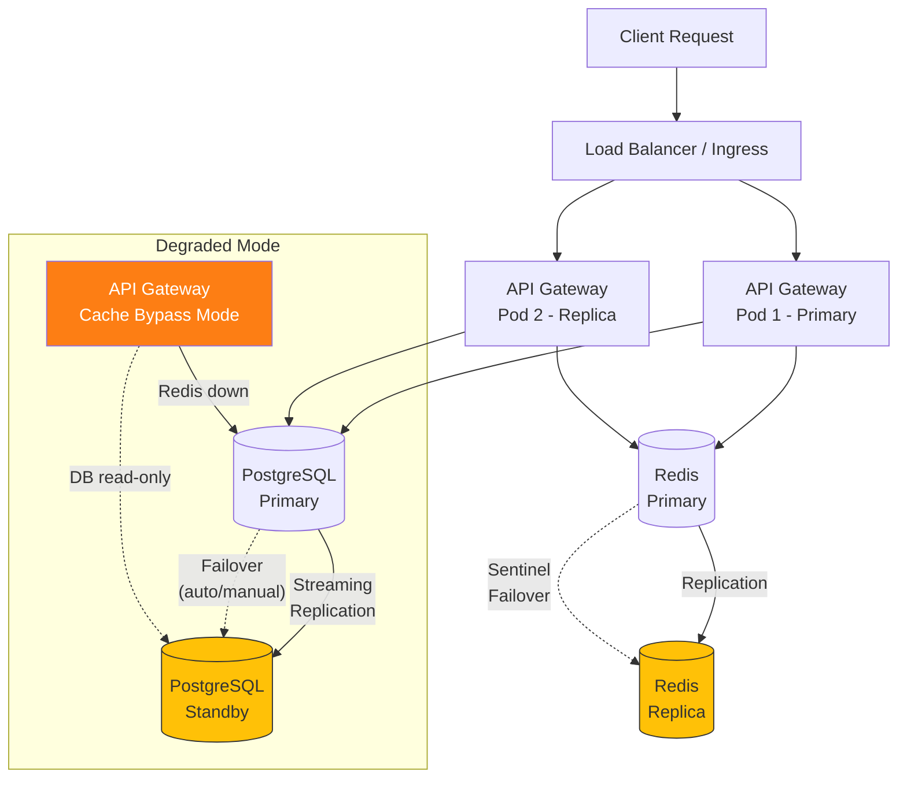
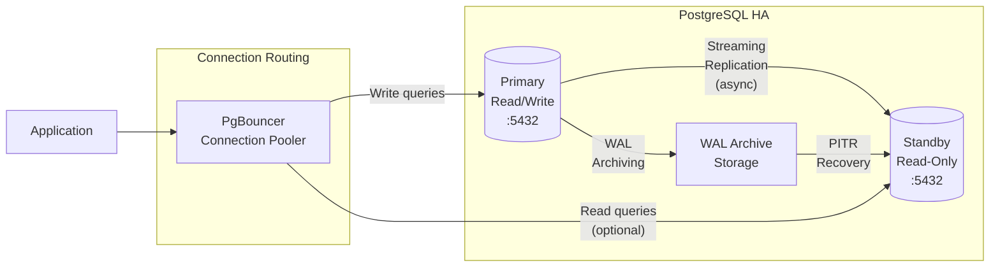

# Resilience Design

<!-- 
  TEMPLATE INSTRUCTIONS (System Designer — VM-2):
  This document defines the resilience architecture for GateForge.
  Every service must have defined circuit breakers, retries, health checks, and failover paths.
  Fill in all [PLACEHOLDER] sections based on architecture decisions and NFR targets.
  Cross-reference: RESILIENCE-SECURITY-GUIDE.md for detailed resilience patterns.
  Cross-reference: monitoring-design.md for alerting on resilience metrics.
  Cross-reference: infrastructure-design.md for HPA and resource allocation.
-->

## Document Metadata

| Field          | Value                                      |
|----------------|--------------------------------------------|
| Document ID    | GF-DES-RES-001                             |
| Version        | [PLACEHOLDER — e.g., 1.0.0]               |
| Owner          | System Designer (VM-2)                     |
| Status         | [PLACEHOLDER — Draft / In Review / Approved] |
| Last Updated   | [PLACEHOLDER — YYYY-MM-DD]                |
| Approved By    | System Architect                           |
| Classification | Internal                                   |

---

## 1. Resilience Patterns Applied

<!-- 
  Catalog every resilience pattern in use across the system.
  Each pattern must have a clear configuration, fallback behavior, and owning service.
  If a pattern is NOT applied to a service, document why.
-->

| Pattern              | Service          | Configuration Summary                       | Fallback Behavior                           |
|----------------------|------------------|---------------------------------------------|---------------------------------------------|
| Circuit Breaker      | API Gateway      | Open after 5 failures in 30s, half-open at 60s | Return cached response or 503 with retry-after |
| Circuit Breaker      | Auth Service     | Open after 3 failures in 15s, half-open at 30s | Reject auth requests, return 503           |
| Retry with Backoff   | API → PostgreSQL | 3 retries, exponential backoff (100ms base)  | Return 503, log failure                    |
| Retry with Backoff   | API → Redis      | 2 retries, exponential backoff (50ms base)   | Bypass cache, read from DB directly        |
| Bulkhead             | API Gateway      | 50 concurrent requests per downstream service | Queue overflow → 429 Too Many Requests     |
| Timeout              | All HTTP calls   | 5s default, 30s for long-running operations  | Abort and return timeout error              |
| Rate Limiting        | API Gateway      | 100 req/s per IP, 1000 req/s global          | 429 response with Retry-After header       |
| Graceful Degradation | Web Frontend     | Feature flags for non-critical features      | Disable feature, show informational banner |
| [PLACEHOLDER]        | [PLACEHOLDER]    | [PLACEHOLDER]                                | [PLACEHOLDER]                              |

## 2. Circuit Breaker Configuration per Service

<!-- 
  Define circuit breaker settings for each service-to-service call.
  These must be tuned based on load testing and production observation.
  Reference: resilience4j or opossum (Node.js) configuration options.
-->

| Service Call              | Timeout | Failure Threshold | Failure Window | Reset Timeout (Half-Open) | Fallback                                    |
|---------------------------|---------|-------------------|----------------|---------------------------|---------------------------------------------|
| API Gateway → Auth Service| 3s      | 5 failures        | 30s            | 60s                       | Return cached auth decision (if available)  |
| API Gateway → PostgreSQL  | 5s      | 3 failures        | 15s            | 30s                       | Return 503 Service Unavailable              |
| API Gateway → Redis       | 2s      | 5 failures        | 30s            | 30s                       | Bypass cache, query DB directly             |
| API Gateway → Worker      | 10s     | 3 failures        | 60s            | 120s                      | Queue request for later processing          |
| Worker → PostgreSQL       | 10s     | 3 failures        | 30s            | 60s                       | Re-queue job with delay                     |
| Worker → Redis            | 2s      | 5 failures        | 30s            | 30s                       | Log warning, continue without cache         |
| [PLACEHOLDER]             | [PLACEHOLDER] | [PLACEHOLDER] | [PLACEHOLDER] | [PLACEHOLDER]            | [PLACEHOLDER]                               |

<!-- 
  Circuit breaker states:
  - CLOSED: Normal operation, requests pass through
  - OPEN: Failures exceeded threshold, requests short-circuited to fallback
  - HALF-OPEN: After reset timeout, allow limited requests to test recovery
-->

## 3. Retry Policy Configuration

<!-- 
  Define retry policies for transient failure handling.
  Always use exponential backoff with jitter to prevent thundering herd.
  Never retry non-idempotent operations unless safe to do so.
-->

| Service Call              | Max Retries | Initial Backoff | Backoff Multiplier | Max Backoff | Jitter   | Retryable Errors                    |
|---------------------------|-------------|-----------------|--------------------|-----------  |----------|-------------------------------------|
| API Gateway → PostgreSQL  | 3           | 100ms           | 2x                 | 2s          | ±50ms    | Connection timeout, connection refused |
| API Gateway → Redis       | 2           | 50ms            | 2x                 | 500ms       | ±25ms    | Connection timeout, READONLY         |
| API Gateway → Auth Service| 2           | 200ms           | 2x                 | 1s          | ±100ms   | 502, 503, 504, ECONNRESET           |
| Worker → PostgreSQL       | 3           | 500ms           | 2x                 | 5s          | ±250ms   | Connection timeout, deadlock detected|
| Worker → External API     | 3           | 1s              | 2x                 | 10s         | ±500ms   | 429, 502, 503, 504                  |
| [PLACEHOLDER]             | [PLACEHOLDER] | [PLACEHOLDER] | [PLACEHOLDER]     | [PLACEHOLDER] | [PLACEHOLDER] | [PLACEHOLDER]                 |

<!-- 
  IMPORTANT: Never retry on 4xx client errors (except 429).
  Never retry POST/PATCH/DELETE unless the operation is idempotent.
  Use idempotency keys for mutation retries where applicable.
-->

## 4. Health Check Design

<!-- 
  Every service must expose liveness, readiness, and startup probes.
  - Liveness: Is the process alive? Restart if not.
  - Readiness: Can the service handle traffic? Remove from LB if not.
  - Startup: Has the service finished initializing? Avoid premature liveness kills.
-->

| Service          | Liveness Path          | Liveness Timeout | Readiness Path          | Readiness Timeout | Startup Probe         | Startup Timeout |
|------------------|------------------------|------------------|-------------------------|-------------------|-----------------------|-----------------|
| API Gateway      | `/health/live`         | 5s (period: 10s) | `/health/ready`         | 5s (period: 10s)  | `/health/startup`     | 60s (period: 5s)|
| Auth Service     | `/health/live`         | 5s (period: 10s) | `/health/ready`         | 5s (period: 10s)  | `/health/startup`     | 30s (period: 5s)|
| Web Frontend     | `/health`              | 3s (period: 15s) | `/health`               | 3s (period: 15s)  | TCP check :3000       | 30s (period: 5s)|
| Worker           | `/health/live`         | 5s (period: 15s) | `/health/ready`         | 5s (period: 10s)  | `/health/startup`     | 60s (period: 5s)|
| PostgreSQL       | `pg_isready`           | 5s (period: 10s) | `pg_isready` + `SELECT 1`| 5s (period: 10s)| TCP check :5432       | 90s (period: 10s)|
| Redis            | `redis-cli ping`       | 3s (period: 10s) | `redis-cli ping`        | 3s (period: 10s)  | TCP check :6379       | 30s (period: 5s)|
| [PLACEHOLDER]    | [PLACEHOLDER]          | [PLACEHOLDER]    | [PLACEHOLDER]           | [PLACEHOLDER]     | [PLACEHOLDER]         | [PLACEHOLDER]   |

### Health Check Implementation Notes

- **Readiness checks** must verify downstream dependencies (DB connection pool, Redis connectivity)
- **Liveness checks** must NOT check downstream dependencies (avoid cascading restarts)
- **Startup probes** prevent premature liveness probe failures during long initialization
- **Failure thresholds**: Liveness = 3 consecutive failures, Readiness = 2 consecutive failures

## 5. Failover Architecture

<!-- 
  Show the primary and secondary paths for each critical data flow.
  The system must degrade gracefully — no single point of failure should 
  cause a complete outage.
-->

### Failover Scenarios

| Scenario                    | Detection Method           | Automatic? | Failover Action                                | Recovery Action                          |
|-----------------------------|----------------------------|------------|------------------------------------------------|------------------------------------------|
| API Gateway pod failure     | Liveness probe failure     | Yes        | K8s restarts pod, LB routes to healthy pods    | Pod auto-restarts                        |
| PostgreSQL primary failure  | Streaming replication lag  | [PLACEHOLDER] | Promote standby to primary              | Rebuild old primary as standby           |
| Redis primary failure       | Sentinel monitoring        | Yes        | Sentinel promotes replica to primary           | Old primary rejoins as replica           |
| Complete namespace failure  | Monitoring alerts          | No         | Manual: redirect traffic to DR environment     | Restore namespace from manifests         |
| Ingress controller failure  | Health check failure       | Yes        | Redundant ingress pod takes over               | Failed pod restarts automatically        |
| [PLACEHOLDER]               | [PLACEHOLDER]              | [PLACEHOLDER] | [PLACEHOLDER]                             | [PLACEHOLDER]                            |

## 6. Database HA Design

### 6.1 PostgreSQL Replication Topology

<!-- 
  Document the replication setup. For single-VM deployments, describe 
  the target HA architecture even if not immediately implemented.
-->

### PostgreSQL HA Configuration

| Parameter                      | Value                    | Notes                                    |
|--------------------------------|--------------------------|------------------------------------------|
| Replication mode               | Streaming (async)        | [PLACEHOLDER — async vs sync trade-off]  |
| Max WAL senders                | 5                        | Supports multiple standbys               |
| WAL keep size                  | 1GB                      | Retain WAL for standby catch-up          |
| Replication slot               | Yes                      | Prevent WAL removal before standby reads |
| Synchronous commit             | off (async) / on (sync)  | [PLACEHOLDER — based on durability needs]|
| Failover tool                  | [PLACEHOLDER — Patroni, pg_auto_failover, manual] |                       |
| [PLACEHOLDER]                  | [PLACEHOLDER]            | [PLACEHOLDER]                            |

### 6.2 Redis Sentinel / Cluster

| Parameter                | Value                    | Notes                                    |
|--------------------------|--------------------------|------------------------------------------|
| Topology                 | [PLACEHOLDER — Sentinel or Cluster] | [PLACEHOLDER]                 |
| Number of sentinels      | 3                        | Quorum for failover decision             |
| Quorum                   | 2                        | Majority required to trigger failover    |
| Down-after-milliseconds  | 5000                     | Time before node considered down         |
| Failover timeout         | 60000                    | Max time for failover process            |
| Min replicas to write    | [PLACEHOLDER]            | Data safety vs availability trade-off    |

## 7. Disaster Recovery Plan

<!-- 
  Define RPO/RTO targets per service tier and the procedures to meet them.
  These targets must align with the SLA defined in operations/.
-->

### 7.1 RPO / RTO Targets

| Service Tier     | Services                      | RPO Target      | RTO Target      | Backup Method                          |
|------------------|-------------------------------|-----------------|-----------------|----------------------------------------|
| Tier 1 (Critical)| API Gateway, Auth Service     | 0 (no data loss)| 5 minutes       | Replicated, multi-pod                  |
| Tier 1 (Critical)| PostgreSQL                    | 1 minute        | 15 minutes      | Streaming replication + WAL archiving  |
| Tier 2 (Important)| Redis                        | 5 minutes       | 10 minutes      | RDB snapshots + AOF                    |
| Tier 2 (Important)| Worker                       | 0 (stateless)   | 5 minutes       | Re-deploy from manifest                |
| Tier 3 (Standard)| Monitoring stack              | 1 hour          | 30 minutes      | Re-deploy from manifests, data rebuilt |
| [PLACEHOLDER]    | [PLACEHOLDER]                 | [PLACEHOLDER]   | [PLACEHOLDER]   | [PLACEHOLDER]                          |

### 7.2 Recovery Procedures

| Scenario                          | Procedure                                                                                  | Estimated Time | Owner           |
|-----------------------------------|--------------------------------------------------------------------------------------------|----------------|-----------------|
| Single pod failure                | Automatic: Kubernetes restarts pod via liveness probe                                      | < 1 min        | Kubernetes      |
| PostgreSQL primary failure        | 1. Verify standby is current 2. Promote standby 3. Update connection strings 4. Rebuild standby | 15 min    | System Designer |
| Complete data loss (PostgreSQL)   | 1. Restore from latest pg_basebackup 2. Replay WAL to target time 3. Verify data integrity | 30–60 min  | System Designer |
| Redis data loss                   | 1. Restart Redis 2. Data repopulated from DB on cache miss (self-healing)                  | 5–10 min       | Automatic       |
| Cluster-wide failure              | 1. Provision new cluster 2. Apply manifests from Git 3. Restore DB from backup 4. Verify   | 1–2 hours      | System Designer |
| [PLACEHOLDER]                     | [PLACEHOLDER]                                                                              | [PLACEHOLDER]  | [PLACEHOLDER]   |

## 8. Chaos Engineering Test Plan

<!-- 
  Define chaos experiments to validate resilience. Start with less destructive 
  tests and progress to more severe scenarios. Never run chaos tests in production
  without safeguards (blast radius limits, auto-abort).
-->

| Test ID  | Scenario                          | Method                                | Target Environment | Frequency     | Acceptance Criteria                                | Blast Radius Limit            |
|----------|-----------------------------------|---------------------------------------|--------------------|--------------|----------------------------------------------------|-------------------------------|
| CHAOS-01 | Kill random API pod               | `kubectl delete pod` (random)         | UAT                | Weekly        | No user-facing errors, traffic shifts in < 10s     | 1 pod at a time               |
| CHAOS-02 | Simulate PostgreSQL latency       | `tc netem delay 500ms` on DB pod      | UAT                | Bi-weekly     | API response time < 2x normal, no timeouts         | DB pod network only           |
| CHAOS-03 | Redis connection failure           | Block port 6379 via NetworkPolicy     | UAT                | Bi-weekly     | API falls back to DB reads, no 500 errors          | Redis namespace only          |
| CHAOS-04 | CPU pressure on API pods          | stress-ng on API pods                 | UAT                | Monthly       | HPA scales up, response time stays < 500ms p99     | API pods only                 |
| CHAOS-05 | DNS resolution failure            | Corrupt CoreDNS configmap temporarily | UAT                | Monthly       | Services retry and recover, circuit breakers trigger | DNS only, 2 min max duration |
| CHAOS-06 | Disk pressure on PostgreSQL       | Fill disk to 90%                      | UAT                | Quarterly     | Alerts fire, autovacuum handles, no data corruption | DB volume only               |
| [PLACEHOLDER] | [PLACEHOLDER]                | [PLACEHOLDER]                         | [PLACEHOLDER]      | [PLACEHOLDER]| [PLACEHOLDER]                                      | [PLACEHOLDER]                |

<!-- 
  Chaos testing rules:
  1. Never run in production without explicit approval and safeguards
  2. Always have a rollback / abort mechanism ready
  3. Monitor during the test — abort if unexpected impact
  4. Document results in the Resilience Test Results Log below
-->

## 9. Rollback Strategy

<!-- REQUIRED: All design documents must include a rollback strategy. -->

| Resilience Change              | Rollback Method                                        | Verification                              |
|--------------------------------|--------------------------------------------------------|-------------------------------------------|
| Circuit breaker config change  | Revert config, redeploy service                        | Verify circuit breaker metrics in Grafana  |
| Health check probe change      | Revert deployment YAML, `kubectl apply`                | Confirm pods pass new probes               |
| Retry policy change            | Revert config, redeploy                                | Load test to verify retry behavior         |
| PostgreSQL replication change  | Revert `postgresql.conf`, reload                       | Check `pg_stat_replication`                |
| Redis topology change          | Revert sentinel config, restart sentinels              | Verify sentinel status                     |
| [PLACEHOLDER]                  | [PLACEHOLDER]                                          | [PLACEHOLDER]                              |

## 10. Security Assessment

<!-- REQUIRED: All design documents must include a security assessment section. -->

| Area                       | Risk Level | Controls                                              | Status        |
|----------------------------|------------|-------------------------------------------------------|---------------|
| Circuit breaker bypass     | Medium     | Server-side enforcement, not configurable by clients   | [PLACEHOLDER] |
| Health check information   | Low        | Health endpoints return minimal info, no debug data    | [PLACEHOLDER] |
| Chaos testing access       | High       | Chaos tools restricted to UAT, RBAC-controlled         | [PLACEHOLDER] |
| Failover credential access | High       | Standby uses same sealed-secrets, auto-rotated         | [PLACEHOLDER] |
| [PLACEHOLDER]              | [PLACEHOLDER] | [PLACEHOLDER]                                      | [PLACEHOLDER] |

## 11. Resilience Test Results Log

<!-- 
  Record every chaos/resilience test result. This is the evidence that 
  resilience controls work as designed. Update after every test.
-->

| Date       | Test ID  | Scenario                    | Result  | Observations                                  | Action Taken                           |
|------------|----------|-----------------------------|---------|-----------------------------------------------|----------------------------------------|
| YYYY-MM-DD | CHAOS-01 | [Example] Kill API pod      | PASS    | Traffic shifted in 8s, no user errors observed | None — within acceptance criteria      |
| YYYY-MM-DD | CHAOS-03 | [Example] Redis failure     | FAIL    | API returned 500 errors for 30s before fallback| Fix: Added cache bypass fallback logic |
| [PLACEHOLDER] | [PLACEHOLDER] | [PLACEHOLDER]        | [PLACEHOLDER] | [PLACEHOLDER]                           | [PLACEHOLDER]                          |

---

<!-- 
  REVIEW CHECKLIST (System Architect):
  [ ] All services have circuit breakers with defined fallbacks
  [ ] Retry policies use exponential backoff with jitter
  [ ] Health checks differentiate liveness vs readiness correctly
  [ ] Failover paths documented for every stateful component
  [ ] Database HA topology supports RPO/RTO targets
  [ ] Disaster recovery procedures are actionable (not just theoretical)
  [ ] Chaos engineering tests cover critical failure modes
  [ ] Rollback strategy documented for all resilience changes
  [ ] Security assessment completed
  [ ] Test results log initialized
  Cross-reference: RESILIENCE-SECURITY-GUIDE.md
  Cross-reference: monitoring-design.md for alerting on resilience metrics
-->
