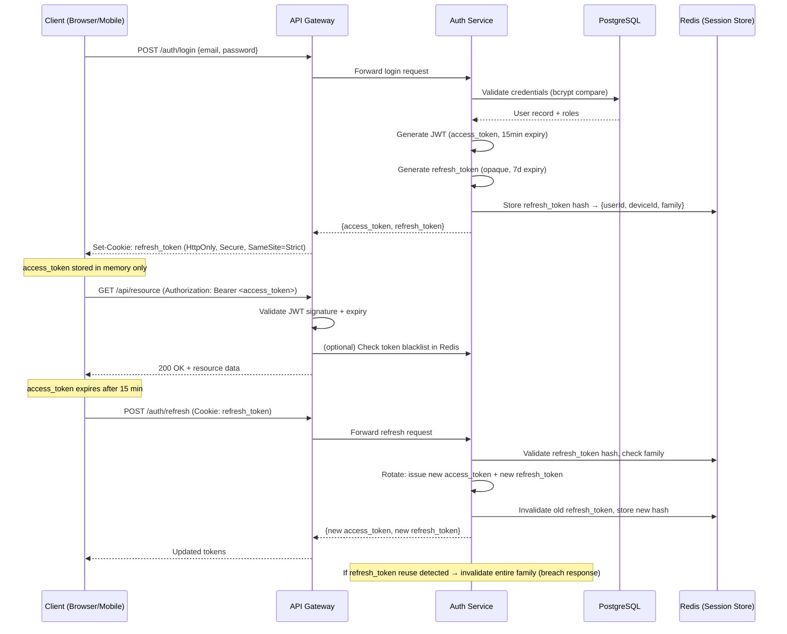
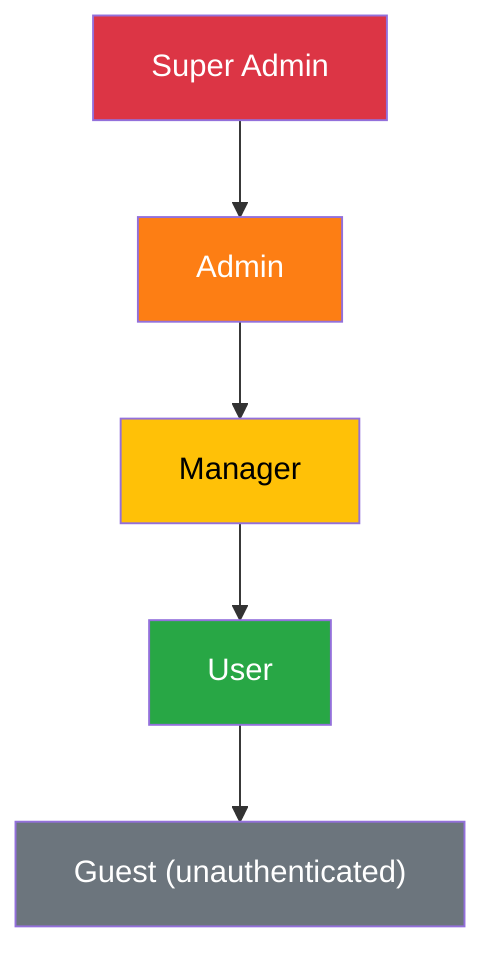
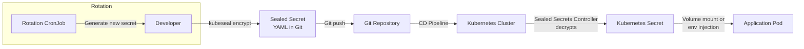
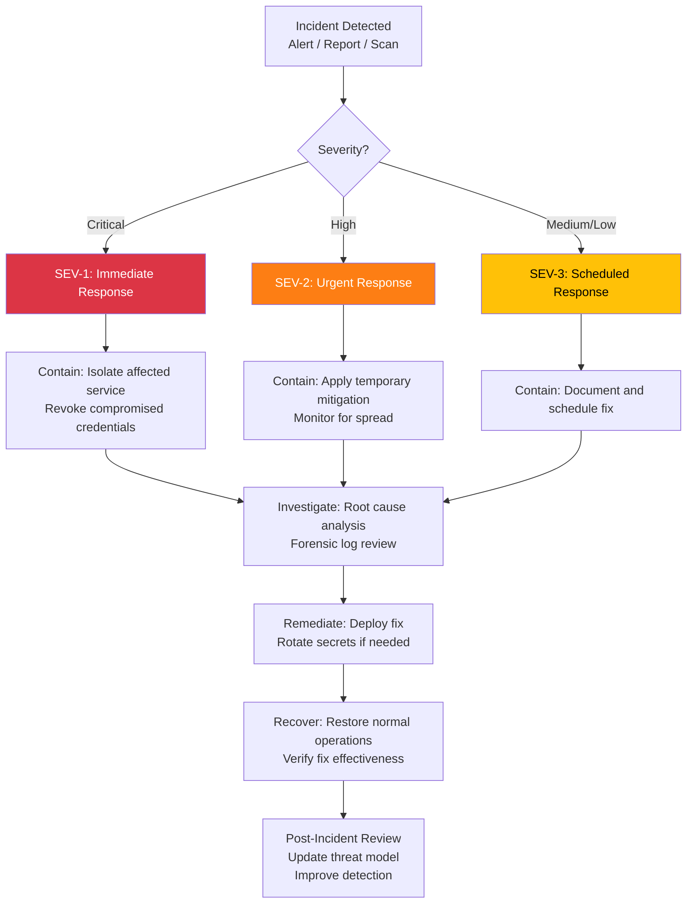

# Security Design

<!-- 
  TEMPLATE INSTRUCTIONS (System Designer — VM-2):
  This document defines the security architecture for GateForge, aligned with OWASP guidelines.
  Fill in all [PLACEHOLDER] sections. Every control must map to a threat from the STRIDE model.
  Cross-reference: RESILIENCE-SECURITY-GUIDE.md for detailed implementation patterns.
  Cross-reference: architecture/system-architecture.md for component inventory.
  Industry standard: OWASP Application Security Verification Standard (ASVS).
-->

## Document Metadata

| Field          | Value                                      |
|----------------|--------------------------------------------|
| Document ID    | GF-DES-SEC-001                             |
| Version        | [PLACEHOLDER — e.g., 1.0.0]               |
| Owner          | System Designer (VM-2)                     |
| Status         | [PLACEHOLDER — Draft / In Review / Approved] |
| Last Updated   | [PLACEHOLDER — YYYY-MM-DD]                |
| Approved By    | System Architect                           |
| Classification | Confidential                               |

---

## 1. Threat Model (STRIDE Analysis)

<!-- 
  Perform STRIDE analysis for each major component. Every identified threat 
  must have a corresponding mitigation. Update whenever new components are added.
  Reference: https://owasp.org/www-community/Threat_Modeling
-->

### 1.1 STRIDE Threat Matrix

| Component        | Threat Category | Threat Description                                    | Likelihood | Impact | Mitigation                                        | Status        |
|------------------|-----------------|-------------------------------------------------------|------------|--------|---------------------------------------------------|---------------|
| API Gateway      | Spoofing        | Attacker impersonates a legitimate user               | High       | High   | JWT validation, refresh token rotation             | [PLACEHOLDER] |
| API Gateway      | Tampering       | Request body manipulation in transit                  | Medium     | High   | TLS 1.3, request signing, input validation        | [PLACEHOLDER] |
| API Gateway      | Repudiation     | User denies performing an action                      | Medium     | Medium | Audit logging with immutable log store             | [PLACEHOLDER] |
| API Gateway      | Info Disclosure | Sensitive data exposed in error responses             | Medium     | High   | Sanitized error responses, no stack traces in prod | [PLACEHOLDER] |
| API Gateway      | DoS             | Rate limit bypass, resource exhaustion                | High       | High   | Rate limiting, request size limits, HPA            | [PLACEHOLDER] |
| API Gateway      | Elevation       | User escalates to admin role                          | Medium     | Critical | RBAC enforcement, JWT claim validation           | [PLACEHOLDER] |
| PostgreSQL       | Spoofing        | Unauthorized database connection                      | Low        | Critical | Network policies, mTLS, connection allow-list    | [PLACEHOLDER] |
| PostgreSQL       | Tampering       | Direct data modification bypassing application        | Low        | Critical | Network isolation, audit triggers, least privilege | [PLACEHOLDER] |
| PostgreSQL       | Info Disclosure | Data exfiltration via SQL injection                   | Medium     | Critical | Parameterized queries, ORM, WAF                  | [PLACEHOLDER] |
| Redis            | Spoofing        | Unauthorized cache access                             | Medium     | Medium | AUTH password, network policies                    | [PLACEHOLDER] |
| Redis            | Info Disclosure | Session data leakage                                  | Medium     | High   | Encryption at rest (if supported), network isolation | [PLACEHOLDER] |
| Auth Service     | Spoofing        | Forged JWT tokens                                     | Medium     | Critical | RSA/ES256 signatures, short expiry, key rotation | [PLACEHOLDER] |
| Auth Service     | Elevation       | Privilege escalation via token manipulation           | Medium     | Critical | Server-side role validation, signed claims        | [PLACEHOLDER] |
| Web Frontend     | Tampering       | XSS injection                                         | High       | High   | CSP headers, output encoding, DOMPurify           | [PLACEHOLDER] |
| CI/CD Pipeline   | Tampering       | Malicious code injection via compromised dependency   | Medium     | Critical | Lockfile pinning, Dependabot, supply chain signing | [PLACEHOLDER] |
| [PLACEHOLDER]    | [PLACEHOLDER]   | [PLACEHOLDER]                                         | [PLACEHOLDER] | [PLACEHOLDER] | [PLACEHOLDER]                          | [PLACEHOLDER] |

## 2. Authentication Architecture

<!-- 
  Document the full authentication flow including JWT issuance, refresh token 
  rotation, and session management. The sequence diagram must show all parties.
-->

### 2.1 JWT + Refresh Token Flow



### 2.2 Token Configuration

| Parameter                  | Value                | Rationale                                    |
|----------------------------|----------------------|----------------------------------------------|
| Access token algorithm     | ES256                | Asymmetric, compact, high security           |
| Access token expiry        | 15 minutes           | Limits exposure window                       |
| Refresh token type         | Opaque (UUID v4)     | Not self-contained, requires server lookup   |
| Refresh token expiry       | 7 days               | Balance between UX and security              |
| Refresh token rotation     | Every use            | Detect token theft via reuse detection       |
| Token family tracking      | Yes                  | Invalidate all tokens on reuse detection     |
| Password hashing           | bcrypt (cost=12)     | [PLACEHOLDER — adjust per hardware]          |
| [PLACEHOLDER]              | [PLACEHOLDER]        | [PLACEHOLDER]                                |

## 3. Authorization Design

<!-- 
  Define the RBAC model: roles, permissions, and how they map to API endpoints.
  The role hierarchy must be enforced server-side, never trust client claims alone.
-->

### 3.1 RBAC Role Hierarchy



<!-- Roles inherit all permissions of roles below them in the hierarchy. -->

### 3.2 Permission Matrix

| Resource           | Guest | User  | Manager | Admin | Super Admin |
|--------------------|-------|-------|---------|-------|-------------|
| View public pages  | R     | R     | R       | R     | R           |
| Own profile        | —     | CRUD  | CRUD    | CRUD  | CRUD        |
| Own resources      | —     | CRUD  | CRUD    | CRUD  | CRUD        |
| Team resources     | —     | R     | CRUD    | CRUD  | CRUD        |
| User management    | —     | —     | R       | CRUD  | CRUD        |
| System settings    | —     | —     | —       | RU    | CRUD        |
| Audit logs         | —     | —     | —       | R     | CRUD        |
| Role assignment    | —     | —     | —       | —     | CRUD        |
| [PLACEHOLDER]      | —     | —     | —       | —     | —           |

<!-- R = Read, C = Create, U = Update, D = Delete, — = No access -->

### 3.3 Endpoint Authorization

| Endpoint Pattern         | Method | Required Role | Additional Guards              |
|--------------------------|--------|---------------|--------------------------------|
| `/api/v1/public/*`       | GET    | Guest         | Rate limiting only             |
| `/api/v1/users/me`       | GET    | User          | —                              |
| `/api/v1/users/:id`      | GET    | Admin         | —                              |
| `/api/v1/admin/*`        | ALL    | Admin         | IP allow-list (Tailscale only) |
| `/api/v1/system/*`       | ALL    | Super Admin   | MFA required                   |
| [PLACEHOLDER]            | [PLACEHOLDER] | [PLACEHOLDER] | [PLACEHOLDER]          |

## 4. Network Security

<!-- 
  Define Kubernetes NetworkPolicy resources. Start with deny-all, then 
  explicitly allow required traffic. Test policies before deploying to production.
-->

### 4.1 Default Deny-All Policy

```yaml
# Apply to every namespace to enforce zero-trust networking
apiVersion: networking.k8s.io/v1
kind: NetworkPolicy
metadata:
  name: default-deny-all
  namespace: gateforge-app  # Apply per namespace
spec:
  podSelector: {}
  policyTypes:
    - Ingress
    - Egress
```

### 4.2 Allow Ingress to API Gateway

```yaml
apiVersion: networking.k8s.io/v1
kind: NetworkPolicy
metadata:
  name: allow-ingress-to-api
  namespace: gateforge-app
spec:
  podSelector:
    matchLabels:
      app: api-gateway
  policyTypes:
    - Ingress
  ingress:
    - from:
        - namespaceSelector:
            matchLabels:
              name: ingress
        - podSelector:
            matchLabels:
              app: ingress-controller
      ports:
        - protocol: TCP
          port: 8080
```

### 4.3 Allow App-to-Database Traffic

```yaml
apiVersion: networking.k8s.io/v1
kind: NetworkPolicy
metadata:
  name: allow-app-to-postgres
  namespace: gateforge-data
spec:
  podSelector:
    matchLabels:
      app: postgresql
  policyTypes:
    - Ingress
  ingress:
    - from:
        - namespaceSelector:
            matchLabels:
              name: gateforge-app
      ports:
        - protocol: TCP
          port: 5432
```

<!-- Add additional NetworkPolicy definitions for each allowed communication path. -->
<!-- [PLACEHOLDER — Add policies for Redis, monitoring scraping, egress rules] -->

## 5. Secrets Management Workflow

<!-- 
  Document how secrets are created, stored, rotated, and accessed.
  No plaintext secrets in Git repositories or ConfigMaps. Ever.
-->

### 5.1 Secrets Management Flow



### 5.2 Secret Inventory

| Secret Name              | Namespace        | Type           | Rotation Frequency | Owner           |
|--------------------------|------------------|----------------|--------------------|-----------------|
| `pg-credentials`         | `gateforge-data` | Opaque         | 90 days            | System Designer |
| `redis-auth`             | `gateforge-data` | Opaque         | 90 days            | System Designer |
| `jwt-signing-key`        | `gateforge-app`  | Opaque (RSA)   | 30 days            | System Designer |
| `tls-cert`               | `ingress`        | kubernetes.io/tls | Auto (cert-manager) | cert-manager |
| `ghcr-pull-secret`       | `gateforge-app`  | docker-registry | 365 days          | System Designer |
| [PLACEHOLDER]            | [PLACEHOLDER]    | [PLACEHOLDER]  | [PLACEHOLDER]      | [PLACEHOLDER]   |

## 6. TLS Configuration

<!-- 
  Enforce TLS 1.3 everywhere. Document certificate management, renewal,
  and the chain of trust.
-->

### 6.1 TLS Policy

| Parameter                  | Value                          | Notes                                |
|----------------------------|--------------------------------|--------------------------------------|
| Minimum TLS version        | TLS 1.3                        | TLS 1.2 disabled; no legacy support  |
| Cipher suites              | TLS_AES_256_GCM_SHA384, TLS_CHACHA20_POLY1305_SHA256 | AEAD only       |
| Certificate provider       | Let's Encrypt (Production)     | via cert-manager                     |
| Certificate renewal        | Auto-renew at 30 days before expiry | cert-manager default          |
| HSTS                       | `max-age=31536000; includeSubDomains; preload` | Enforce HTTPS       |
| OCSP Stapling              | Enabled                        | Reduce client-side latency           |
| Internal mTLS              | [PLACEHOLDER — e.g., via service mesh or manual certs] | Service-to-service |

### 6.2 Certificate Rotation Procedure

1. cert-manager monitors certificate expiry
2. At 30 days before expiry, cert-manager requests renewal from Let's Encrypt
3. New certificate is stored as Kubernetes Secret
4. Ingress controller picks up new certificate automatically (no downtime)
5. **Manual rotation** (emergency): [PLACEHOLDER — document emergency cert replacement]

## 7. Security Headers Checklist

<!-- 
  Apply these headers via the ingress controller or application middleware.
  Verify with https://securityheaders.com after deployment.
-->

| Header                          | Value                                                       | Purpose                               | Status        |
|---------------------------------|-------------------------------------------------------------|---------------------------------------|---------------|
| `Content-Security-Policy`       | `default-src 'self'; script-src 'self'; style-src 'self' 'unsafe-inline'; img-src 'self' data:; connect-src 'self' https://api.gateforge.example.com` | Prevent XSS, data injection | [PLACEHOLDER] |
| `X-Content-Type-Options`        | `nosniff`                                                   | Prevent MIME sniffing                 | [PLACEHOLDER] |
| `X-Frame-Options`               | `DENY`                                                      | Prevent clickjacking                  | [PLACEHOLDER] |
| `X-XSS-Protection`              | `0`                                                         | Disabled (CSP is preferred)           | [PLACEHOLDER] |
| `Strict-Transport-Security`     | `max-age=31536000; includeSubDomains; preload`             | Force HTTPS                           | [PLACEHOLDER] |
| `Referrer-Policy`               | `strict-origin-when-cross-origin`                           | Control referrer information          | [PLACEHOLDER] |
| `Permissions-Policy`            | `camera=(), microphone=(), geolocation=()`                  | Restrict browser features             | [PLACEHOLDER] |
| `Cache-Control`                 | `no-store` (for API), `public, max-age=31536000` (for static) | Appropriate caching             | [PLACEHOLDER] |
| [PLACEHOLDER]                   | [PLACEHOLDER]                                               | [PLACEHOLDER]                         | [PLACEHOLDER] |

## 8. Input Validation Strategy

<!-- 
  Define validation rules per service. Use allowlisting over denylisting.
  Validate on both client and server; server validation is the source of truth.
-->

### 8.1 Validation Approach per Service

| Service        | Validation Layer    | Library / Mechanism          | Rules                                                     |
|----------------|---------------------|------------------------------|-----------------------------------------------------------|
| Web Frontend   | Client-side         | Zod / React Hook Form        | Type checking, format validation, length limits           |
| API Gateway    | Server-side (NestJS)| class-validator + class-transformer | DTO validation, whitelist properties, strip unknown |
| Auth Service   | Server-side         | class-validator              | Email format, password complexity, token format            |
| Database       | Constraint-level    | PostgreSQL CHECK, NOT NULL   | Data integrity as last line of defense                     |
| [PLACEHOLDER]  | [PLACEHOLDER]       | [PLACEHOLDER]                | [PLACEHOLDER]                                             |

### 8.2 Common Validation Rules

| Field Type      | Max Length | Pattern                         | Sanitization                       |
|-----------------|------------|----------------------------------|------------------------------------|
| Email           | 254        | RFC 5322 compliant               | Lowercase, trim                    |
| Password        | 128        | Min 12 chars, 1 upper, 1 lower, 1 digit, 1 special | bcrypt hash (never log) |
| Username        | 32         | `^[a-zA-Z0-9_-]+$`              | Trim                               |
| Free text       | 10,000     | UTF-8                            | HTML encode on output              |
| UUID            | 36         | `^[0-9a-f]{8}-...-[0-9a-f]{12}$`| Strict format validation           |
| URL             | 2,048      | HTTPS only, allowlisted domains  | URL encode                         |
| [PLACEHOLDER]   | [PLACEHOLDER] | [PLACEHOLDER]               | [PLACEHOLDER]                      |

## 9. Dependency Vulnerability Management

<!-- 
  Define the process for scanning, triaging, and remediating dependency vulnerabilities.
  Automated scanning must run on every CI pipeline execution.
-->

| Aspect               | Configuration                                              |
|----------------------|------------------------------------------------------------|
| Scanning Tool        | [PLACEHOLDER — e.g., Dependabot, Snyk, Trivy]             |
| Scan Frequency       | Every PR + daily scheduled scan on main branch             |
| Container Scanning   | Trivy on every Docker image build                          |
| SAST                 | [PLACEHOLDER — e.g., CodeQL, Semgrep]                      |
| SCA                  | [PLACEHOLDER — e.g., npm audit, Snyk]                      |
| License Compliance   | [PLACEHOLDER — e.g., FOSSA, license-checker]               |

### Response SLA

| Severity   | Response Time | Remediation Time | Escalation                         |
|------------|---------------|------------------|------------------------------------|
| Critical   | 4 hours       | 24 hours         | Immediate patch, page System Architect |
| High       | 24 hours      | 7 days           | Prioritize in current iteration    |
| Medium     | 72 hours      | 30 days          | Add to backlog                     |
| Low        | 1 week        | 90 days          | Schedule in future iteration       |

## 10. Penetration Test Schedule and Scope

<!-- 
  Define when and what will be tested. Penetration tests should occur before 
  major releases and on a regular cadence.
-->

| Test Type           | Scope                                        | Frequency       | Performed By    | Last Performed |
|---------------------|----------------------------------------------|-----------------|-----------------|----------------|
| External pen test   | Public-facing APIs, web application          | Quarterly       | [PLACEHOLDER]   | [PLACEHOLDER]  |
| Internal pen test   | Internal services, Kubernetes cluster        | Semi-annually   | [PLACEHOLDER]   | [PLACEHOLDER]  |
| Automated DAST      | All HTTP endpoints                           | Every release   | OWASP ZAP       | [PLACEHOLDER]  |
| Social engineering  | Phishing simulation, credential stuffing     | Annually        | [PLACEHOLDER]   | [PLACEHOLDER]  |
| [PLACEHOLDER]       | [PLACEHOLDER]                                | [PLACEHOLDER]   | [PLACEHOLDER]   | [PLACEHOLDER]  |

### Scope Inclusions

- [PLACEHOLDER — List all in-scope targets, endpoints, and infrastructure]

### Scope Exclusions

- [PLACEHOLDER — List out-of-scope items, e.g., third-party SaaS, production data]

## 11. Security Incident Response Plan

<!-- 
  Define the escalation path and response procedures for security incidents.
  All team members must be familiar with this flow.
-->

### 11.1 Escalation Flow



### 11.2 Incident Response Roles

| Role                   | Responsibility                                    | Contact             |
|------------------------|---------------------------------------------------|---------------------|
| Incident Commander     | Coordinates response, makes escalation decisions  | [PLACEHOLDER]       |
| Technical Lead         | Investigates root cause, implements fix            | [PLACEHOLDER]       |
| Communications Lead    | Stakeholder notification, status page updates      | [PLACEHOLDER]       |
| [PLACEHOLDER]          | [PLACEHOLDER]                                     | [PLACEHOLDER]       |

### 11.3 Response Time Targets

| Severity | Detection Target | Containment Target | Resolution Target | Communication Cadence |
|----------|------------------|--------------------|-------------------|-----------------------|
| SEV-1    | < 5 min          | < 30 min           | < 4 hours         | Every 30 min          |
| SEV-2    | < 15 min         | < 2 hours          | < 24 hours        | Every 2 hours         |
| SEV-3    | < 1 hour         | < 24 hours         | < 7 days          | Daily                 |

## 12. Security Assessment Log

<!-- 
  REQUIRED: Record all security assessments, reviews, and findings here.
  This is the audit trail for security posture changes over time.
-->

| Date       | Scope                          | Findings                                   | Severity | Remediation Status                     |
|------------|--------------------------------|--------------------------------------------|----------|----------------------------------------|
| YYYY-MM-DD | [Example] JWT implementation   | Refresh token not rotated on each use      | High     | Fixed — rotation implemented in v1.2.0 |
| YYYY-MM-DD | [Example] Container images     | 3 high CVEs in base image dependencies     | High     | Patched — upgraded to node:20.11-alpine|
| YYYY-MM-DD | [Example] Network policies     | Redis accessible from monitoring namespace | Medium   | Fixed — added deny policy              |
| [PLACEHOLDER] | [PLACEHOLDER]              | [PLACEHOLDER]                              | [PLACEHOLDER] | [PLACEHOLDER]                    |

---

<!-- 
  REVIEW CHECKLIST (System Architect):
  [ ] STRIDE analysis covers all components
  [ ] Authentication flow includes token rotation and breach detection
  [ ] RBAC model matches business requirements
  [ ] NetworkPolicies enforce zero-trust networking
  [ ] Secrets management uses sealed-secrets or vault (no plaintext)
  [ ] TLS 1.3 enforced, certificates auto-rotated
  [ ] All security headers configured and verified
  [ ] Input validation defined for all services
  [ ] Dependency scanning integrated into CI/CD
  [ ] Incident response plan reviewed and tested
  [ ] Security assessment log initialized
  Cross-reference: RESILIENCE-SECURITY-GUIDE.md
-->
