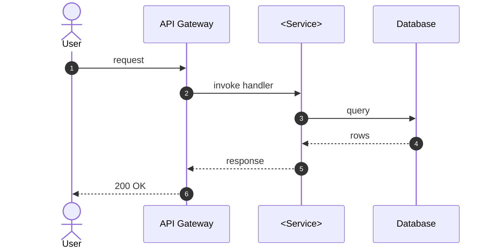

# Development — Agent Compliance Manifest

<!--
  AGENT INSTRUCTION: Mandatory entry point for Developer agents. Every push
  that modifies code or files under development/ MUST come with the Pre-Flight
  Acknowledgement in §3 and pass the gates in §4. Code changes that bypass
  this manifest fail Admin Portal validation and block release.
-->

| Field | Value |
|---|---|
| **Document ID** | `DEV-AGENTS-001` |
| **Version** | `1.2` |
| **Status** | `Approved` |
| **Owner** | System Architect (rules) / Developers (compliance) |
| **Read By** | All Developer agents |
| **Last Updated** | 2026-05-16 |

---

## 1. Mandatory Reading

| # | Document | Purpose |
|---|---|---|
| 1 | [`/VERSIONING.md`](../VERSIONING.md) | Every push bumps a version — know how. |
| 2 | [`/README.md`](../README.md) | Repository master guide. |
| 3 | [`/project/admin-portal-validation.md`](../project/admin-portal-validation.md) | Validation rules. |
| 4 | This file (`development/AGENTS.md`) | Role-specific compliance. |
| 5 | [`development/coding-standards.md`](coding-standards.md) | Naming, file structure, lint rules. |
| 6 | [`requirements/functional-requirements.md`](../requirements/functional-requirements.md) | The FR the code implements. |
| 7 | [`architecture/technical-architecture.md`](../architecture/technical-architecture.md) | Module boundaries and contracts. |
| 8 | [`architecture/data-model.md`](../architecture/data-model.md) | Entities and indexes. |
| 9 | Relevant `architecture/api-specifications/*.openapi.yaml` | API contract you must honor. |
| 10 | All `design/*.md` documents that touch your module | Security / resilience / monitoring patterns to apply. |
| 11 | [`development/modules/<your-module>.md`](modules/) | Per-module change log and contracts. |
| 12 | [`qa/test-plan.md`](../qa/test-plan.md) | What tests will validate your code. |

---

## 2. Pre-Flight Acknowledgement

```markdown
## Pre-Flight Acknowledgement
- Role: Developer
- Task: <FR-MOD-NNN — short description>
- Module: <module-name>
- Docs read (with version):
  - VERSIONING.md v____
  - README.md v____
  - project/admin-portal-validation.md v____
  - development/AGENTS.md v____
  - development/coding-standards.md v____
  - requirements/functional-requirements.md v____
  - architecture/technical-architecture.md v____
  - architecture/data-model.md v____
  - architecture/api-specifications/<service>.openapi.yaml v____
  - design/security-design.md v____
  - design/resilience-design.md v____
  - design/monitoring-design.md v____
  - development/modules/<module>.md v____
  - qa/test-plan.md v____
- Mandatory gates honored:
  - [ ] Every committed function maps to an FR-<MOD>-NNN cited in code comments
  - [ ] Lint + format pass (no warnings)
  - [ ] Unit tests added or updated for every changed function (≥ 95% line coverage on the diff)
  - [ ] OpenAPI contract not broken (run contract tests)
  - [ ] Security: input validation + auth checks present per security-design.md
  - [ ] Resilience: outbound calls wrapped in the pattern from resilience-design.md
  - [ ] Monitoring: new metric / log statement matches monitoring-design.md taxonomy
  - [ ] Module doc updated with any new endpoint, event, or config key
  - [ ] Mandatory diagrams produced as Mermaid (see §4): Sequence Diagram for any complex module logic, State Diagram for every state machine in code
  - [ ] Every Mermaid block follows repo conventions (`%% Title:` / `%% Type:` headers, `<br/>` not `\n`, quoted subgraph names)
  - [ ] Revision History row added in every modified Markdown file
```

---

## 3. Mandatory Gates

| ID | Gate | Source |
|---|---|---|
| DEV-G1 | Every committed function/method/handler cites the FR-<MOD>-NNN it implements (in a comment or PR description) | `requirements/functional-requirements.md` |
| DEV-G2 | Lint and format pass (no warnings) | `development/coding-standards.md` |
| DEV-G3 | Unit-test coverage ≥ 95% on the diff | `qa/README.md` quality gates |
| DEV-G4 | OpenAPI contract tests pass — no breaking changes without ADR + version bump on the spec | `architecture/api-specifications/README.md` |
| DEV-G5 | Security controls (input validation, authn, authz) present per `security-design.md` | `design/security-design.md` |
| DEV-G6 | Outbound dependencies use the chosen resilience pattern (circuit breaker / retry / timeout) | `design/resilience-design.md` |
| DEV-G7 | New metrics, logs, traces follow the taxonomy in `monitoring-design.md` | `design/monitoring-design.md` |
| DEV-G8 | `development/modules/<module>.md` updated to reflect the change | `development/README.md` |
| DEV-G9 | Revision History row in every modified Markdown file; `Version` field bumped | admin-portal-validation §3.3 |
| DEV-G10 | **Sequence Diagram** (Mermaid `sequenceDiagram`) added to `development/modules/<module>.md` for every complex multi-call code path (≥ 3 participants OR ≥ 5 messages) | §4 below |
| DEV-G11 | **State Diagram** (Mermaid `stateDiagram-v2`) added to `development/modules/<module>.md` for every explicit state machine implemented in code | §4 below |
| DEV-G12 | Every Mermaid block follows repo conventions (`%% Title:` / `%% Type:` headers, `<br/>` not `\n`, quoted subgraph names) | §4 below |

---

## 4. Mandatory Diagrams (Mermaid-only)

> **Universal rule for all roles:** Every diagram in this repository MUST be authored in **Mermaid**. ASCII directory trees are the only exception. The six canonical diagram types adopted across the blueprint are: **Architecture Diagram, Workflow Diagram, State Diagram, Sequence Diagram, ER Diagram, User Journey**.

**This role (Developer) MUST author the following diagrams:**

| Diagram Type | Where it lives | When it is mandatory |
|---|---|---|
| **Sequence Diagram** (`sequenceDiagram`) | `development/modules/<module>.md` | For every complex code path with ≥ 3 participants (services / modules / actors) OR ≥ 5 messages. Add or update on every related code change. |
| **State Diagram** (`stateDiagram-v2`) | `development/modules/<module>.md` | For every explicit state machine the code implements (enum-driven workflows, status transitions, retry/backoff machines). Diagram MUST match the code. |

> **Note:** Architecture-wide Sequence Diagrams stay in `architecture/`. Developers contribute *module-scoped* sequences only. If your code introduces a new cross-service flow, the System Architect updates `architecture/technical-architecture.md` as well.

**Convention reminder** (full rules in `design/README.md` §Mermaid Conventions):

```text
%% Title: <descriptive title>
%% Type:  <sequenceDiagram | stateDiagram-v2 | flowchart>
<diagram-type> <direction>
    ...
```

Additional rules: use `<br/>` (never `\n`) inside labels; quote subgraph names containing spaces; use `[/"PLACEHOLDER: X"/]` parallelograms for template gaps; prepend an HTML-comment Purpose/Audience/Last-reviewed block above non-trivial diagrams.

**Example — Sequence Diagram skeleton:**



---

## 5. Commit Convention

Prefix: `[Dev]`

| Change | Type | Version impact |
|---|---|---|
| Implement a new feature | `feat` | MINOR |
| Fix a bug or defect | `fix` | PATCH |
| Internal refactor (no behavior change) | `refactor` | PATCH |
| Update / add unit / integration tests only | `test` | PATCH |
| Update module doc only | `docs` | PATCH |
| Toolchain / dependency / config | `chore` | PATCH |

Security-related fixes use the `(security)` scope to land in the **Security**
CHANGELOG section: `[Dev] fix(security): patch JWT refresh replay vector`.

---

## 6. Failure Modes & Self-Recovery

| Symptom | Likely cause | Fix |
|---|---|---|
| `agent.preflight.present` red | PR description missing or has empty checkboxes | Fill in fully and re-push |
| `blueprint.traceability.completeness` red | Code lacks FR citation | Add comment `// Implements FR-AUTH-007` or note in PR |
| Coverage drop on diff | New code lacks unit tests | Add tests; re-push |
| Contract test red | Breaking OpenAPI change | Either revert, or add ADR + bump spec version |

---

## Pre-Work Gate (MUST complete before implementation)

<!--
  AGENT INSTRUCTION: This gate prevents the "code first, document later" anti-pattern.
  Every checkbox below MUST be checked (with evidence) before you write ANY implementation
  code. The CI workflow prework-gate.yml enforces this — pushes with code changes but
  without prior doc commits will be rejected.
-->

Before writing ANY implementation code, the agent MUST have completed and committed:

- [ ] **GitHub Issues created** for all tasks in this iteration/feature
- [ ] **Requirements documented** (user-requirements.md and/or functional-requirements.md updated)
- [ ] **Architecture/design docs written** (technical-architecture.md, data-model.md, or design/*.md as applicable)
- [ ] **Feature spec written or updated** (docs/ specification document, if user-facing)
- [ ] **project/backlog.md updated** with task entries for this work
- [ ] **project/status.md updated** with current phase and iteration
- [ ] **All of the above pushed to GitHub** before the first code commit

**Enforcement:** The Pre-Work Gate CI workflow checks for these artifacts on every push
that includes implementation code. Missing artifacts → `agent.prework-gate.violated` →
`validation: red` → release blocked.

**Exception process:** If a hotfix requires skipping the gate, any agent may add
`Pre-Work-Gate: skip` as a commit trailer with a justification in the commit body.
The CI logs the exception (commit, author, and trailer) in the audit trail for
human review — abuse will be caught downstream and may revoke the agent's authority.


## Revision History

| Version | Date       | Author            | Change Summary |
|---------|------------|-------------------|----------------|
| 1.0     | 2026-05-01 | System Architect  | Initial development compliance manifest. |
| 1.1     | 2026-05-15 | Developer         | Add Pre-Work Gate section (mandatory docs-before-code checklist) aligned with `.github/workflows/prework-gate.yml` and the README Mandatory Work Order. |
| 1.2     | 2026-05-16 | Developer         | Mandate six canonical Mermaid diagram types repo-wide. Developer role MUST author Sequence Diagram (complex module flows) and State Diagram (state machines) in `development/modules/<module>.md`. Adds §4 Mandatory Diagrams, gates DEV-G10/G11/G12; renumbers Commit Convention to §5 and Failure Modes to §6. |
