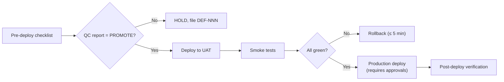

# Operations — Agent Compliance Manifest

<!--
  AGENT INSTRUCTION: Mandatory entry point for the Operator agent (VM-5).
  Every push that modifies operations/ — including deployment-log entries,
  ops-log entries, incident reports, SLA tracking — MUST come with the
  Pre-Flight Acknowledgement in §3 and pass the gates in §4.

  Special rule: per /VERSIONING.md, EVERY deployment to ANY environment
  (Dev / UAT / Production) starts with a GitHub push. Local-only or
  out-of-band deployments are prohibited.
-->

| Field | Value |
|---|---|
| **Document ID** | `OPS-AGENTS-001` |
| **Version** | `1.2` |
| **Status** | `Approved` |
| **Owner** | Operator (VM-5) |
| **Read By** | Operator agents |
| **Last Updated** | 2026-05-16 |

---

## 1. Mandatory Reading

| # | Document | Purpose |
|---|---|---|
| 1 | [`/VERSIONING.md`](../VERSIONING.md) | Every deployment is a versioned event tracked in GitHub. |
| 2 | [`/README.md`](../README.md) | Master guide. |
| 3 | [`/project/admin-portal-validation.md`](../project/admin-portal-validation.md) | Validation rules. |
| 4 | This file (`operations/AGENTS.md`) | Role-specific compliance. |
| 5 | [`operations/README.md`](README.md) | Operations directory overview. |
| 6 | [`operations/deployment-runbook.md`](deployment-runbook.md) | Step-by-step deploy procedures. |
| 7 | [`operations/sla-slo-tracking.md`](sla-slo-tracking.md) | SLI / SLO / SLA targets. |
| 8 | [`operations/audit-evidence.md`](audit-evidence.md) | Audit log handling. |
| 9 | [`operations/healthcare-readiness.md`](healthcare-readiness.md) | PHI / BAA / residency overlay (if in scope). |
| 10 | [`design/infrastructure-design.md`](../design/infrastructure-design.md) | Infra topology. |
| 11 | [`design/monitoring-design.md`](../design/monitoring-design.md) | Dashboards and alerts. |
| 12 | [`design/resilience-design.md`](../design/resilience-design.md) | Rollback strategy is grounded here. |
| 13 | Latest [`project/release-evidence-pack.md`](../project/release-evidence-pack.md) for the release being deployed | Release pre-conditions. |
| 14 | The QC test report for this release (`qa/reports/TEST-REPORT-ITER-NNN-*.md`) | PROMOTE/HOLD/ROLLBACK signal from QC. |

---

## 2. Pre-Flight Acknowledgement (top of every deployment-log and incident-report entry)

```markdown
## Pre-Flight Acknowledgement
- Role: Operator (VM-5)
- Task: Deploy v____ to <Dev|UAT|Prod>  |  Incident response  |  Ops-log entry
- Docs read (with version):
  - VERSIONING.md v____
  - README.md v____
  - project/admin-portal-validation.md v____
  - operations/AGENTS.md v____
  - operations/deployment-runbook.md v____
  - operations/sla-slo-tracking.md v____
  - operations/audit-evidence.md v____
  - operations/healthcare-readiness.md v____
  - design/infrastructure-design.md v____
  - design/monitoring-design.md v____
  - design/resilience-design.md v____
  - project/release-evidence-pack.md (entry for v____) v____
  - qa/reports/<latest test report> v____
- Mandatory gates honored:
  - [ ] OPS-G1  Source pushed to GitHub before any deploy step
  - [ ] OPS-G2  VERSION file matches the release tag
  - [ ] OPS-G3  Pre-deployment checklist (deployment-runbook §1) all green
  - [ ] OPS-G4  QC report for this release shows PROMOTE
  - [ ] OPS-G5  Production deploys: Architect + End-user approvals recorded
  - [ ] OPS-G6  Rollback procedure verified executable in < 5 min
  - [ ] OPS-G7  Post-deploy verification (deployment-runbook §5) all green
  - [ ] OPS-G8  deployment-log.md and operation-log.md entries committed
  - [ ] OPS-G9  SLA/SLO impact recorded in sla-slo-tracking.md
  - [ ] OPS-G10 No secrets / real PHI / real PII in any committed file
  - [ ] OPS-G13 Mandatory diagrams produced as Mermaid (see §4): Workflow Diagram for every runbook, State Diagram for incident lifecycle
  - [ ] OPS-G14 Every Mermaid block follows repo conventions (`%% Title:` / `%% Type:` headers, `<br/>` not `\n`, quoted subgraph names)
```

---

## 3. Mandatory Gates

| ID | Gate | Source |
|---|---|---|
| OPS-G1 | **Every change is in GitHub before deploy** — no local-only patches; the deploy must reference a commit SHA already on origin | `/VERSIONING.md` |
| OPS-G2 | The `VERSION` file content matches the git tag and the image tag being deployed | `/VERSIONING.md` |
| OPS-G3 | Pre-deployment checklist (`deployment-runbook.md` §1) — every item ticked | `operations/deployment-runbook.md` |
| OPS-G4 | QC test report for the release shows **PROMOTE** | `qa/README.md` §6 |
| OPS-G5 | Production deploys require both Architect and End-user approvals recorded in deployment-runbook §4.1 | `operations/deployment-runbook.md` §4 |
| OPS-G6 | Rollback procedure verified executable within 5 minutes | `operations/deployment-runbook.md` §6 |
| OPS-G7 | Post-deployment verification checklist all green | `operations/deployment-runbook.md` §5 |
| OPS-G8 | `deployment-log.md` and `operation-log.md` entries committed in the same push | `operations/README.md` |
| OPS-G9 | SLA/SLO impact recorded — error budget consumption updated | `operations/sla-slo-tracking.md` |
| OPS-G10 | No secrets / real PHI / real PII in any committed file | admin-portal-validation §5.2 |
| OPS-G11 | If healthcare scope: BAA register, audit-export evidence, and PHI flow updated when relevant | `operations/healthcare-readiness.md` |
| OPS-G12 | Revision History rows added in every modified Markdown file | admin-portal-validation §3.3 |
| OPS-G13 | **Workflow Diagram** (Mermaid `flowchart`) present and current for every runbook in `operations/deployment-runbook.md` and `operations/incident-reports/README.md` | §4 below |
| OPS-G14 | **State Diagram** (Mermaid `stateDiagram-v2`) present for the incident lifecycle in `operations/incident-reports/README.md` | §4 below |
| OPS-G15 | Every Mermaid block follows repo conventions (`%% Title:` / `%% Type:` headers, `<br/>` not `\n`, quoted subgraph names) | §4 below |

---

## 4. Mandatory Diagrams (Mermaid-only)

> **Universal rule for all roles:** Every diagram in this repository MUST be authored in **Mermaid**. ASCII directory trees are the only exception. The six canonical diagram types adopted across the blueprint are: **Architecture Diagram, Workflow Diagram, State Diagram, Sequence Diagram, ER Diagram, User Journey**.

**This role (Operator) MUST author the following diagrams:**

| Diagram Type | Where it lives | When it is mandatory |
|---|---|---|
| **Workflow Diagram** (`flowchart`) | `operations/deployment-runbook.md`, `operations/incident-reports/README.md` | One per runbook (deploy, rollback, failover, restore, scaling) and one for the incident-response top-level flow. Kept current with every runbook revision. |
| **State Diagram** (`stateDiagram-v2`) | `operations/incident-reports/README.md` | One for the incident lifecycle (Detected → Triaged → Mitigated → Resolved → Post-mortem). |

**Convention reminder** (full rules in `design/README.md` §Mermaid Conventions):

```text
%% Title: <descriptive title>
%% Type:  <flowchart | stateDiagram-v2>
<diagram-type> <direction>
    ...
```

Additional rules: use `<br/>` (never `\n`) inside labels; quote subgraph names containing spaces; use `[/"PLACEHOLDER: X"/]` parallelograms for template gaps; prepend an HTML-comment Purpose/Audience/Last-reviewed block above non-trivial diagrams.

**Example — Deployment runbook Workflow skeleton:**



---

## 5. Commit Convention

Prefix: `[Ops]`

| Change | Type | Version impact |
|---|---|---|
| Deployment event | `deploy` | PATCH |
| Runbook content addition (new procedure / new env) | `feat` | MINOR |
| Runbook fix (correct command / fix typo in steps) | `fix` | PATCH |
| Operational log entry (routine maintenance) | `chore` | PATCH |
| Incident report | `fix` | PATCH (or MINOR if it introduces a permanent procedure change) |
| SLA/SLO target change | `feat` | MINOR |

---

## 6. Failure Modes & Self-Recovery

| Symptom | Likely cause | Fix |
|---|---|---|
| Deploy attempted without GitHub push | Operator skipped step | **STOP**. Push first. Re-deploy from the pushed SHA. |
| `OPS-G2` red — VERSION ≠ tag | Manual edit to VERSION | Forbidden — see VERSIONING.md. Revert and let CI bump. |
| QC report shows HOLD or ROLLBACK | Trying to deploy a non-PROMOTED release | Do not deploy. File defects, request new test cycle. |
| Production deploy missing approvals | OPS-G5 violated | Stop and obtain approvals; record in runbook §4.1. |

---

## Pre-Work Gate (MUST complete before implementation)

<!--
  AGENT INSTRUCTION: This gate prevents the "code first, document later" anti-pattern.
  Every checkbox below MUST be checked (with evidence) before you write ANY implementation
  code. The CI workflow prework-gate.yml enforces this — pushes with code changes but
  without prior doc commits will be rejected.
-->

Before writing ANY implementation code, the agent MUST have completed and committed:

- [ ] **GitHub Issues created** for all tasks in this iteration/feature
- [ ] **Requirements documented** (user-requirements.md and/or functional-requirements.md updated)
- [ ] **Architecture/design docs written** (technical-architecture.md, data-model.md, or design/*.md as applicable)
- [ ] **Feature spec written or updated** (docs/ specification document, if user-facing)
- [ ] **project/backlog.md updated** with task entries for this work
- [ ] **project/status.md updated** with current phase and iteration
- [ ] **All of the above pushed to GitHub** before the first code commit

**Enforcement:** The Pre-Work Gate CI workflow checks for these artifacts on every push
that includes implementation code. Missing artifacts → `agent.prework-gate.violated` →
`validation: red` → release blocked.

**Exception process:** If a hotfix requires skipping the gate, any agent may add
`Pre-Work-Gate: skip` as a commit trailer with a justification in the commit body.
The CI logs the exception (commit, author, and trailer) in the audit trail for
human review — abuse will be caught downstream and may revoke the agent's authority.


## Revision History

| Version | Date       | Author        | Change Summary |
|---------|------------|---------------|----------------|
| 1.0     | 2026-05-01 | Operator + Architect | Initial operations compliance manifest. Reinforces "every deploy via GitHub push" and a 12-gate pre-flight checklist. |
| 1.1     | 2026-05-15 | Ops Engineer      | Add Pre-Work Gate section (mandatory docs-before-code checklist) aligned with `.github/workflows/prework-gate.yml` and the README Mandatory Work Order. |
| 1.2     | 2026-05-16 | Operator (VM-5)   | Mandate six canonical Mermaid diagram types repo-wide. Operations role MUST author Workflow Diagram (every runbook) and State Diagram (incident lifecycle). Adds §4 Mandatory Diagrams, gates OPS-G13/G14/G15; renumbers Commit Convention to §5 and Failure Modes to §6. |
