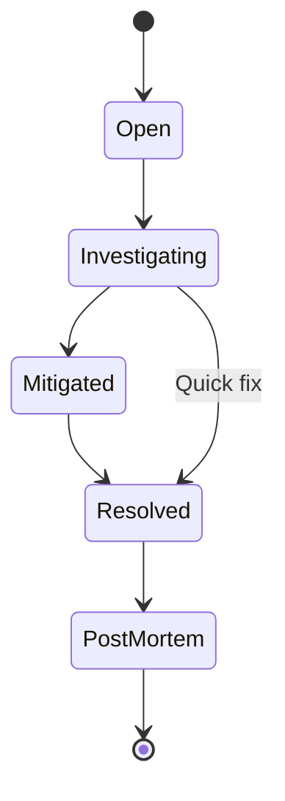

# Incident Reports

<!-- AGENT INSTRUCTION: This directory contains individual incident reports following ITIL incident management standards.
     The Operator agent (VM-5) creates a new file for each incident.
     The System Architect reviews all P0 and P1 incident reports. -->

## File Naming Convention

```
INC-<NNN>.md
```

Examples: `INC-001.md`, `INC-002.md`, `INC-003.md`

<!-- AGENT INSTRUCTION: Use sequential numbering. Never reuse an incident number. -->

## Severity Levels

| Severity | Definition | Response Time | Resolution Target | Notification |
|---|---|---|---|---|
| **P0 — Critical** | Complete service outage or data loss. All users affected. | ≤ 15 minutes | ≤ 4 hours | Immediate page to on-call + Architect + Owner |
| **P1 — High** | Major feature unavailable. >25% of users affected. | ≤ 30 minutes | ≤ 8 hours | Page on-call + notify Architect |
| **P2 — Medium** | Feature degraded. <25% of users affected. Workaround exists. | ≤ 2 hours | ≤ 24 hours | Notify Architect during business hours |
| **P3 — Low** | Minor issue. Cosmetic or edge case. Minimal user impact. | ≤ 1 business day | ≤ 1 week | Log and track in backlog |

## Incident Status Flow



## Incident Report Template

<!-- AGENT INSTRUCTION: Copy the entire template below into a new INC-<NNN>.md file for each incident. -->

```markdown
# Incident Report — INC-<NNN>

| Field | Value |
|---|---|
| **Incident ID** | INC-<NNN> |
| **Severity** | P0 / P1 / P2 / P3 |
| **Status** | open / investigating / mitigated / resolved / post-mortem |
| **Detected By** | Monitoring alert / User report / Automated test |
| **Detection Time** | YYYY-MM-DD HH:MM HKT |
| **Response Time** | YYYY-MM-DD HH:MM HKT |
| **Mitigation Time** | YYYY-MM-DD HH:MM HKT |
| **Resolution Time** | YYYY-MM-DD HH:MM HKT |
| **Duration** | Xh Ym |
| **Incident Commander** | [PLACEHOLDER] |
| **Author** | VM-5 |

---

## Impact

| Dimension | Details |
|---|---|
| **Users Affected** | [PLACEHOLDER — number or percentage of affected users] |
| **Services Affected** | [PLACEHOLDER — list of affected services/modules] |
| **Data Impact** | [PLACEHOLDER — any data loss, corruption, or exposure] |
| **Revenue Impact** | [PLACEHOLDER — estimated revenue impact if applicable] |

---

## Timeline

<!-- Record every significant event in chronological order. Include who did what and when. -->

| Time (HKT) | Event |
|---|---|
| HH:MM | [PLACEHOLDER — Alert fired / Issue detected] |
| HH:MM | [PLACEHOLDER — Incident commander engaged] |
| HH:MM | [PLACEHOLDER — Root cause identified] |
| HH:MM | [PLACEHOLDER — Mitigation applied] |
| HH:MM | [PLACEHOLDER — Resolution confirmed] |

---

## Root Cause Analysis — 5 Whys

1. **Why did the incident occur?**
   [PLACEHOLDER]

2. **Why did that happen?**
   [PLACEHOLDER]

3. **Why did that happen?**
   [PLACEHOLDER]

4. **Why did that happen?**
   [PLACEHOLDER]

5. **Why did that happen?**
   [PLACEHOLDER]

**Root Cause:** [PLACEHOLDER — concise statement of the root cause]

---

## Resolution

[PLACEHOLDER — Describe what was done to resolve the incident. Include commands run, configs changed, code deployed, etc.]

---

## Prevention

[PLACEHOLDER — What changes will be made to prevent this type of incident from recurring?]

---

## Action Items

| ID | Action | Owner | Due Date | Status |
|---|---|---|---|---|
| AI-1 | [PLACEHOLDER] | [PLACEHOLDER] | YYYY-MM-DD | open / in-progress / done |
| AI-2 | [PLACEHOLDER] | [PLACEHOLDER] | YYYY-MM-DD | open / in-progress / done |
| AI-3 | [PLACEHOLDER] | [PLACEHOLDER] | YYYY-MM-DD | open / in-progress / done |

---

## Lessons Learned

- [PLACEHOLDER — What went well during incident response?]
- [PLACEHOLDER — What could be improved?]
- [PLACEHOLDER — Were runbooks adequate? If not, what updates are needed?]
```

---

## Example Incident Report

<!-- AGENT INSTRUCTION: This is a complete example for reference. It demonstrates the expected level of detail. -->

---

# Incident Report — INC-001

| Field | Value |
|---|---|
| **Incident ID** | INC-001 |
| **Severity** | P1 |
| **Status** | post-mortem |
| **Detected By** | Monitoring alert — Prometheus `APIHighBurnRate_Critical` |
| **Detection Time** | 2026-03-22 14:05 HKT |
| **Response Time** | 2026-03-22 14:08 HKT |
| **Mitigation Time** | 2026-03-22 14:25 HKT |
| **Resolution Time** | 2026-03-22 15:10 HKT |
| **Duration** | 1h 5m |
| **Incident Commander** | VM-5 |
| **Author** | VM-5 |

---

## Impact

| Dimension | Details |
|---|---|
| **Users Affected** | ~40% of API requests returning 500 errors |
| **Services Affected** | API Gateway, Authentication module |
| **Data Impact** | No data loss or corruption |
| **Revenue Impact** | N/A (pre-launch) |

---

## Timeline

| Time (HKT) | Event |
|---|---|
| 14:05 | Prometheus alert `APIHighBurnRate_Critical` fired — error rate at 18x burn rate |
| 14:08 | VM-5 acknowledged alert, began investigation |
| 14:12 | Identified elevated 500 errors on `/api/auth/login` and `/api/auth/refresh` endpoints |
| 14:15 | Traced errors to Redis connection timeout — Redis pod in `CrashLoopBackOff` state |
| 14:18 | Root cause identified: Redis OOM killed due to memory limit set too low (64Mi) for session store growth |
| 14:25 | Mitigation applied: increased Redis memory limit to 256Mi, restarted Redis pod |
| 14:30 | Redis pod stable, error rate dropping |
| 14:45 | Error rate returned to normal (<0.1%) |
| 15:10 | Post-deployment verification complete, all smoke tests passing. Incident resolved. |

---

## Root Cause Analysis — 5 Whys

1. **Why did the incident occur?**
   The API returned 500 errors because it could not connect to Redis for session management.

2. **Why could it not connect to Redis?**
   The Redis pod was in a `CrashLoopBackOff` state after being OOM killed.

3. **Why was Redis OOM killed?**
   The Redis memory limit was set to 64Mi, which was insufficient for the growing session store.

4. **Why was the limit set to 64Mi?**
   The initial resource limits were based on minimal estimates and were not updated after UAT testing showed increased session volume.

5. **Why were limits not updated?**
   There was no capacity planning review step in the deployment checklist for resource limits.

**Root Cause:** Insufficient Redis memory limit (64Mi) combined with missing capacity planning review during deployment.

---

## Resolution

1. Increased Redis pod memory limit from 64Mi to 256Mi in `k8s/dev/redis-deployment.yaml`
2. Added Redis `maxmemory-policy allkeys-lru` to prevent future OOM by evicting least-recently-used keys
3. Restarted Redis pod — sessions were regenerated by clients on next request

---

## Prevention

1. Add resource limit review to the pre-deployment checklist
2. Configure Redis memory usage alerts at 70% and 90% thresholds
3. Implement Redis memory usage monitoring in Grafana dashboard
4. Add load testing step to UAT that simulates expected session volume

---

## Action Items

| ID | Action | Owner | Due Date | Status |
|---|---|---|---|---|
| AI-1 | Add resource limit review to pre-deployment checklist | VM-5 | 2026-03-25 | done |
| AI-2 | Configure Redis memory alerts (70%, 90% thresholds) | VM-5 | 2026-03-27 | done |
| AI-3 | Add Redis memory panel to Grafana operations dashboard | VM-5 | 2026-03-27 | done |
| AI-4 | Implement load test for session volume in UAT pipeline | VM-3 | 2026-04-01 | open |

---

## Lessons Learned

- **What went well:** Alert fired within 3 minutes of elevated error rate. Response was fast (3 minutes to acknowledgment). Root cause identified quickly through structured log analysis.
- **What could be improved:** Resource limits should be reviewed as part of deployment checklist, not just at initial setup. Redis should have proactive memory alerts before OOM occurs.
- **Runbook updates needed:** Added Redis troubleshooting section to operations runbook. Added resource limit verification to pre-deployment checklist.
