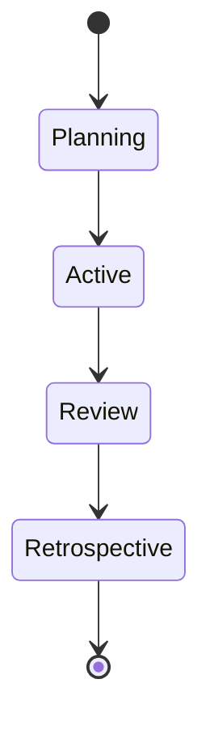

# Iteration Plans

<!-- AGENT INSTRUCTION: This directory contains individual iteration (sprint) plans.
     The System Architect creates iteration plans following Section 8.2.2 of BLUEPRINT-GUIDE.md.
     Each iteration is a time-boxed development cycle (typically 2 weeks). -->

## File Naming Convention

```
ITER-<NNN>.md
```

Examples: `ITER-001.md`, `ITER-002.md`, `ITER-003.md`

<!-- AGENT INSTRUCTION: Use sequential numbering. Never reuse an iteration number. -->

## Iteration Lifecycle



---

## Iteration Plan Template

<!-- AGENT INSTRUCTION: Copy the entire template below into a new ITER-<NNN>.md file. -->

```markdown
# Iteration Plan — ITER-<NNN>

<!-- AGENT INSTRUCTION: Fill in all [PLACEHOLDER] values during iteration planning.
     Update status daily during the iteration. -->

| Field | Value |
|---|---|
| **Iteration ID** | ITER-<NNN> |
| **Version** | 0.1.0 |
| **Owner** | System Architect |
| **Status** | planning / active / review / completed / cancelled |
| **Start Date** | [PLACEHOLDER — YYYY-MM-DD] |
| **End Date** | [PLACEHOLDER — YYYY-MM-DD] |
| **Duration** | [PLACEHOLDER — e.g., 2 weeks] |
| **Last Updated** | [PLACEHOLDER] |

---

## Iteration Goal

[PLACEHOLDER — A concise statement of what this iteration aims to accomplish.
Example: "Deliver core authentication module with registration, login, and token refresh."]

---

## Committed Items

<!-- AGENT INSTRUCTION: These items are committed for this iteration during planning.
     Pull from the master backlog (project/backlog.md).
     Total points should not exceed team velocity. -->

| ID | Type | Module | Title | Assigned | Points | Status |
|---|---|---|---|---|---|---|
| [PLACEHOLDER] | [PLACEHOLDER] | [PLACEHOLDER] | [PLACEHOLDER] | [PLACEHOLDER] | [PLACEHOLDER] | not-started / in-progress / in-review / done / blocked |

**Total Committed Points:** [PLACEHOLDER]
**Team Velocity (avg):** [PLACEHOLDER]

---

## Stretch Items

<!-- AGENT INSTRUCTION: Items to pull in if committed work finishes early. -->

| ID | Type | Module | Title | Points |
|---|---|---|---|---|
| [PLACEHOLDER] | [PLACEHOLDER] | [PLACEHOLDER] | [PLACEHOLDER] | [PLACEHOLDER] |

---

## Dependencies & Risks

| Dependency / Risk | Impact | Mitigation | Owner |
|---|---|---|---|
| [PLACEHOLDER] | [PLACEHOLDER] | [PLACEHOLDER] | [PLACEHOLDER] |

---

## Daily Status

<!-- AGENT INSTRUCTION: Update this section daily during standup.
     Record blockers, progress, and any scope changes. -->

### [PLACEHOLDER — YYYY-MM-DD]

**Progress:**
- [PLACEHOLDER]

**Blockers:**
- [PLACEHOLDER]

**Scope Changes:**
- [PLACEHOLDER]

---

## Iteration Review

<!-- AGENT INSTRUCTION: Complete this section at the end of the iteration. -->

### Completed Items

| ID | Title | Points | Notes |
|---|---|---|---|
| [PLACEHOLDER] | [PLACEHOLDER] | [PLACEHOLDER] | [PLACEHOLDER] |

### Incomplete Items

| ID | Title | Points | Reason | Carry Forward? |
|---|---|---|---|---|
| [PLACEHOLDER] | [PLACEHOLDER] | [PLACEHOLDER] | [PLACEHOLDER] | Yes / No |

### Metrics

| Metric | Value |
|---|---|
| Committed Points | [PLACEHOLDER] |
| Completed Points | [PLACEHOLDER] |
| Velocity | [PLACEHOLDER] |
| Completion Rate | [PLACEHOLDER]% |
| Items Added Mid-Iteration | [PLACEHOLDER] |
| Items Removed Mid-Iteration | [PLACEHOLDER] |

---

## Retrospective

<!-- AGENT INSTRUCTION: Complete after iteration review. Focus on actionable improvements. -->

### What Went Well
- [PLACEHOLDER]

### What Could Be Improved
- [PLACEHOLDER]

### Action Items

| Action | Owner | Due Date |
|---|---|---|
| [PLACEHOLDER] | [PLACEHOLDER] | [PLACEHOLDER] |
```
