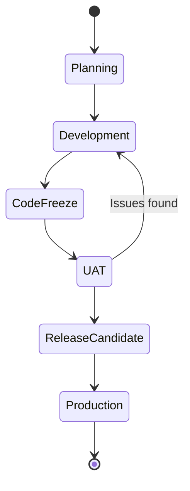

# Release Plans

<!-- AGENT INSTRUCTION: This directory contains individual release plans.
     The System Architect creates release plans following Section 8.3.1 of BLUEPRINT-GUIDE.md.
     Each release corresponds to a semantic version (vX.Y.Z) deployed to production. -->

## File Naming Convention

```
RELEASE-v<X.Y.Z>.md
```

Examples: `RELEASE-v0.1.0.md`, `RELEASE-v1.0.0.md`, `RELEASE-v1.1.0.md`

<!-- AGENT INSTRUCTION: Follow semantic versioning (semver.org):
     MAJOR.MINOR.PATCH
     - MAJOR: Breaking changes
     - MINOR: New features (backward-compatible)
     - PATCH: Bug fixes (backward-compatible) -->

## Release Lifecycle



---

## Release Plan Template

<!-- AGENT INSTRUCTION: Copy the entire template below into a new RELEASE-v<X.Y.Z>.md file. -->

```markdown
# Release Plan — v<X.Y.Z>

<!-- AGENT INSTRUCTION: Fill in all [PLACEHOLDER] values during release planning.
     Update status as the release progresses through the lifecycle. -->

| Field | Value |
|---|---|
| **Release Version** | v<X.Y.Z> |
| **Version** | 0.1.0 |
| **Owner** | System Architect |
| **Status** | planning / development / code-freeze / uat / release-candidate / released / cancelled |
| **Release Type** | major / minor / patch / hotfix |
| **Target Date** | [PLACEHOLDER — YYYY-MM-DD] |
| **Actual Date** | [PLACEHOLDER] |
| **Last Updated** | [PLACEHOLDER] |

---

## Release Goal

[PLACEHOLDER — What does this release deliver? Who benefits? What business value?]

---

## Scope — Included Items

<!-- AGENT INSTRUCTION: List all backlog items included in this release.
     Pull from the master backlog and iteration plans. -->

| ID | Type | Module | Title | Status | Iteration |
|---|---|---|---|---|---|
| [PLACEHOLDER] | [PLACEHOLDER] | [PLACEHOLDER] | [PLACEHOLDER] | [PLACEHOLDER] | [PLACEHOLDER] |

---

## Scope — Excluded / Deferred

<!-- AGENT INSTRUCTION: Items originally planned but moved out of this release. -->

| ID | Title | Reason | Target Release |
|---|---|---|---|
| [PLACEHOLDER] | [PLACEHOLDER] | [PLACEHOLDER] | [PLACEHOLDER] |

---

## Release Criteria

<!-- AGENT INSTRUCTION: All criteria must be met before release to production. -->

| # | Criterion | Met? |
|---|---|---|
| 1 | All committed items are done | ☐ |
| 2 | All unit tests pass (≥ 90% coverage) | ☐ |
| 3 | All integration tests pass | ☐ |
| 4 | All E2E tests pass | ☐ |
| 5 | UAT sign-off received | ☐ |
| 6 | No open P0 or P1 bugs | ☐ |
| 7 | Performance benchmarks met | ☐ |
| 8 | Security scan clean (no critical/high) | ☐ |
| 9 | Documentation updated | ☐ |
| 10 | Rollback procedure tested | ☐ |
| 11 | Architect approval received | ☐ |

---

## Dependencies

| Dependency | Type | Status | Owner |
|---|---|---|---|
| [PLACEHOLDER] | infrastructure / external-service / other-module | [PLACEHOLDER] | [PLACEHOLDER] |

---

## Risk Assessment

| Risk | Likelihood | Impact | Mitigation | Owner |
|---|---|---|---|---|
| [PLACEHOLDER] | Low/Medium/High | Low/Medium/High | [PLACEHOLDER] | [PLACEHOLDER] |

---

## Release Schedule

| Milestone | Planned Date | Actual Date | Status |
|---|---|---|---|
| Development Complete | [PLACEHOLDER] | [PLACEHOLDER] | [PLACEHOLDER] |
| Code Freeze | [PLACEHOLDER] | [PLACEHOLDER] | [PLACEHOLDER] |
| UAT Start | [PLACEHOLDER] | [PLACEHOLDER] | [PLACEHOLDER] |
| UAT Sign-Off | [PLACEHOLDER] | [PLACEHOLDER] | [PLACEHOLDER] |
| Release Candidate Tagged | [PLACEHOLDER] | [PLACEHOLDER] | [PLACEHOLDER] |
| Production Deployment | [PLACEHOLDER] | [PLACEHOLDER] | [PLACEHOLDER] |

---

## Deployment Notes

<!-- AGENT INSTRUCTION: Special instructions for this release's deployment.
     Reference the deployment runbook (operations/deployment-runbook.md) for standard procedure. -->

### Database Migrations

[PLACEHOLDER — List any migrations included in this release]

### Configuration Changes

[PLACEHOLDER — New/changed environment variables, feature flags, etc.]

### Breaking Changes

[PLACEHOLDER — API changes, schema changes, or behavioral changes that require coordination]

### Rollback Plan

[PLACEHOLDER — Specific rollback considerations for this release beyond standard procedure]

---

## Post-Release Validation

| Check | Result | Notes |
|---|---|---|
| Smoke tests pass | [PLACEHOLDER] | [PLACEHOLDER] |
| Monitoring healthy | [PLACEHOLDER] | [PLACEHOLDER] |
| No elevated error rates | [PLACEHOLDER] | [PLACEHOLDER] |
| Key user flows verified | [PLACEHOLDER] | [PLACEHOLDER] |

---

## Release Notes

<!-- AGENT INSTRUCTION: User-facing release notes for this version. -->

### Added
- [PLACEHOLDER]

### Changed
- [PLACEHOLDER]

### Fixed
- [PLACEHOLDER]

### Known Issues
- [PLACEHOLDER]
```
