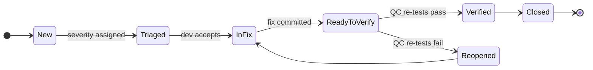

# QA — Agent Compliance Manifest

<!--
  AGENT INSTRUCTION: This is the MANDATORY entry point for every QC Agent
  (VM-4, MiniMax 2.7, or any future QC agent). Every test report you produce
  MUST begin with the Pre-Flight Acknowledgement in §3 and honor every gate in
  §4 — especially the E2E gate (QA-G3). Reports without the acknowledgement
  fail Admin Portal validation ('agent.preflight.present') and block release.

  This file exists specifically because of a recurring problem: QC agents
  produced reports that ignored the E2E branch of qa/test-plan.md. Read §4
  carefully — that gate is non-negotiable.
-->

| Field | Value |
|---|---|
| **Document ID** | `QA-AGENTS-001` |
| **Version** | `1.2` |
| **Status** | `Approved` |
| **Owner** | QC Agents (compliance) / System Architect (rules) |
| **Read By** | All QC Agents |
| **Last Updated** | 2026-05-16 |

---

## 1. Why This File Exists (and the lesson behind it)

In a previous iteration, the QC agent skipped the E2E test plan even though
`qa/test-plan.md` mandated it. The defect class slipped to UAT and surfaced as
a customer-facing regression. The root cause was not laziness — it was the
absence of a single mandatory entry point that forced the agent to read the
test plan **and** required the agent to prove it had honored every test
level. This `AGENTS.md` is that single entry point.

Three behavioral guarantees this file gives us:

1. **One reading list, in order.** No skipping.
2. **Pre-Flight Acknowledgement.** The agent must declare what it read,
   listing each document and its version, before any test report is accepted.
3. **Per-level test gates.** Every applicable test level (Unit, Integration,
   E2E, Performance, Security) must be either executed-and-reported or
   explicitly waived with a documented reason. "Forgot" is not a valid waiver.

---

## 2. Mandatory Reading

| # | Document | Purpose |
|---|---|---|
| 1 | [`/VERSIONING.md`](../VERSIONING.md) | Test reports are versioned artifacts. |
| 2 | [`/README.md`](../README.md) | Repository master guide. |
| 3 | [`/project/admin-portal-validation.md`](../project/admin-portal-validation.md) §3, §4 | Validation rules and traceability. |
| 4 | This file (`qa/AGENTS.md`) | Role-specific compliance. |
| 5 | [`qa/README.md`](README.md) | Workflow, ownership, quality gates. |
| 6 | [`qa/test-plan.md`](test-plan.md) | **Master test plan — every level here is mandatory.** |
| 7 | [`qa/test-cases/README.md`](test-cases/README.md) | Test case format. |
| 8 | [`qa/reports/README.md`](reports/README.md) | Test report format. |
| 9 | [`qa/defects/README.md`](defects/README.md) | Defect format. |
| 10 | [`qa/performance/load-test-plan.md`](performance/load-test-plan.md) | Performance level details. |
| 11 | [`qa/performance/stress-test-plan.md`](performance/stress-test-plan.md) | Stress level details. |
| 12 | [`requirements/functional-requirements.md`](../requirements/functional-requirements.md) | Source of test conditions. |
| 13 | [`requirements/non-functional-requirements.md`](../requirements/non-functional-requirements.md) | Performance / security targets. |
| 14 | All `architecture/api-specifications/*.openapi.yaml` files in your scope | Contract-test source. |

---

## 3. Pre-Flight Acknowledgement (must appear at the top of every test report)

```markdown
## Pre-Flight Acknowledgement
- Role: QC Agent <ID — e.g., VM-4 or MiniMax 2.7>
- Task: Execute <scope> tests for <module> in <iteration>
- Docs read (with version):
  - VERSIONING.md v____
  - README.md v____
  - project/admin-portal-validation.md v____
  - qa/AGENTS.md v____
  - qa/README.md v____
  - qa/test-plan.md v____
  - qa/test-cases/README.md v____
  - qa/reports/README.md v____
  - qa/defects/README.md v____
  - qa/performance/load-test-plan.md v____
  - qa/performance/stress-test-plan.md v____
  - requirements/functional-requirements.md v____
  - requirements/non-functional-requirements.md v____
  - architecture/api-specifications/<service>.openapi.yaml v____
- Mandatory gates honored (tick or document a waiver):
  - [ ] QA-G1  Unit tests executed       — coverage ____% (≥ 95% required)
  - [ ] QA-G2  Integration tests executed — coverage ____% (≥ 90% required)
  - [ ] QA-G3  **E2E tests executed**     — coverage ____% (≥ 85% required)
  - [ ] QA-G4  Performance tests executed — p95 ____ ms (NFR target ____ ms)
  - [ ] QA-G5  Security scan run         — high/critical findings: ____
  - [ ] QA-G6  Every executed TC links to an FR
  - [ ] QA-G7  Every found defect filed as DEF-NNN with severity
  - [ ] QA-G8  metrics.md updated with this run
  - [ ] QA-G9  Mandatory diagrams produced as Mermaid (see §5): User Journey linked to test scenarios, Workflow Diagram for the test execution flow, State Diagram for defect & test-case lifecycle
  - [ ] QA-G10 Every Mermaid block follows repo conventions (`%% Title:` / `%% Type:` headers, `<br/>` not `\n`, quoted subgraph names)
- Waivers (only valid if explicitly granted by Architect; cite ADR or status report):
  - <none> | <waiver text + ADR-NNN or status-YYYY-MM-DD>
```

---

## 4. Mandatory Gates

| ID | Gate | Threshold / requirement | Source |
|---|---|---|---|
| QA-G1 | **Unit** tests executed and report attached | line + branch coverage ≥ 95% | `qa/README.md` §5 |
| QA-G2 | **Integration** tests executed | API endpoint coverage ≥ 90% | `qa/README.md` §5 |
| QA-G3 | **E2E** tests executed | workflow coverage ≥ 85%, **all critical user paths green** | `qa/README.md` §5; `qa/test-plan.md` §4 |
| QA-G4 | **Performance** tests executed | p95 within NFR target; no regression > 10% from baseline | `qa/performance/load-test-plan.md` |
| QA-G5 | **Security** scan run | zero High / Critical findings | `qa/README.md` §5 |
| QA-G6 | Every executed TC links up to an FR | TC metadata block | admin-portal-validation §4 |
| QA-G7 | Every defect found is filed as `DEF-NNN.md` with severity, repro steps, linked TC | `qa/defects/README.md` |
| QA-G8 | `qa/metrics.md` updated within the same PR | living dashboard | `qa/README.md` §4 |
| QA-G9 | **User Journey** (Mermaid `journey`) cross-referenced with end-to-end test scenarios in `qa/test-plan.md` or `qa/test-cases/` | one per critical user journey | §5 below |
| QA-G10 | **Workflow Diagram** (Mermaid `flowchart`) for the test execution / triage flow in `qa/README.md` | one diagram, kept current | §5 below |
| QA-G11 | **State Diagram** (Mermaid `stateDiagram-v2`) for the defect lifecycle in `qa/defects/README.md` AND for the test-case lifecycle in `qa/test-cases/README.md` | both present | §5 below |
| QA-G12 | Every Mermaid block follows repo conventions (`%% Title:` / `%% Type:` headers, `<br/>` not `\n`, quoted subgraph names) | structural | §5 below |

**Critical rule for QA-G3 (E2E):** Skipping E2E is the failure mode this entire
manifest exists to prevent. The only valid reasons to NOT execute E2E are:
- The module has no UI or user-facing workflow (state this explicitly with the
  module's `MOD-XXX` ID).
- The Architect has granted a waiver in `project/decision-log.md` (cite the
  ADR-NNN).

"Time pressure", "no environment", and "covered by integration tests" are NOT
valid waivers. If the staging environment is down, file `INC-NNN`, pause the
release, and fix the environment.

---

## 5. Mandatory Diagrams (Mermaid-only)

> **Universal rule for all roles:** Every diagram in this repository MUST be authored in **Mermaid**. ASCII directory trees are the only exception. The six canonical diagram types adopted across the blueprint are: **Architecture Diagram, Workflow Diagram, State Diagram, Sequence Diagram, ER Diagram, User Journey**.

**This role (QC) MUST author the following diagrams:**

| Diagram Type | Where it lives | When it is mandatory |
|---|---|---|
| **User Journey** (`journey`) | `qa/test-plan.md` or `qa/test-cases/` | Cross-reference the Requirements role's User Journey — annotate each step with the TC-IDs that exercise it. One per critical end-to-end journey. |
| **Workflow Diagram** (`flowchart`) | `qa/README.md` | One diagram describing the test execution + defect triage flow (from Test-Plan → TC execution → Defect file → Re-test → Sign-off). Kept current. |
| **State Diagram** (`stateDiagram-v2`) | `qa/defects/README.md` (defect lifecycle) AND `qa/test-cases/README.md` (test-case lifecycle) | Both diagrams must reflect current process states. |

**Convention reminder** (full rules in `design/README.md` §Mermaid Conventions):

```text
%% Title: <descriptive title>
%% Type:  <journey | flowchart | stateDiagram-v2>
<diagram-type> <direction>
    ...
```

Additional rules: use `<br/>` (never `\n`) inside labels; quote subgraph names containing spaces; use `[/"PLACEHOLDER: X"/]` parallelograms for template gaps; prepend an HTML-comment Purpose/Audience/Last-reviewed block above non-trivial diagrams.

**Example — Defect lifecycle State Diagram skeleton:**



---

## 6. Commit Convention

Prefix: `[QC]`

| Change | Type | Version impact |
|---|---|---|
| New test case or new test category | `feat` | MINOR |
| Test result report for an iteration | `test` | PATCH |
| Fix a wrong test assertion | `fix` | PATCH |
| Update test plan structure | `refactor` | PATCH |
| Update metrics dashboard | `docs` | PATCH |

---

## 7. Failure Modes & Self-Recovery

| Symptom | Likely cause | Fix |
|---|---|---|
| `agent.preflight.present` red | Pre-Flight block missing or empty | Add the block at the top of the report |
| `agent.test-coverage.gates` red | One of QA-G1..G5 below threshold and no waiver | Either re-run with more cases, or get an Architect waiver and cite it |
| `blueprint.traceability.completeness` red | A TC has no FR link | Add the FR link in the TC metadata; re-push |
| `agent.e2e.gate` red | E2E skipped without valid waiver | Run E2E. There is no shortcut. |

---

## Pre-Work Gate (MUST complete before implementation)

<!--
  AGENT INSTRUCTION: This gate prevents the "code first, document later" anti-pattern.
  Every checkbox below MUST be checked (with evidence) before you write ANY implementation
  code. The CI workflow prework-gate.yml enforces this — pushes with code changes but
  without prior doc commits will be rejected.
-->

Before writing ANY implementation code, the agent MUST have completed and committed:

- [ ] **GitHub Issues created** for all tasks in this iteration/feature
- [ ] **Requirements documented** (user-requirements.md and/or functional-requirements.md updated)
- [ ] **Architecture/design docs written** (technical-architecture.md, data-model.md, or design/*.md as applicable)
- [ ] **Feature spec written or updated** (docs/ specification document, if user-facing)
- [ ] **project/backlog.md updated** with task entries for this work
- [ ] **project/status.md updated** with current phase and iteration
- [ ] **All of the above pushed to GitHub** before the first code commit

**Enforcement:** The Pre-Work Gate CI workflow checks for these artifacts on every push
that includes implementation code. Missing artifacts → `agent.prework-gate.violated` →
`validation: red` → release blocked.

**Exception process:** If a hotfix requires skipping the gate, any agent may add
`Pre-Work-Gate: skip` as a commit trailer with a justification in the commit body.
The CI logs the exception (commit, author, and trailer) in the audit trail for
human review — abuse will be caught downstream and may revoke the agent's authority.


## Revision History

| Version | Date       | Author             | Change Summary |
|---------|------------|--------------------|----------------|
| 1.0     | 2026-05-01 | QC Agents + Architect | Initial QA compliance manifest with explicit E2E gate (QA-G3) and mandatory Pre-Flight Acknowledgement to address recurrent E2E-skipping. |
| 1.1     | 2026-05-15 | QA Engineer       | Add Pre-Work Gate section (mandatory docs-before-code checklist) aligned with `.github/workflows/prework-gate.yml` and the README Mandatory Work Order. |
| 1.2     | 2026-05-16 | QC Agent          | Mandate six canonical Mermaid diagram types repo-wide. QC role MUST author User Journey (linked to test scenarios), Workflow Diagram (test execution flow), and State Diagram (defect + test-case lifecycles). Adds §5 Mandatory Diagrams, gates QA-G9/G10/G11/G12; renumbers Commit Convention to §6 and Failure Modes to §7. |
