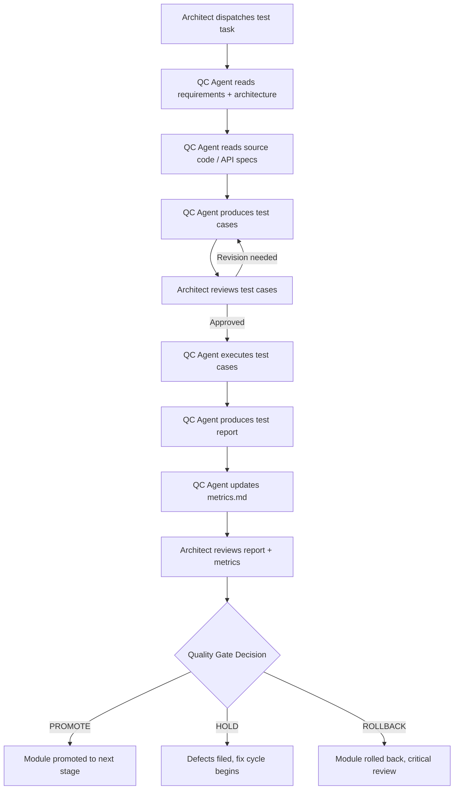
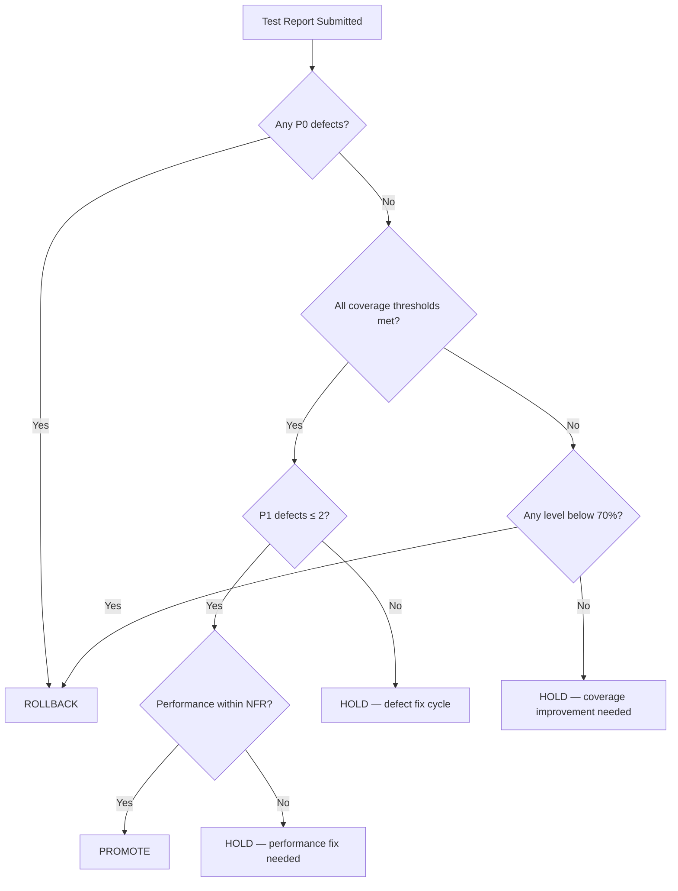

# QA — Quality Assurance Directory

<!-- 
  AGENT INSTRUCTIONS:
  This README serves as the entry point for the qa/ directory. QC Agents (VM-4, MiniMax 2.7)
  should read this file first to understand the structure, ownership model, and quality gate
  thresholds before producing any test artifacts. The Architect reviews all QC output.
-->

| Field          | Value                                    |
|----------------|------------------------------------------|
| Document ID    | QA-README-001                            |
| Version        | 1.0                                      |
| Owner          | QC Agents (VM-4, MiniMax 2.7)           |
| Reviewer       | System Architect                         |
| Status         | [PLACEHOLDER]                            |
| Last Updated   | [PLACEHOLDER]                            |

---

## 1. Purpose

This directory contains all quality assurance artifacts for the GateForge project. Every document here is produced by **QC Agents** (VM-4, MiniMax 2.7) following the [QA-FRAMEWORK.md](../QA-FRAMEWORK.md), and reviewed by the **System Architect** before acceptance.

All test documentation follows **IEEE 829** standards for test documentation structure and **ISTQB** methodology for test design and execution.

---

## 2. Directory Structure

```
qa/
├── README.md                          ← This file (directory overview)
├── test-plan.md                       ← Master Test Plan (IEEE 829)
├── ui-auto-test-plan.md               ← GateForge UI Auto-Test Standard, instantiated for this project (mandatory when SUT ships a web UI)
├── intents.md                         ← AI explorer intents (one block per critical user journey) for Lane B
├── playwright.config.ts               ← Lane A Playwright configuration (committed, not generated)
├── openclaw.qa.yaml                   ← OpenClaw profile + agent config for QC
├── docker-compose.qa.yml              ← Lane B headful Chrome + OpenClaw QA gateway
├── metrics.md                         ← QA Metrics Dashboard (living document, includes UI Auto-Test KPIs)
├── features/                          ← Gherkin .feature files (auth/, core-flows/, ai-agents/)
├── steps/                             ← Step definitions for Gherkin
├── pages/                             ← Page Object Model classes
├── fixtures/                          ← Seed scripts, test data
├── visual-baselines/                  ← PNG baselines for visual regression (committed)
├── ai-explorer/
│   ├── prompts/                       ← Prompt templates per intent class
│   └── generated/                     ← AI-proposed tests (PR-reviewed before promotion)
├── scripts/
│   └── bootstrap-qa-runner.sh         ← Idempotent setup for the headless Ubuntu QC runner
├── test-cases/
│   ├── README.md                      ← Test case format guide & examples
│   ├── TC-<module>-<type>-NNN.md      ← Individual test case files
│   └── ...
├── performance/
│   ├── load-test-plan.md              ← Load testing strategy & profiles
│   └── stress-test-plan.md            ← Stress testing & breaking point analysis
├── reports/
│   ├── README.md                      ← Test report format guide & examples
│   ├── TEST-REPORT-ITER-<NNN>-<module>.md  ← Per-iteration test reports
│   └── ...
└── defects/
    ├── README.md                      ← Defect report format guide & examples
    ├── DEF-<NNN>.md                   ← Individual defect reports
    └── ...
```

> **UI Auto-Test layout is mandatory.** Every project that ships a web UI must have the bolded files above. They are the project-level instantiation of the GateForge **UI Auto-Test Standard** (in the QC role guide of both [`gateforge-openclaw-configs`](https://github.com/tonylnng/gateforge-openclaw-configs) and [`gateforge-openclaw-single`](https://github.com/tonylnng/gateforge-openclaw-single)). Missing files force a `Rejected` verdict at the QC release gate.

---

## 3. Document Ownership

| Artifact               | Producer              | Reviewer           | Frequency                |
|------------------------|-----------------------|--------------------|--------------------------|
| Master Test Plan       | QC Agents             | System Architect   | Once, updated per phase  |
| Test Cases             | QC Agents             | System Architect   | Per feature / iteration  |
| Test Reports           | QC Agents             | System Architect   | Per iteration            |
| Defect Reports         | QC Agents             | System Architect   | As discovered            |
| QA Metrics Dashboard   | QC Agents             | System Architect   | After every test run     |
| Load Test Plan         | QC Agents             | System Architect   | Per release cycle        |
| Stress Test Plan       | QC Agents             | System Architect   | Per release cycle        |
| Performance Reports    | QC Agents             | System Architect   | Per load/stress run      |

---

## 4. Workflow

<!-- 
  AGENT INSTRUCTIONS:
  This is the standard QC workflow. QC Agents must follow these steps in order.
  The Architect dispatches tasks via the project backlog; QC Agents never self-assign.
-->



### Workflow Steps

1. **Dispatch** — The Architect creates a test task in the project backlog, specifying the module, scope, and test levels required.
2. **Read Requirements** — The QC Agent reads the relevant functional requirements (`requirements/functional/FR-*.md`) and non-functional requirements (`requirements/nfr.md`).
3. **Read Code / API Specs** — The QC Agent reads the module source code and API specifications (`architecture/api/`).
4. **Produce Test Cases** — The QC Agent writes test cases following the format in `test-cases/README.md`.
5. **Review** — The Architect reviews test cases for completeness and correctness.
6. **Execute** — The QC Agent runs the approved test cases and records actual results.
7. **Report** — The QC Agent produces a test report following the format in `reports/README.md`.
8. **Update Metrics** — The QC Agent updates `metrics.md` with the latest results.
9. **Quality Gate Decision** — The Architect evaluates the report against the quality gate thresholds.

---

## 4.1 UI Auto-Test (Lane A + Lane B) — mandatory cross-cutting layer

When the System Under Test ships a web UI, the QC role applies the GateForge **UI Auto-Test Standard** on every iteration in addition to the workflow above. Two execution lanes run on the same headless Ubuntu QC runner:

| Lane | Profile | Tool | Cadence | Gate impact |
|---|---|---|---|---|
| **Lane A — Deterministic** | `profile=openclaw` | OpenClaw + Playwright MCP | Every PR | Hard gate |
| **Lane B — AI Exploratory** | `profile=user` (CDP) | OpenClaw + Chrome DevTools MCP, Claude Sonnet 4.6 / MiniMax 2.7 | Nightly + pre-release | Hard gate on new P0/P1 |

The runner is Ubuntu Server 22.04+ LTS, no desktop. See `docker-compose.qa.yml` for the `chrome-headful` Lane B service and `scripts/bootstrap-qa-runner.sh` for first-time setup. The full operational playbook (Xvfb fallback, persisted profiles, networking, security, resource tiers) is in the QC role's `UI-AUTO-TEST-STANDARD.md` § 9 (Headless Ubuntu Operations).

The **per-project test plan** lives in `qa/ui-auto-test-plan.md`. It instantiates the canonical standard for *this* project: lists the critical user journeys, the `data-testid` namespaces in scope, the visual-regression baselines, the a11y/perf budgets, and Lane B intent files.

---

## 5. Quality Gate Thresholds

<!-- 
  AGENT INSTRUCTIONS:
  These thresholds are non-negotiable. A module cannot be promoted unless ALL applicable
  thresholds are met. The Architect may grant exceptions only with documented rationale.
-->

| Test Level   | Minimum Coverage | Notes                                                    |
|--------------|-----------------|----------------------------------------------------------|
| Unit         | ≥ 95%           | Line + branch coverage. All critical paths must be covered. |
| Integration  | ≥ 90%           | API contract tests, service-to-service communication.      |
| E2E          | ≥ 85%           | User-facing workflows. All happy paths + critical error paths. |
| Critical Failure | < 70%       | If any test level falls below 70%, immediate ROLLBACK.     |

### Additional Gates

| Metric                        | Threshold          |
|-------------------------------|-------------------|
| P0 (Critical) defects open    | 0                 |
| P1 (Major) defects open       | ≤ 2               |
| Performance p95 latency       | Within NFR target |
| Security vulnerabilities (High+) | 0              |

### UI Auto-Test Gates (web UI projects only)

| Gate ID | Metric | Threshold | Source |
|---|---|---|---|
| **G-UI-1** | Lane A (deterministic) pass rate on release commit | 100% | `qa/reports/laneA-*.junit.xml` |
| **G-UI-2** | Visual regression — max pixel diff on critical pages | < 0.1% | `qa/visual-baselines/` |
| **G-UI-3** | axe-core critical issues | 0 | `qa/reports/a11y-*.json` |
| **G-UI-4** | Lighthouse performance score (mobile) | ≥ 80 | `qa/reports/lighthouse-*.json` |
| **G-UI-5** | Lane B (AI exploratory) new P0/P1 in last 24 h | 0 | `qa/reports/laneB-*.json` |
| **G-UI-6** | Intent coverage — % of `intents.md` entries with passing AI run | 100% | `qa/reports/intent-coverage.json` |
| **G-UI-7** | Headless Compliance Checklist signed in release verdict | True | `qc/gates/<release>.md` |

A `Rejected` verdict is mandatory if any G-UI-* gate fails. The QC report's `uiAutoTest` JSON block (see UI Auto-Test Standard § 6) is mandatory on release-tagged commits.

---

## 6. PROMOTE / HOLD / ROLLBACK Decision Model

<!-- 
  AGENT INSTRUCTIONS:
  The Architect makes the final gate decision. QC Agents provide a recommendation in the
  test report, but the Architect has override authority. Document the rationale always.
-->

| Decision     | Criteria                                                                                      | Action                                                             |
|--------------|-----------------------------------------------------------------------------------------------|--------------------------------------------------------------------|
| **PROMOTE**  | All quality gate thresholds met. Zero P0 defects. ≤ 2 P1 defects (with fixes scheduled). No performance regressions. | Module advances to next stage (e.g., dev → staging → production).  |
| **HOLD**     | One or more thresholds missed by ≤ 5%. P1 defects exist but have known root cause. No P0 defects. | Module stays in current stage. Fix cycle initiated. Re-test within one iteration. |
| **ROLLBACK** | Any test level below 70%. P0 defects found. Performance degradation > 20% from baseline. Security vulnerabilities (High+). | Module reverted to previous known-good state. Critical review required. Post-mortem filed. |

### Decision Flow



---

## 7. File Naming Conventions

### Test Cases

```
TC-<module>-<type>-<NNN>.md
```

| Component   | Values                                          | Example             |
|-------------|------------------------------------------------|---------------------|
| `<module>`  | auth, user, payment, order, notification, etc.  | auth                |
| `<type>`    | unit, integration, e2e, performance, security   | unit                |
| `<NNN>`     | Three-digit sequential number                   | 001                 |

**Examples:** `TC-auth-unit-001.md`, `TC-payment-integration-003.md`, `TC-order-e2e-012.md`

### Test Reports

```
TEST-REPORT-ITER-<NNN>-<module>.md
```

**Examples:** `TEST-REPORT-ITER-001-auth.md`, `TEST-REPORT-ITER-003-payment.md`

### Defect Reports

```
DEF-<NNN>.md
```

**Examples:** `DEF-001.md`, `DEF-042.md`

### Performance Reports

```
PERF-REPORT-<type>-<YYYY-MM-DD>.md
```

**Examples:** `PERF-REPORT-load-2026-04-07.md`, `PERF-REPORT-stress-2026-04-10.md`

---

## 8. Cross-References

| Document                         | Location                                    | Relationship                          |
|----------------------------------|---------------------------------------------|---------------------------------------|
| QA Framework                     | `../QA-FRAMEWORK.md`                        | Governing methodology and standards   |
| Functional Requirements          | `../requirements/functional/`               | Source of test conditions              |
| Non-Functional Requirements      | `../requirements/nfr.md`                    | Performance, security, quality targets|
| API Specifications               | `../architecture/api/`                      | Contract test source                  |
| Architecture Decision Records    | `../architecture/decisions/`                | Context for test strategy             |
| Project Iterations               | `../project/iterations/`                    | Test schedule alignment               |
| Deployment Runbooks              | `../operations/runbooks/`                   | Environment setup for testing         |
| Monitoring & Observability       | `../design/monitoring-observability.md`     | Dashboard references for perf tests   |

---

## 9. Getting Started (QC Agent Quick Reference)

<!-- 
  AGENT INSTRUCTIONS:
  When a QC Agent is assigned to this project for the first time, follow this checklist:
  1. Read this README completely
  2. Read ../QA-FRAMEWORK.md for methodology
  3. Read the test-plan.md for overall strategy
  4. Read test-cases/README.md for test case format
  5. Read reports/README.md for report format
  6. Read defects/README.md for defect format
  7. Read the relevant requirements for your assigned module
  8. Begin producing test cases
-->

1. Read this `README.md` fully.
2. Read [`../QA-FRAMEWORK.md`](../QA-FRAMEWORK.md) for governing methodology.
3. Read [`test-plan.md`](test-plan.md) for the master test strategy.
4. Read the format guide for the artifact you are producing:
   - [`test-cases/README.md`](test-cases/README.md) — for test cases
   - [`reports/README.md`](reports/README.md) — for test reports
   - [`defects/README.md`](defects/README.md) — for defect reports
5. Read the relevant requirements from `../requirements/`.
6. Produce your artifacts following the templates exactly.
7. Update `metrics.md` after every test execution.
