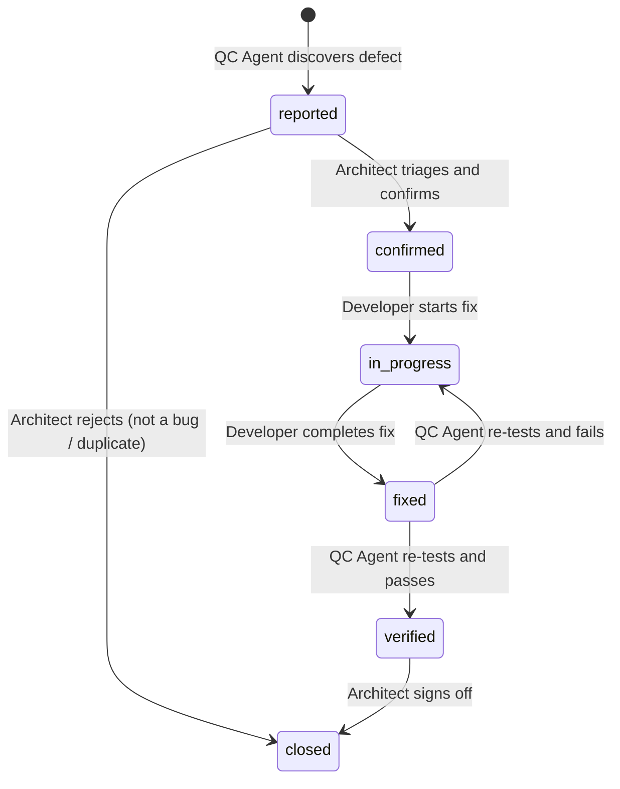

# Defect Report Format Guide

<!--
  AGENT INSTRUCTIONS:
  This document defines the mandatory format for all defect reports in qa/defects/.
  QC Agents create a defect report for every bug found during test execution. Each defect
  gets its own file. The defect lifecycle is tracked in the Status field.
  
  Defects are discovered by QC Agents, triaged by the Architect, fixed by Developers,
  and verified by QC Agents. The full lifecycle must be documented in the defect file.
-->

| Field          | Value                                    |
|----------------|------------------------------------------|
| Document ID    | QA-DEF-FMT-001                           |
| Version        | 1.0                                      |
| Owner          | QC Agents (VM-4, MiniMax 2.7)           |
| Reviewer       | System Architect                         |
| Status         | [PLACEHOLDER]                            |
| Last Updated   | [PLACEHOLDER]                            |

---

## 1. File Naming Convention

```
DEF-<NNN>.md
```

| Component   | Description                              | Example   |
|-------------|------------------------------------------|-----------|
| `<NNN>`     | Three-digit sequential defect number (global, not per-module) | 001 |

**Examples:** `DEF-001.md`, `DEF-042.md`, `DEF-100.md`

**Numbering rules:**
- Numbers are globally sequential across all modules.
- Never reuse a defect number, even if the defect is closed or invalid.
- The next number is always max(existing DEF numbers) + 1.

---

## 2. Defect Report Template

<!-- 
  AGENT INSTRUCTIONS:
  Copy everything between START TEMPLATE and END TEMPLATE when creating a new defect file.
  Fill in all fields available at the time of discovery. Fields marked "filled after X" are
  updated later in the lifecycle. Do not remove any section.
-->

### --- START TEMPLATE ---

```markdown
# Defect: DEF-<NNN>

## Metadata

| Field                | Value                                      |
|----------------------|--------------------------------------------|
| Defect ID            | DEF-<NNN>                                  |
| Severity             | critical / major / minor / cosmetic        |
| Priority             | P0 (Critical) / P1 (High) / P2 (Medium) / P3 (Low) |
| Status               | reported / confirmed / in-progress / fixed / verified / closed |
| Module               | [module name]                              |
| Feature              | [feature name]                             |
| Related Test Case    | TC-<module>-<type>-<NNN>                   |
| Related Requirement  | FR-XXX / NFR-XXX                           |
| Environment          | dev / uat / production                     |
| Reported By          | [QC Agent ID]                              |
| Reported Date        | [YYYY-MM-DD]                               |
| Assigned To          | [Developer Agent / person]                 |
| Fixed By             | [filled after fix]                         |
| Fixed Date           | [filled after fix]                         |
| Verified By          | [filled after QC re-test]                  |
| Verified Date        | [filled after QC re-test]                  |
| Last Updated         | [YYYY-MM-DD]                               |

---

## Steps to Reproduce

<!-- 
  Provide precise, numbered steps that anyone can follow to reproduce the defect.
  Include specific data values, URLs, and user actions. Avoid vague instructions.
-->

1. [Step 1]
2. [Step 2]
3. [Step 3]
4. [Step N]

**Reproduction rate:** [always / intermittent (N/10 attempts) / rare]

---

## Expected Behaviour

<!-- What SHOULD happen according to the requirements. Reference the FR/NFR ID. -->

[PLACEHOLDER]

---

## Actual Behaviour

<!-- What ACTUALLY happens. Be specific — include error messages, HTTP status codes, etc. -->

[PLACEHOLDER]

---

## Screenshots / Logs

<!-- 
  Attach or link to screenshots, error logs, stack traces, or network traces.
  Store files in qa/defects/attachments/DEF-<NNN>/ directory.
-->

| Attachment          | Path / Link                                  | Description              |
|---------------------|----------------------------------------------|--------------------------|
| Screenshot          | `attachments/DEF-<NNN>/screenshot-1.png`     | [what it shows]          |
| Error Log           | `attachments/DEF-<NNN>/error.log`            | [relevant log excerpt]   |
| Network Trace       | `attachments/DEF-<NNN>/network.har`          | [relevant request/response] |

---

## Root Cause Analysis

<!-- Filled after investigation by the Developer. Explain WHY the defect occurred. -->

[PLACEHOLDER — filled after investigation]

---

## Fix Description

<!-- Filled after the fix is implemented. Describe what was changed and why. -->

| Field              | Value                                      |
|--------------------|--------------------------------------------|
| Fix Commit         | [commit hash or PR link]                   |
| Files Changed      | [list of files modified]                   |
| Fix Summary        | [brief description of the fix]             |
| Regression Risk    | low / medium / high                        |
| Tests Added        | [new test case IDs if any]                 |

---

## Verification Result

<!-- Filled after QC Agent re-tests the fix. -->

| Field              | Value                                      |
|--------------------|--------------------------------------------|
| Verification Date  | [YYYY-MM-DD]                               |
| Verified By        | [QC Agent ID]                              |
| Result             | pass / fail                                |
| Regression Tested  | yes / no                                   |
| Notes              | [any observations during verification]     |
```

### --- END TEMPLATE ---

---

## 3. Field Definitions

### Severity Levels

| Severity  | Definition                                                                | Examples                                                    |
|-----------|---------------------------------------------------------------------------|-------------------------------------------------------------|
| Critical  | System crash, data loss, security breach, core functionality completely broken. | Application crashes on login. Payment processed twice. Data leaked to unauthorized user. |
| Major     | Major feature broken, no acceptable workaround for production use.         | Password reset email never arrives. Order status stuck. Search returns wrong results. |
| Minor     | Feature works but with issues. Workaround exists.                          | Date format incorrect in one view. Sorting order wrong on one column. Slow response on edge case. |
| Cosmetic  | Visual or cosmetic issue with no functional impact.                        | Misaligned button. Typo in UI label. Inconsistent font size. |

### Priority Levels

| Priority | Label    | SLA (time to fix)   | Escalation                                   |
|----------|----------|---------------------|----------------------------------------------|
| P0       | Critical | 4 hours             | Immediately escalated to Architect. All other work paused. |
| P1       | High     | 24 hours            | Escalated to Architect within 4 hours. Blocks promotion.   |
| P2       | Medium   | 1 iteration         | Tracked in iteration backlog. Does not block promotion.    |
| P3       | Low      | Backlog             | Added to backlog. Scheduled when capacity allows.          |

### Status Workflow



| Status       | Owner             | Description                                              |
|-------------|-------------------|----------------------------------------------------------|
| reported    | QC Agent          | Defect discovered and documented. Awaiting triage.        |
| confirmed   | System Architect  | Architect confirmed the defect is valid. Awaiting assignment. |
| in-progress | Developer Agent   | Developer is actively working on the fix.                 |
| fixed       | Developer Agent   | Fix implemented and deployed to test environment. Awaiting QC verification. |
| verified    | QC Agent          | QC Agent has re-tested and confirmed the fix resolves the defect. |
| closed      | System Architect  | Defect resolved and signed off. Or rejected during triage. |

---

## 4. Example: DEF-001 — JWT Refresh Token Race Condition

<!--
  AGENT INSTRUCTIONS:
  This is a complete example defect report showing all fields populated through the full
  lifecycle (reported → confirmed → in-progress → fixed → verified → closed).
  Use this as a reference for the expected level of detail.
-->

# Defect: DEF-001

## Metadata

| Field                | Value                                      |
|----------------------|--------------------------------------------|
| Defect ID            | DEF-001                                    |
| Severity             | major                                      |
| Priority             | P1 (High)                                  |
| Status               | verified                                   |
| Module               | auth                                       |
| Feature              | JWT token refresh                          |
| Related Test Case    | TC-auth-integration-004                    |
| Related Requirement  | FR-AUTH-003 (JWT access + refresh tokens)  |
| Environment          | dev                                        |
| Reported By          | QC Agent VM-4                              |
| Reported Date        | 2026-04-05                                 |
| Assigned To          | Developer Agent                            |
| Fixed By             | Developer Agent                            |
| Fixed Date           | 2026-04-06                                 |
| Verified By          | QC Agent VM-4                              |
| Verified Date        | 2026-04-06                                 |
| Last Updated         | 2026-04-06                                 |

---

## Steps to Reproduce

1. Authenticate as a user and obtain an access token and refresh token.
2. Wait for the access token to expire (or use a short-lived token with 5s expiry for testing).
3. Send a `POST /api/v1/auth/refresh` request with the refresh token from Client A.
4. Within 1 second of Step 3, send another `POST /api/v1/auth/refresh` request with the **same** refresh token from Client B (simulating a second tab or device).
5. Observe the response from Client B.

**Reproduction rate:** always (10/10 attempts)

---

## Expected Behaviour

Per FR-AUTH-003 and security best practice (refresh token rotation), once a refresh token is used, it should be invalidated. The second request (Client B) should receive a `401 Unauthorized` response indicating the refresh token has already been consumed.

---

## Actual Behaviour

Both Client A and Client B receive new access tokens and new refresh tokens. The original refresh token is consumed by Client A, but Client B's request arrives before the token invalidation is committed to the database. Client B receives a valid response with a second set of tokens.

This creates two valid sessions from a single refresh token, violating the refresh token rotation security model. An attacker who captures a refresh token could race against the legitimate user to obtain a parallel session.

**Error details:**
- Client A response: HTTP 200, new tokens issued (correct)
- Client B response: HTTP 200, new tokens issued (INCORRECT — should be 401)
- Database state after: Two active refresh tokens for the same user session

---

## Screenshots / Logs

| Attachment          | Path / Link                                           | Description                           |
|---------------------|-------------------------------------------------------|---------------------------------------|
| Race condition log  | `attachments/DEF-001/race-condition-log.txt`          | Timestamps showing both requests within 200ms window |
| Database state      | `attachments/DEF-001/db-state-after.sql`              | Query showing two active refresh tokens |
| Test output         | `attachments/DEF-001/tc-auth-integration-004-output.txt` | Full test case output with failure details |

---

## Root Cause Analysis

The `AuthService.refreshToken()` method performs the following steps:
1. Look up the refresh token in the database.
2. Validate it is not expired.
3. Generate new access + refresh tokens.
4. Delete the old refresh token.
5. Insert the new refresh token.

Steps 1–5 are NOT wrapped in a database transaction with proper isolation. When two requests arrive within the same window, both pass step 1 (token exists), and both proceed to generate new tokens. The deletion in step 4 of the first request has not yet been committed when the second request reaches step 1.

**Root cause:** Missing database transaction with `SERIALIZABLE` isolation level (or advisory lock) around the refresh token rotation logic.

---

## Fix Description

| Field              | Value                                      |
|--------------------|--------------------------------------------|
| Fix Commit         | `a1b2c3d` (PR #47)                        |
| Files Changed      | `src/auth/auth.service.ts`, `src/auth/auth.service.spec.ts` |
| Fix Summary        | Wrapped the refresh token rotation logic in a PostgreSQL transaction with `SERIALIZABLE` isolation. Added a unique constraint on the `consumed_at` column to prevent double-consumption. Added a 1-second grace period where the old refresh token is marked as consumed but still exists (for legitimate retry scenarios). |
| Regression Risk    | low                                        |
| Tests Added        | TC-auth-integration-011 (concurrent refresh race condition test) |

---

## Verification Result

| Field              | Value                                      |
|--------------------|--------------------------------------------|
| Verification Date  | 2026-04-06                                 |
| Verified By        | QC Agent VM-4                              |
| Result             | pass                                       |
| Regression Tested  | yes                                        |
| Notes              | Ran TC-auth-integration-004 (original failing test) — now passes. Ran new TC-auth-integration-011 with 10 concurrent refresh requests — only the first succeeds, rest receive 401. Full auth integration suite re-run: all 11 tests pass. No regressions detected. |

---

## 5. Triage Guidelines (for Architect)

<!--
  AGENT INSTRUCTIONS:
  The Architect uses these guidelines when triaging new defect reports. Triage should
  happen within 4 hours of the defect being reported.
-->

### Triage Checklist

- [ ] Defect is reproducible (or has clear evidence if intermittent)
- [ ] Severity is appropriate (not over- or under-classified)
- [ ] Priority is set based on impact and urgency
- [ ] Related requirement and test case are linked
- [ ] Steps to reproduce are clear enough for the Developer to follow
- [ ] No duplicate of an existing defect

### Triage Outcomes

| Outcome          | Action                                                         |
|------------------|----------------------------------------------------------------|
| Confirmed        | Set status to `confirmed`. Assign to Developer. Set priority.  |
| Duplicate        | Set status to `closed`. Link to the original defect ID.        |
| Not a bug        | Set status to `closed`. Add explanation in Notes.              |
| Need more info   | Return to QC Agent with specific questions. Status stays `reported`. |
| Deferred         | Set status to `confirmed`, priority P3. Add to backlog.        |

---

## 6. Review Checklist (for Architect)

<!--
  AGENT INSTRUCTIONS:
  The Architect uses this checklist when reviewing defect reports.
-->

- [ ] File name follows `DEF-<NNN>.md` convention
- [ ] All metadata fields populated at the current lifecycle stage
- [ ] Severity and priority are appropriate
- [ ] Steps to reproduce are specific and numbered
- [ ] Expected and actual behaviour clearly described
- [ ] Related test case and requirement linked
- [ ] Screenshots or logs attached where applicable
- [ ] Root cause analysis is filled (if status ≥ in-progress)
- [ ] Fix description is filled (if status ≥ fixed)
- [ ] Verification result is filled (if status = verified)
