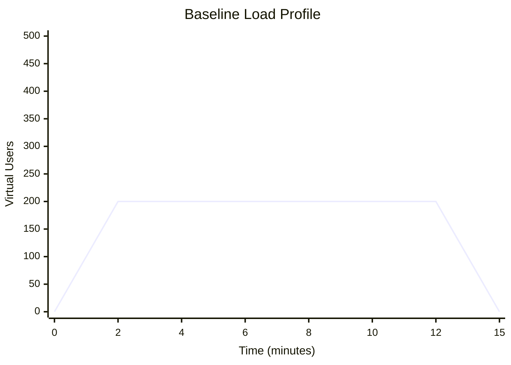
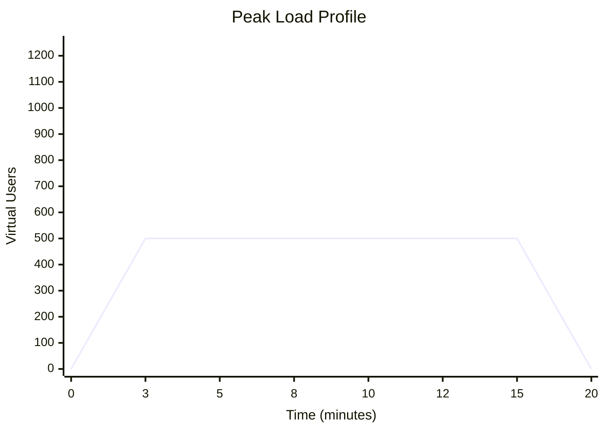

# Load Test Plan

<!--
  AGENT INSTRUCTIONS:
  This document defines the load testing strategy for GateForge. It validates that the system
  meets NFR performance targets under expected and peak traffic conditions. QC Agents produce
  this plan and update it per release cycle. The Architect reviews before execution.
  
  Load tests simulate realistic user traffic patterns. They are NOT stress tests — see
  stress-test-plan.md for breaking-point analysis.
-->

| Field          | Value                                    |
|----------------|------------------------------------------|
| Document ID    | QA-PERF-LOAD-001                         |
| Version        | 1.0                                      |
| Owner          | QC Agent MiniMax 2.7                     |
| Reviewer       | System Architect                         |
| Status         | [PLACEHOLDER]                            |
| Last Updated   | [PLACEHOLDER]                            |

---

## 1. Load Test Objectives

<!-- AGENT INSTRUCTIONS: Align objectives to specific NFR-PERF-* requirements. -->

1. **Validate NFR performance targets** — Confirm the system meets all response time, throughput, and error rate targets defined in `../requirements/nfr.md`.
2. **Establish performance baselines** — Record baseline metrics for trend tracking across releases.
3. **Identify bottlenecks** — Detect performance bottlenecks before they reach production.
4. **Validate auto-scaling** — Confirm Kubernetes HPA triggers correctly under load.
5. **Validate caching effectiveness** — Confirm Redis caching reduces database load as expected.

---

## 2. Workload Model

<!--
  AGENT INSTRUCTIONS:
  Model the workload based on expected production traffic patterns. Use analytics data
  if available, otherwise estimate from the business model. Each scenario represents a
  user behaviour pattern.
-->

| Scenario                   | Concurrent Users | Ramp-up Period | Steady-state Duration | Think Time | Weight (% of traffic) |
|----------------------------|-----------------|----------------|----------------------|------------|----------------------|
| Browse / Read              | [PLACEHOLDER]   | 2 min          | 10 min               | 3–5 sec    | 50%                  |
| User Login                 | [PLACEHOLDER]   | 2 min          | 10 min               | 5–10 sec   | 15%                  |
| Create / Update Operations | [PLACEHOLDER]   | 2 min          | 10 min               | 10–15 sec  | 20%                  |
| Search                     | [PLACEHOLDER]   | 2 min          | 10 min               | 5–8 sec    | 10%                  |
| Payment Checkout           | [PLACEHOLDER]   | 2 min          | 10 min               | 15–30 sec  | 5%                   |

**Total Expected Concurrent Users:** [PLACEHOLDER]  
**Peak Multiplier:** 2.5× (peak = 2.5 × normal traffic)

---

## 3. Target Endpoints

<!--
  AGENT INSTRUCTIONS:
  List every endpoint under test with its performance targets. Derive targets from NFR-PERF-*
  requirements. Include both read and write endpoints. Group by module.
-->

### Auth Module

| Endpoint                     | Method | Expected RPS | Target p95 Latency | Target p99 Latency | Max Error Rate |
|------------------------------|--------|-------------|--------------------|--------------------|----------------|
| `/api/v1/auth/login`         | POST   | [PLACEHOLDER] | 300ms              | 500ms              | < 0.1%         |
| `/api/v1/auth/refresh`       | POST   | [PLACEHOLDER] | 100ms              | 200ms              | < 0.1%         |
| `/api/v1/auth/logout`        | POST   | [PLACEHOLDER] | 100ms              | 200ms              | < 0.1%         |

### User Module

| Endpoint                     | Method | Expected RPS | Target p95 Latency | Target p99 Latency | Max Error Rate |
|------------------------------|--------|-------------|--------------------|--------------------|----------------|
| `/api/v1/users/:id`          | GET    | [PLACEHOLDER] | 100ms              | 200ms              | < 0.1%         |
| `/api/v1/users/:id`          | PUT    | [PLACEHOLDER] | 200ms              | 400ms              | < 0.1%         |
| `/api/v1/users`              | GET    | [PLACEHOLDER] | 200ms              | 400ms              | < 0.1%         |

### Order Module

| Endpoint                     | Method | Expected RPS | Target p95 Latency | Target p99 Latency | Max Error Rate |
|------------------------------|--------|-------------|--------------------|--------------------|----------------|
| `/api/v1/orders`             | POST   | [PLACEHOLDER] | 500ms              | 800ms              | < 0.1%         |
| `/api/v1/orders/:id`         | GET    | [PLACEHOLDER] | 150ms              | 300ms              | < 0.1%         |
| `/api/v1/orders`             | GET    | [PLACEHOLDER] | 300ms              | 500ms              | < 0.1%         |

### Payment Module

| Endpoint                     | Method | Expected RPS | Target p95 Latency | Target p99 Latency | Max Error Rate |
|------------------------------|--------|-------------|--------------------|--------------------|----------------|
| `/api/v1/payments/checkout`  | POST   | [PLACEHOLDER] | 1000ms             | 1500ms             | < 0.05%        |
| `/api/v1/payments/webhook`   | POST   | [PLACEHOLDER] | 200ms              | 400ms              | < 0.01%        |

<!-- AGENT INSTRUCTIONS: Add additional modules and endpoints as the architecture evolves. -->

---

## 4. Test Environment

<!--
  AGENT INSTRUCTIONS:
  Load test environment MUST mirror production capacity. If it cannot, document the scaling
  factor and adjust expected results accordingly. Coordinate with Operator for provisioning.
-->

### 4.1 Infrastructure Specifications

| Component       | Specification                                          | Notes                              |
|-----------------|--------------------------------------------------------|------------------------------------|
| Kubernetes      | [PLACEHOLDER] nodes, [PLACEHOLDER] CPU / [PLACEHOLDER] RAM each | Mirror production cluster |
| NestJS API Pods | [PLACEHOLDER] replicas, [PLACEHOLDER] CPU / [PLACEHOLDER] RAM limits | HPA: min [PLACEHOLDER], max [PLACEHOLDER] |
| PostgreSQL      | [PLACEHOLDER] vCPU, [PLACEHOLDER] RAM, [PLACEHOLDER] IOPS SSD | Mirror production RDS instance |
| Redis           | [PLACEHOLDER] nodes, [PLACEHOLDER] RAM each           | Mirror production ElastiCache      |
| Load Generator  | Dedicated VM: 4 vCPU, 8 GB RAM, 1 Gbps network       | Isolated from SUT network          |

### 4.2 Data Volume

| Data Entity     | Record Count       | Notes                                |
|-----------------|-------------------|--------------------------------------|
| Users           | [PLACEHOLDER]     | Realistic distribution of roles      |
| Orders          | [PLACEHOLDER]     | Historical + active orders           |
| Products        | [PLACEHOLDER]     | All categories represented           |
| Sessions        | [PLACEHOLDER]     | Pre-warmed Redis cache               |

### 4.3 Network Conditions

- Load generator and system under test (SUT) in the **same cloud region**
- Network latency: < 1ms between load generator and SUT
- No bandwidth throttling during load tests
- External dependencies (payment gateways) **mocked** with realistic latency (50–200ms)

---

## 5. Test Data Preparation

<!-- 
  AGENT INSTRUCTIONS:
  Describe how to generate test data that accurately represents production patterns.
  Never use real PII. Data must be deterministic and reproducible.
-->

### 5.1 User Accounts

```bash
# Generate test users using k6 or a seed script
# Each user has a unique email, password, and profile data
node scripts/generate-test-users.js --count=10000 --output=test-data/users.json
```

### 5.2 Pre-populated Data

- Seed the database using migration scripts: `npm run db:seed:performance`
- Data distributions should match production analytics (e.g., 60% of orders in "completed" status)
- All generated passwords use the same hash for performance (no bcrypt overhead in test)

### 5.3 Authentication Tokens

- Pre-generate JWT tokens for all test users before the load test
- Store tokens in a CSV file loaded by k6: `test-data/tokens.csv`
- Token expiry set to 24 hours to prevent expiry during test

---

## 6. Load Profiles

### 6.1 Baseline Load (Normal Traffic)

<!--
  AGENT INSTRUCTIONS:
  Baseline represents average daily traffic. Use this to establish "normal" performance metrics.
-->

```
Profile: baseline
Duration: 15 minutes total (2 min ramp-up, 10 min steady, 3 min ramp-down)
Virtual Users: [PLACEHOLDER] concurrent
RPS Target: [PLACEHOLDER] total
```



### 6.2 Peak Load (Expected Peak)

<!--
  AGENT INSTRUCTIONS:
  Peak represents 2.5× normal traffic — the expected maximum during marketing events, 
  seasonal spikes, etc.
-->

```
Profile: peak
Duration: 20 minutes total (3 min ramp-up, 12 min steady, 5 min ramp-down)
Virtual Users: [PLACEHOLDER] concurrent (2.5× baseline)
RPS Target: [PLACEHOLDER] total
```



### 6.3 Endurance Test (Sustained Load)

<!--
  AGENT INSTRUCTIONS:
  Endurance tests detect memory leaks, connection pool exhaustion, and degradation over time.
  Run for an extended period at normal load levels.
-->

```
Profile: endurance
Duration: 4 hours total (5 min ramp-up, 3h 50m steady, 5 min ramp-down)
Virtual Users: [PLACEHOLDER] concurrent (same as baseline)
RPS Target: [PLACEHOLDER] total
Key Focus: Memory growth, connection pool stability, response time drift
```

---

## 7. Success Criteria

<!--
  AGENT INSTRUCTIONS:
  All criteria must be met for the load test to PASS. If any metric fails, the test is
  marked as FAIL and the module receives a HOLD decision. Update targets from NFR-PERF-*.
-->

| Metric                        | Target                      | Measurement Method                     |
|-------------------------------|-----------------------------|----------------------------------------|
| p95 Response Time (overall)   | ≤ NFR target per endpoint   | k6 built-in metrics                    |
| p99 Response Time (overall)   | ≤ NFR target per endpoint   | k6 built-in metrics                    |
| Error Rate (HTTP 5xx)         | < 0.1%                      | k6 `http_req_failed` rate              |
| Throughput                    | ≥ [PLACEHOLDER] RPS         | k6 `http_reqs` rate                    |
| CPU Utilization (avg)         | < 70%                       | Grafana / Kubernetes metrics           |
| Memory Utilization (avg)      | < 80%                       | Grafana / Kubernetes metrics           |
| Database Connection Pool      | < 80% utilization           | PostgreSQL `pg_stat_activity`          |
| Redis Hit Rate                | > 90%                       | Redis INFO stats                       |
| HPA Scaling Events            | Triggered within 60 seconds | Kubernetes events                      |
| Zero OOMKills                 | 0 during test               | Kubernetes pod events                  |
| Endurance: Memory Growth      | < 5% over 4 hours           | Grafana memory chart                   |
| Endurance: p95 Drift          | < 10% increase over 4 hours | k6 time-series comparison              |

---

## 8. Monitoring During Test

<!--
  AGENT INSTRUCTIONS:
  List the specific dashboards and metrics to monitor in real-time during the load test.
  Reference dashboards from ../design/monitoring-observability.md.
-->

### 8.1 Grafana Dashboards

| Dashboard                     | URL / Path                              | Key Panels to Watch                     |
|-------------------------------|-----------------------------------------|-----------------------------------------|
| API Performance               | [PLACEHOLDER]                           | Request rate, latency percentiles, errors|
| Kubernetes Cluster            | [PLACEHOLDER]                           | CPU, memory, pod count, HPA status      |
| PostgreSQL                    | [PLACEHOLDER]                           | Query time, connections, lock waits      |
| Redis                         | [PLACEHOLDER]                           | Hit rate, memory usage, connections      |
| Application Logs              | [PLACEHOLDER]                           | Error logs, slow query warnings          |

### 8.2 Key Metrics Checklist

During the load test, monitor these metrics every 2 minutes:

- [ ] API response times within target
- [ ] Error rate below threshold
- [ ] CPU utilization below 70%
- [ ] Memory utilization below 80%
- [ ] No OOMKill events
- [ ] Database connection pool not saturated
- [ ] Redis cache hit rate stable
- [ ] No pod restarts

---

## 9. Load Test Report Template

<!--
  AGENT INSTRUCTIONS:
  After each load test execution, produce a report following this template. Save as:
  qa/reports/PERF-REPORT-load-<YYYY-MM-DD>.md
-->

### --- START LOAD TEST REPORT TEMPLATE ---

```markdown
# Load Test Report — [DATE]

| Field          | Value                                    |
|----------------|------------------------------------------|
| Document ID    | PERF-REPORT-load-[YYYY-MM-DD]            |
| Version        | 1.0                                      |
| Profile        | baseline / peak / endurance              |
| Author         | [QC Agent ID]                            |
| Status         | PASS / FAIL                              |
| Last Updated   | [YYYY-MM-DD]                             |

## Test Configuration

| Parameter          | Value               |
|--------------------|--------------------|
| Duration           | [X minutes/hours]   |
| Virtual Users      | [N]                 |
| Ramp-up            | [X minutes]         |
| Target RPS         | [N]                 |
| Environment        | [env description]   |
| k6 Version         | [version]           |
| Test Script        | [path to script]    |

## Results Summary

| Metric                    | Target        | Actual        | Status   |
|---------------------------|---------------|---------------|----------|
| Total Requests            | —             | [N]           | —        |
| Avg Response Time         | —             | [Nms]         | —        |
| p95 Response Time         | ≤ [N]ms       | [N]ms         | PASS/FAIL|
| p99 Response Time         | ≤ [N]ms       | [N]ms         | PASS/FAIL|
| Max Response Time         | —             | [N]ms         | —        |
| Error Rate (5xx)          | < 0.1%        | [N]%          | PASS/FAIL|
| Throughput (RPS)          | ≥ [N]         | [N]           | PASS/FAIL|
| Peak CPU Utilization      | < 70%         | [N]%          | PASS/FAIL|
| Peak Memory Utilization   | < 80%         | [N]%          | PASS/FAIL|

## Endpoint Breakdown

| Endpoint                    | p50    | p95    | p99    | Error % | RPS   | Status   |
|-----------------------------|--------|--------|--------|---------|-------|----------|
| POST /api/v1/auth/login     | [N]ms  | [N]ms  | [N]ms  | [N]%    | [N]   | PASS/FAIL|
| GET /api/v1/users/:id       | [N]ms  | [N]ms  | [N]ms  | [N]%    | [N]   | PASS/FAIL|
| POST /api/v1/orders         | [N]ms  | [N]ms  | [N]ms  | [N]%    | [N]   | PASS/FAIL|
| [additional endpoints...]   | ...    | ...    | ...    | ...     | ...   | ...      |

## Resource Utilization

| Resource                    | Average | Peak   | Notes                          |
|-----------------------------|---------|--------|--------------------------------|
| API Pod CPU                 | [N]%    | [N]%   | [observations]                 |
| API Pod Memory              | [N] MB  | [N] MB | [observations]                 |
| PostgreSQL CPU              | [N]%    | [N]%   | [observations]                 |
| PostgreSQL Connections      | [N]     | [N]    | Pool max: [N]                  |
| Redis Memory                | [N] MB  | [N] MB | [observations]                 |
| Redis Hit Rate              | [N]%    | —      | [observations]                 |

## Charts

<!-- Include or link to the following charts (exported from Grafana or k6 Cloud): -->

1. **Response Time Over Time** — p50, p95, p99 lines over test duration
2. **Throughput Over Time** — RPS over test duration
3. **Error Rate Over Time** — Error percentage over test duration
4. **CPU / Memory Over Time** — Resource utilization over test duration

## Bottleneck Analysis

<!-- Identify the top 3 performance bottlenecks discovered during this test. -->

1. **[Bottleneck]:** [Description, evidence, root cause hypothesis]
2. **[Bottleneck]:** [Description, evidence, root cause hypothesis]
3. **[Bottleneck]:** [Description, evidence, root cause hypothesis]

## Recommendations

1. [Recommendation 1]
2. [Recommendation 2]
3. [Recommendation 3]

## Comparison to Previous Run

| Metric          | Previous Run  | This Run      | Change   |
|-----------------|---------------|---------------|----------|
| p95 Latency     | [N]ms         | [N]ms         | +/-[N]%  |
| Error Rate      | [N]%          | [N]%          | +/-[N]%  |
| Throughput      | [N] RPS       | [N] RPS       | +/-[N]%  |
```

### --- END LOAD TEST REPORT TEMPLATE ---

---

## 10. k6 Configuration Example

<!--
  AGENT INSTRUCTIONS:
  This is a reference k6 script structure. Adapt to the specific endpoints and scenarios
  for each load test run. Store actual scripts in the test repository, not in this plan.
-->

```javascript
// k6-load-test.js — Example baseline load test
import http from 'k6/http';
import { check, sleep } from 'k6';
import { Rate, Trend } from 'k6/metrics';

// Custom metrics
const errorRate = new Rate('error_rate');
const loginDuration = new Trend('login_duration');

export const options = {
  stages: [
    { duration: '2m', target: 200 },   // Ramp up
    { duration: '10m', target: 200 },   // Steady state
    { duration: '3m', target: 0 },      // Ramp down
  ],
  thresholds: {
    http_req_duration: ['p(95)<300', 'p(99)<500'],
    http_req_failed: ['rate<0.001'],
    error_rate: ['rate<0.001'],
  },
};

const BASE_URL = __ENV.BASE_URL || 'https://staging.gateforge.dev';
const tokens = open('./test-data/tokens.csv').split('\n');

export default function () {
  const token = tokens[__VU % tokens.length];
  const headers = { Authorization: `Bearer ${token}`, 'Content-Type': 'application/json' };

  // Scenario: Browse (50% weight)
  if (Math.random() < 0.5) {
    const res = http.get(`${BASE_URL}/api/v1/users/me`, { headers });
    check(res, {
      'status is 200': (r) => r.status === 200,
      'response time < 200ms': (r) => r.timings.duration < 200,
    });
    errorRate.add(res.status >= 400);
  }
  // Scenario: Login (15% weight)
  else if (Math.random() < 0.3) {
    const loginRes = http.post(`${BASE_URL}/api/v1/auth/login`, JSON.stringify({
      email: `user${__VU}@loadtest.gateforge.dev`,
      password: 'LoadT3st!Pass#2026',
    }), { headers: { 'Content-Type': 'application/json' } });

    loginDuration.add(loginRes.timings.duration);
    check(loginRes, {
      'login status 200': (r) => r.status === 200,
      'login has token': (r) => JSON.parse(r.body).accessToken !== undefined,
    });
    errorRate.add(loginRes.status >= 400);
  }
  // Scenario: Create order (20% weight)
  else {
    const orderRes = http.post(`${BASE_URL}/api/v1/orders`, JSON.stringify({
      items: [{ productId: 'prod_001', quantity: 1 }],
    }), { headers });
    check(orderRes, {
      'order created': (r) => r.status === 201,
    });
    errorRate.add(orderRes.status >= 400);
  }

  sleep(Math.random() * 5 + 3); // Think time: 3-8 seconds
}
```

---

## 11. Artillery Configuration Example

```yaml
# artillery-load-test.yml — Alternative load test configuration
config:
  target: "https://staging.gateforge.dev"
  phases:
    - duration: 120      # 2 min ramp-up
      arrivalRate: 1
      rampTo: 50
    - duration: 600      # 10 min steady
      arrivalRate: 50
    - duration: 180      # 3 min ramp-down
      arrivalRate: 50
      rampTo: 0
  defaults:
    headers:
      Content-Type: "application/json"
  plugins:
    expect: {}

scenarios:
  - name: "Browse User Profile"
    weight: 50
    flow:
      - get:
          url: "/api/v1/users/me"
          headers:
            Authorization: "Bearer {{ $processEnvironment.TEST_TOKEN }}"
          expect:
            - statusCode: 200
            - hasProperty: "id"

  - name: "Login"
    weight: 15
    flow:
      - post:
          url: "/api/v1/auth/login"
          json:
            email: "user{{ $randomNumber(1, 10000) }}@loadtest.gateforge.dev"
            password: "LoadT3st!Pass#2026"
          expect:
            - statusCode: 200
```

---

## 12. Schedule and Frequency

<!-- AGENT INSTRUCTIONS: Adjust frequency based on project phase and release cadence. -->

| Test Profile | Frequency                       | Trigger                              |
|-------------|--------------------------------|--------------------------------------|
| Baseline    | Every iteration (weekly)        | End of iteration, before gate review |
| Peak        | Every release (bi-weekly)       | Before staging → production promote  |
| Endurance   | Monthly                         | First week of each month             |
| Ad-hoc      | As needed                       | After significant architectural changes, performance fix verification |

---

## Revision History

| Version | Date          | Author         | Changes                           |
|---------|---------------|----------------|-----------------------------------|
| 1.0     | [PLACEHOLDER] | [PLACEHOLDER]  | Initial load test plan created    |
| [PLACEHOLDER] | [PLACEHOLDER] | [PLACEHOLDER] | [PLACEHOLDER]               |
