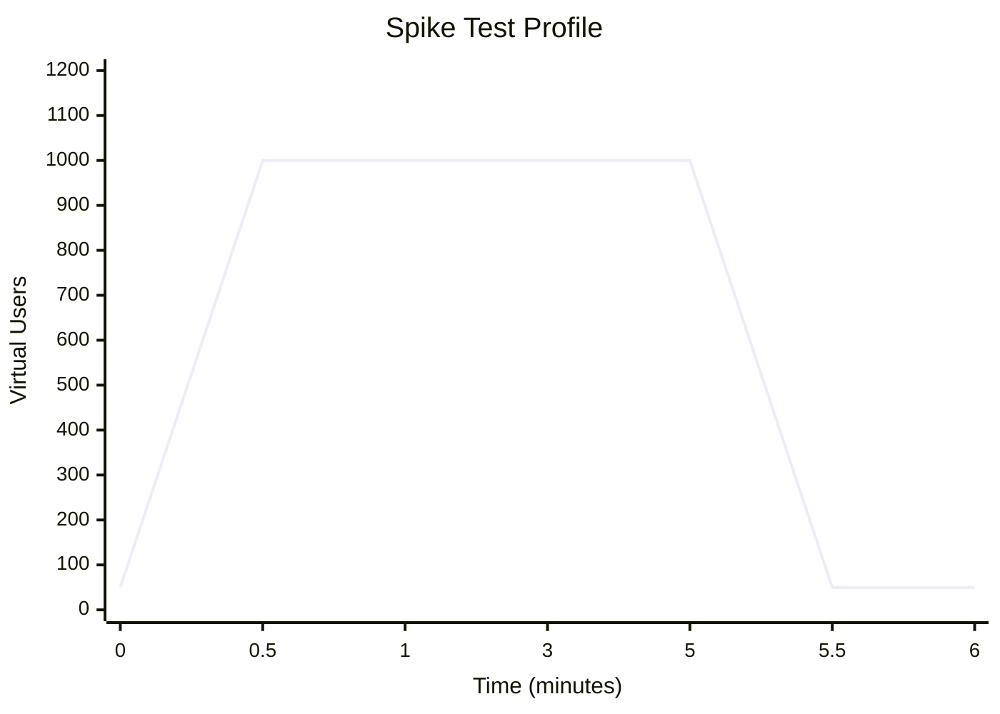
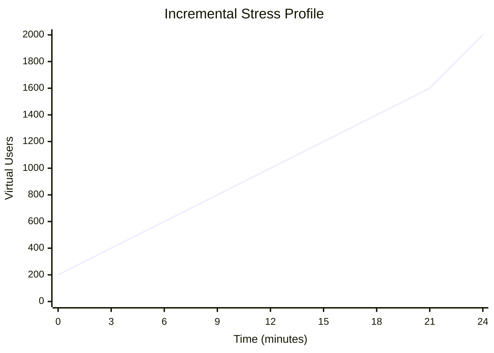
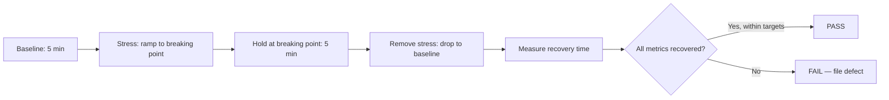

# Stress Test Plan

<!--
  AGENT INSTRUCTIONS:
  This document defines the stress testing strategy for GateForge. Stress tests push the system
  BEYOND normal operating capacity to find breaking points and verify graceful degradation.
  This is distinct from load testing (see load-test-plan.md), which validates NFR targets
  under expected traffic.
  
  Key goals: Find breaking points, verify circuit breakers, validate recovery behaviour.
-->

| Field          | Value                                    |
|----------------|------------------------------------------|
| Document ID    | QA-PERF-STRESS-001                       |
| Version        | 1.0                                      |
| Owner          | QC Agent MiniMax 2.7                     |
| Reviewer       | System Architect                         |
| Status         | [PLACEHOLDER]                            |
| Last Updated   | [PLACEHOLDER]                            |

---

## 1. Stress Test Objectives

<!-- AGENT INSTRUCTIONS: These objectives are distinct from load test objectives. Focus on limits and failure modes. -->

1. **Identify system breaking points** — Determine the maximum load the system can sustain before failure.
2. **Verify graceful degradation** — Confirm the system degrades predictably (rate limiting, circuit breakers, queue backpressure) rather than crashing.
3. **Validate recovery behaviour** — Measure how quickly the system returns to normal after stress is removed.
4. **Test resource exhaustion scenarios** — Verify behaviour when CPU, memory, connections, and disk are saturated.
5. **Identify failure cascades** — Determine if failure in one component triggers cascading failures in others.
6. **Validate alerting** — Confirm monitoring alerts fire at the correct thresholds during stress.

---

## 2. Stress Scenarios

<!--
  AGENT INSTRUCTIONS:
  Each scenario incrementally increases load until the system breaks. Document the specific
  starting load, increment size, and maximum load to attempt. Each step duration should be
  long enough to observe the system stabilize (or fail).
-->

| Scenario                        | Start Load (VUs) | Increment (VUs) | Max Load (VUs) | Duration per Step | Expected Breaking Point |
|---------------------------------|------------------|-----------------|----------------|-------------------|------------------------|
| API Gateway Saturation          | 200              | 100             | 2000           | 3 min             | [PLACEHOLDER]          |
| Database Connection Exhaustion  | 100              | 50              | 1000           | 3 min             | [PLACEHOLDER]          |
| Redis Cache Bypass (cache miss) | 200              | 100             | 1500           | 3 min             | [PLACEHOLDER]          |
| Write-Heavy Workload            | 50               | 50              | 800            | 3 min             | [PLACEHOLDER]          |
| Authentication Flood            | 100              | 100             | 2000           | 2 min             | [PLACEHOLDER]          |
| Large Payload Processing        | 50               | 25              | 500            | 3 min             | [PLACEHOLDER]          |
| Spike Test (instant surge)      | 0 → 1000         | N/A (instant)   | 1000           | Hold 5 min        | [PLACEHOLDER]          |

### Spike Test Profile



### Incremental Stress Profile



---

## 3. Breaking Point Criteria

<!--
  AGENT INSTRUCTIONS:
  Define what "broken" means for each metric. When ANY of these conditions occur, the system
  has reached its breaking point at that load level. Record the exact VU count and timestamp.
-->

The system is considered to have reached its **breaking point** when any of the following occur:

| Condition                                        | Threshold                                    |
|--------------------------------------------------|----------------------------------------------|
| HTTP error rate (5xx)                            | Exceeds 5% for > 30 seconds continuously     |
| p95 response time                                | Exceeds 5× NFR target for > 1 minute         |
| Request timeout rate                             | Exceeds 10% for > 30 seconds                 |
| Pod OOMKill events                               | Any OOMKill occurs                           |
| Pod CrashLoopBackOff                             | Any pod enters CrashLoopBackOff              |
| Database connection pool                         | 100% utilization for > 60 seconds            |
| Redis connection refused                         | Any connection refused errors                |
| Application process unresponsive                 | Health check fails for > 30 seconds          |
| Complete request failure                         | 100% of requests fail for > 10 seconds       |

---

## 4. Graceful Degradation Expectations

<!--
  AGENT INSTRUCTIONS:
  Define the expected system behaviour under overload. These are the "correct" failure modes.
  If the system does NOT behave this way, file a defect.
-->

When the system is under stress beyond its rated capacity, the following degradation behaviours are expected:

| Mechanism                   | Expected Behaviour                                                       | Verification Method                    |
|-----------------------------|-------------------------------------------------------------------------|----------------------------------------|
| **Rate Limiting**           | API returns `429 Too Many Requests` with `Retry-After` header when per-client rate exceeded | Monitor 429 response count, verify header |
| **Circuit Breaker (Open)**  | Downstream calls fail-fast with `503 Service Unavailable` when dependency is unresponsive | Check circuit breaker state in metrics |
| **Circuit Breaker (Half-Open)** | After cooldown, circuit breaker allows limited probe requests to test recovery | Monitor probe success rate            |
| **Queue Backpressure**      | Message queues apply backpressure; producers receive `503` or slow down when queue is full | Monitor queue depth, producer error rate |
| **Connection Pool Limits**  | New requests receive `503` when connection pool is exhausted, rather than hanging indefinitely | Monitor connection pool utilization + response codes |
| **Request Timeout**         | Long-running requests are terminated after configured timeout (e.g., 30s) with `504 Gateway Timeout` | Verify no requests hang indefinitely |
| **Graceful Shedding**       | Low-priority requests (e.g., analytics, non-critical reads) are shed before high-priority requests | Monitor response codes by endpoint priority |
| **Health Check Degradation**| Health endpoint returns `degraded` status (HTTP 200 with degraded body, not 503) while core functions still operational | Monitor health endpoint response body |

### What Must NOT Happen Under Stress

- Application process crash or unhandled exception causing pod restart
- Data corruption or partial writes
- Silent data loss (messages dropped without error)
- Cascading failure to unrelated modules
- Memory leak leading to eventual OOMKill
- Zombie connections holding resources without releasing
- Loss of previously established sessions for existing users

---

## 5. Recovery Test

<!--
  AGENT INSTRUCTIONS:
  After stress is removed, measure how fast the system returns to baseline performance.
  This validates that no permanent damage occurred during the stress test.
-->

### Recovery Test Protocol

1. **Establish baseline** — Run baseline load test for 5 minutes. Record p95, error rate, throughput.
2. **Apply stress** — Increase to breaking point (as discovered in stress scenarios).
3. **Hold stress** — Maintain breaking-point load for 5 minutes.
4. **Remove stress** — Instantly drop to baseline load level.
5. **Measure recovery** — Record time for all metrics to return to baseline values.

### Recovery Targets

| Metric                    | Recovery Target             | Measurement                        |
|---------------------------|-----------------------------|------------------------------------|
| p95 Response Time         | Return to baseline within 2 minutes | Time from stress removal to p95 ≤ baseline + 10% |
| Error Rate                | Return to < 0.1% within 1 minute | Time from stress removal to error rate < 0.1% |
| Throughput                | Return to baseline within 2 minutes | Time from stress removal to RPS ≥ baseline - 5% |
| Circuit Breakers          | All closed within 3 minutes | Monitor circuit breaker state transitions |
| Connection Pools          | Return to normal within 1 minute | Monitor pool utilization metrics |
| Pod Count                 | Scale down to normal within 10 minutes | Monitor HPA decisions |
| Health Check              | Return `healthy` within 1 minute | Monitor health endpoint response |

### Recovery Flow



---

## 6. Resource Exhaustion Tests

<!--
  AGENT INSTRUCTIONS:
  Each resource exhaustion scenario targets a specific system resource. These tests may
  require special tooling or configuration (e.g., setting artificially low memory limits).
  Coordinate with Operator for environment setup.
-->

### 6.1 CPU Saturation

| Parameter            | Value                                      |
|----------------------|--------------------------------------------|
| Method               | CPU-intensive workload (complex queries, heavy computation) |
| Target               | Sustain > 95% CPU on API pods              |
| Duration             | 10 minutes                                 |
| Expected Behaviour   | Response times increase gradually. HPA scales pods. Rate limiting activates. No crashes. |
| Verification         | Monitor CPU metrics, pod scaling events, response times |
| Pass Criteria        | System remains responsive (p95 < 10s). No OOMKills. HPA triggers within 60s. |

### 6.2 Memory Exhaustion

| Parameter            | Value                                      |
|----------------------|--------------------------------------------|
| Method               | Memory-intensive requests (large payloads, heavy caching) with artificially reduced memory limits |
| Target               | Push memory usage to > 90% of pod limits   |
| Duration             | 15 minutes                                 |
| Expected Behaviour   | GC pressure increases. Response times increase. Pod should NOT OOMKill — should shed load first. |
| Verification         | Monitor memory metrics, GC pause times, pod events |
| Pass Criteria        | No OOMKill events. Graceful degradation via load shedding. Memory stabilizes below limit. |

### 6.3 Disk I/O Saturation

| Parameter            | Value                                      |
|----------------------|--------------------------------------------|
| Method               | Heavy write operations (logging, file uploads, database writes) |
| Target               | Saturate disk IOPS on database volume      |
| Duration             | 10 minutes                                 |
| Expected Behaviour   | Write latency increases. Database queries slow down. Application returns appropriate errors for write timeouts. |
| Verification         | Monitor disk IOPS, write latency, database query time |
| Pass Criteria        | No data corruption. Writes either succeed or return clear error. Read performance degrades gracefully. |

### 6.4 Connection Pool Exhaustion

| Parameter            | Value                                      |
|----------------------|--------------------------------------------|
| Method               | Long-running transactions holding connections + high concurrent request rate |
| Target               | Exhaust PostgreSQL connection pool (typically 20–100 connections) |
| Duration             | 10 minutes                                 |
| Expected Behaviour   | New requests receive `503` when no connections available. Existing transactions complete. Connection pool recovers when long transactions finish. |
| Verification         | Monitor `pg_stat_activity`, connection pool metrics, HTTP 503 rate |
| Pass Criteria        | No connection leaks. Pool recovers fully after pressure removed. No partial transactions. |

### 6.5 Database Connection Limit

| Parameter            | Value                                      |
|----------------------|--------------------------------------------|
| Method               | Exceed PostgreSQL `max_connections` setting by opening connections from multiple pools |
| Target               | Hit PostgreSQL `max_connections` limit     |
| Duration             | 5 minutes                                  |
| Expected Behaviour   | New connection attempts rejected by PostgreSQL. Application handles `FATAL: too many connections` error gracefully. Returns 503, not 500. |
| Verification         | Monitor PostgreSQL logs, application error logs, HTTP response codes |
| Pass Criteria        | No application crash. Clear error logging. Existing connections unaffected. Recovery after connections freed. |

---

## 7. Stress Test Report Template

<!--
  AGENT INSTRUCTIONS:
  After each stress test execution, produce a report following this template. Save as:
  qa/reports/PERF-REPORT-stress-<YYYY-MM-DD>.md
-->

### --- START STRESS TEST REPORT TEMPLATE ---

```markdown
# Stress Test Report — [DATE]

| Field          | Value                                    |
|----------------|------------------------------------------|
| Document ID    | PERF-REPORT-stress-[YYYY-MM-DD]          |
| Version        | 1.0                                      |
| Author         | [QC Agent ID]                            |
| Status         | PASS / FAIL                              |
| Last Updated   | [YYYY-MM-DD]                             |

## Breaking Point Results

| Scenario                        | Breaking Point (VUs) | Breaking Condition          | Time to Break     |
|---------------------------------|---------------------|-----------------------------|-------------------|
| API Gateway Saturation          | [N]                 | [condition that triggered]   | [N] min from start|
| Database Connection Exhaustion  | [N]                 | [condition that triggered]   | [N] min from start|
| Redis Cache Bypass              | [N]                 | [condition that triggered]   | [N] min from start|
| Write-Heavy Workload            | [N]                 | [condition that triggered]   | [N] min from start|
| Authentication Flood            | [N]                 | [condition that triggered]   | [N] min from start|
| Spike Test                      | [N]                 | [condition that triggered]   | [N] min from start|

## Degradation Behaviour

| Mechanism              | Expected                    | Actual                      | Status   |
|------------------------|-----------------------------|-----------------------------|----------|
| Rate Limiting          | 429 responses at threshold  | [observed behaviour]        | PASS/FAIL|
| Circuit Breaker        | Opens for failed dependency | [observed behaviour]        | PASS/FAIL|
| Queue Backpressure     | 503 when queue full         | [observed behaviour]        | PASS/FAIL|
| Connection Pool        | 503 when exhausted          | [observed behaviour]        | PASS/FAIL|
| Request Timeout        | 504 after 30s               | [observed behaviour]        | PASS/FAIL|
| Health Check           | Returns degraded            | [observed behaviour]        | PASS/FAIL|

## Recovery Time

| Metric                    | Recovery Target    | Actual Recovery Time | Status   |
|---------------------------|--------------------|---------------------|----------|
| p95 Response Time         | < 2 min            | [N] min             | PASS/FAIL|
| Error Rate                | < 1 min            | [N] min             | PASS/FAIL|
| Throughput                | < 2 min            | [N] min             | PASS/FAIL|
| Circuit Breakers          | < 3 min            | [N] min             | PASS/FAIL|
| Connection Pools          | < 1 min            | [N] min             | PASS/FAIL|
| Pod Count                 | < 10 min           | [N] min             | PASS/FAIL|

## Resource Exhaustion Results

| Resource             | Test Performed | Behaviour Observed                  | Data Corruption? | Status   |
|----------------------|---------------|-------------------------------------|------------------|----------|
| CPU                  | Yes / No      | [description]                       | No               | PASS/FAIL|
| Memory               | Yes / No      | [description]                       | No               | PASS/FAIL|
| Disk I/O             | Yes / No      | [description]                       | No               | PASS/FAIL|
| Connection Pool      | Yes / No      | [description]                       | No               | PASS/FAIL|
| DB Connection Limit  | Yes / No      | [description]                       | No               | PASS/FAIL|

## Failure Cascade Analysis

<!-- Did failure in one component cause failures in others? -->

| Origin Component | Cascading Effect              | Severity | Mitigation Needed          |
|-----------------|-------------------------------|----------|----------------------------|
| [component]     | [what happened downstream]    | [H/M/L]  | [recommended fix]          |

## Recommendations

1. **[Category]:** [Recommendation with specific action and expected improvement]
2. **[Category]:** [Recommendation]
3. **[Category]:** [Recommendation]

## Comparison to Previous Stress Test

| Metric                    | Previous      | Current       | Trend    |
|---------------------------|---------------|---------------|----------|
| API Breaking Point (VUs)  | [N]           | [N]           | ↑/↓/→    |
| Recovery Time (p95)       | [N] min       | [N] min       | ↑/↓/→    |
| Cascading Failures        | [N]           | [N]           | ↑/↓/→    |
```

### --- END STRESS TEST REPORT TEMPLATE ---

---

## 8. Schedule and Frequency

<!-- AGENT INSTRUCTIONS: Stress tests are more disruptive than load tests. Schedule during off-peak hours. -->

| Test Type                    | Frequency                       | Trigger                                          | Window              |
|------------------------------|---------------------------------|--------------------------------------------------|---------------------|
| Full Stress Suite            | Per release (bi-weekly)         | Before staging → production promotion            | Off-peak hours only |
| Spike Test                   | Per release                     | After load test passes                           | Off-peak hours only |
| Resource Exhaustion (subset) | Monthly                         | Quarterly full suite, monthly rotating subset    | Off-peak hours only |
| Recovery Test                | Every stress test execution     | Appended to every stress test run                | Same window         |
| Ad-hoc                       | As needed                       | After infrastructure changes, new dependency added | Coordinated with Ops |

---

## Revision History

| Version | Date          | Author         | Changes                            |
|---------|---------------|----------------|------------------------------------|
| 1.0     | [PLACEHOLDER] | [PLACEHOLDER]  | Initial stress test plan created   |
| [PLACEHOLDER] | [PLACEHOLDER] | [PLACEHOLDER] | [PLACEHOLDER]                |
