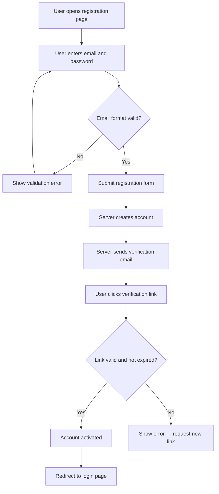
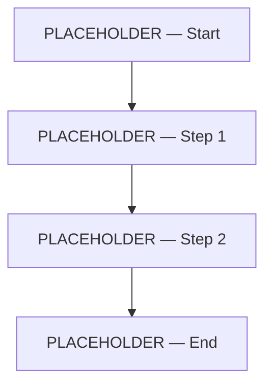
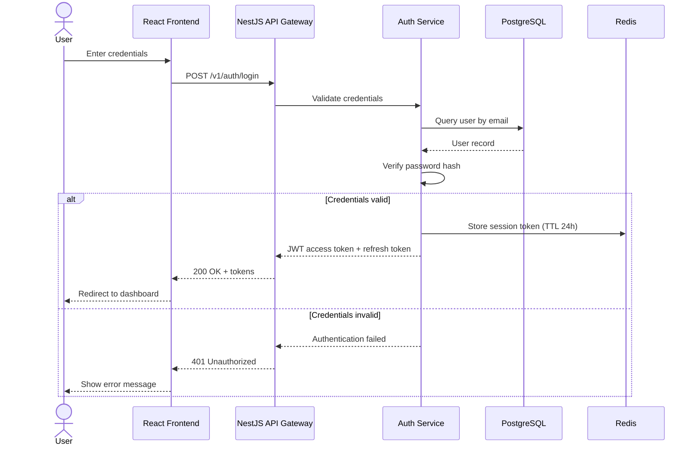
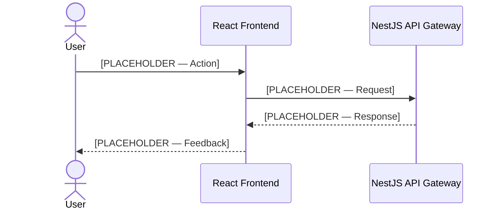

# User Requirements Document

<!--
  STANDARD: IEEE 830 / ISO/IEC/IEEE 29148
  PURPOSE: Capture raw user requirements directly from Tony NG's briefing.
  OWNER: System Architect
  
  INSTRUCTIONS FOR THE ARCHITECT:
  1. Conduct a requirements elicitation session with Tony.
  2. Fill every [PLACEHOLDER] section with concrete information.
  3. User stories must be atomic — one action per story.
  4. Every user story must have measurable acceptance criteria.
  5. Use Mermaid diagrams to visualize workflows and interactions.
  6. Update the Revision History table with every change.
  7. Move Status to "In Review" when ready for Tony's validation.
-->

## Document Metadata

| Field | Value |
|-------|-------|
| **Document ID** | `REQ-USER-001` |
| **Version** | `0.1` |
| **Status** | `Draft` |
| **Owner** | System Architect |
| **Last Updated** | `YYYY-MM-DD` |
| **Approved By** | — |
| **Standard** | IEEE 830 / ISO/IEC/IEEE 29148 |

---

## 1. Project Overview

### 1.1 Business Context

<!-- Describe the business domain, market context, and why this project exists. -->

[PLACEHOLDER — Describe the business problem this project solves, the market opportunity, and why it matters now.]

### 1.2 Project Objectives

<!-- List 3–7 measurable objectives. Each should be SMART: Specific, Measurable, Achievable, Relevant, Time-bound. -->

| # | Objective | Success Metric | Target Date |
|---|-----------|---------------|-------------|
| 1 | [PLACEHOLDER — e.g., Launch MVP for user authentication] | [e.g., 100 beta users onboarded] | [YYYY-MM-DD] |
| 2 | [PLACEHOLDER] | [PLACEHOLDER] | [YYYY-MM-DD] |
| 3 | [PLACEHOLDER] | [PLACEHOLDER] | [YYYY-MM-DD] |

### 1.3 Stakeholders

<!-- Identify all stakeholders, their role in the project, and their influence level. -->

| Stakeholder | Role | Interest | Influence | Contact Method |
|------------|------|----------|-----------|----------------|
| Tony NG | Product Owner | High | Decision-maker | Direct briefing |
| [PLACEHOLDER] | [PLACEHOLDER] | [High/Medium/Low] | [Decision-maker/Influencer/Observer] | [PLACEHOLDER] |

### 1.4 Scope

#### In Scope

<!-- List what this project WILL deliver. Be explicit. -->

- [PLACEHOLDER — e.g., User registration and authentication system]
- [PLACEHOLDER — e.g., Real-time notification service]

#### Out of Scope

<!-- List what this project will NOT deliver. Prevents scope creep. -->

- [PLACEHOLDER — e.g., Third-party marketplace integration (deferred to Phase 2)]
- [PLACEHOLDER — e.g., Native desktop application]

---

## 2. User Personas

<!-- 
  Define 2–5 user personas. Each persona represents a distinct user type.
  Personas drive user stories — every story must map to at least one persona.
-->

### Persona 1: [PLACEHOLDER — Persona Name]

| Attribute | Detail |
|-----------|--------|
| **Role** | [PLACEHOLDER — e.g., End User / Customer] |
| **Demographics** | [PLACEHOLDER — e.g., Age 25–40, tech-savvy, mobile-first] |
| **Goals** | [PLACEHOLDER — e.g., Complete tasks quickly with minimal friction] |
| **Pain Points** | [PLACEHOLDER — e.g., Frustrated by slow load times and complex navigation] |
| **Tech Proficiency** | [High / Medium / Low] |
| **Primary Device** | [Mobile / Desktop / Both] |
| **Usage Frequency** | [Daily / Weekly / Monthly] |

### Persona 2: [PLACEHOLDER — Persona Name]

| Attribute | Detail |
|-----------|--------|
| **Role** | [PLACEHOLDER — e.g., Administrator] |
| **Demographics** | [PLACEHOLDER] |
| **Goals** | [PLACEHOLDER] |
| **Pain Points** | [PLACEHOLDER] |
| **Tech Proficiency** | [High / Medium / Low] |
| **Primary Device** | [Mobile / Desktop / Both] |
| **Usage Frequency** | [Daily / Weekly / Monthly] |

<!-- Add more personas as needed. Delete unused persona blocks. -->

---

## 3. User Stories

<!--
  FORMAT: "As a [persona], I want [action], so that [benefit]."
  RULES:
  - Each story must be atomic (one action).
  - Priority uses MoSCoW: Must / Should / Could / Won't.
  - Acceptance criteria must be testable.
  - Link each story to a persona from Section 2.
-->

| ID | As a... | I want to... | So that... | Priority | Persona | Acceptance Criteria |
|----|---------|-------------|-----------|----------|---------|-------------------|
| US-001 | [PLACEHOLDER — e.g., end user] | [PLACEHOLDER — e.g., register with email and password] | [PLACEHOLDER — e.g., I can access the platform securely] | Must | Persona 1 | [PLACEHOLDER — e.g., User receives confirmation email within 30 seconds; account is active after email verification] |
| US-002 | [PLACEHOLDER — e.g., end user] | [PLACEHOLDER — e.g., reset my password via email link] | [PLACEHOLDER — e.g., I can regain access if I forget my credentials] | Must | Persona 1 | [PLACEHOLDER — e.g., Reset link expires after 15 minutes; password must meet complexity rules] |
| US-003 | [PLACEHOLDER — e.g., administrator] | [PLACEHOLDER — e.g., view all registered users in a dashboard] | [PLACEHOLDER — e.g., I can monitor platform adoption and manage accounts] | Should | Persona 2 | [PLACEHOLDER — e.g., Dashboard loads within 2 seconds; supports filtering by registration date and status] |
| US-004 | [PLACEHOLDER] | [PLACEHOLDER] | [PLACEHOLDER] | [Must/Should/Could/Won't] | [Persona] | [PLACEHOLDER] |

<!-- Add rows as needed. Aim for 15–50 user stories for an MVP. -->

---

## 4. User Workflow Diagrams

<!--
  Use Mermaid flowcharts to visualize the primary user workflows.
  Create one diagram per major workflow (e.g., registration, purchase, admin management).
  Replace the placeholder below with actual workflows.
-->

### 4.1 [PLACEHOLDER — Workflow Name, e.g., User Registration Flow]

<!-- 
  REPLACE the above with the actual workflow for this project.
  The example above demonstrates the expected level of detail.
-->

### 4.2 [PLACEHOLDER — Workflow Name]

---

## 5. Sequence Diagrams

<!--
  Use Mermaid sequence diagrams to show interactions between the user and system components.
  Focus on key interactions: authentication, data submission, notifications.
  Replace the placeholder below with actual sequences.
-->

### 5.1 [PLACEHOLDER — Interaction Name, e.g., User Login Sequence]

<!--
  REPLACE the above with the actual sequence for this project.
  The example demonstrates: actor, multiple participants, alt/else blocks, return arrows.
-->

### 5.2 [PLACEHOLDER — Interaction Name]

---

## 6. Assumptions and Constraints

### 6.1 Assumptions

<!--
  List things assumed to be true that, if wrong, would impact the project.
  Each assumption should have a risk level if it proves false.
-->

| # | Assumption | Impact if Wrong | Risk Level |
|---|-----------|----------------|------------|
| 1 | [PLACEHOLDER — e.g., Users have modern browsers (Chrome 90+, Firefox 88+, Safari 14+)] | [e.g., UI may break; need polyfills or fallback rendering] | Medium |
| 2 | [PLACEHOLDER — e.g., Peak concurrent users will not exceed 10,000 in Year 1] | [e.g., Infrastructure sizing insufficient; need auto-scaling redesign] | High |
| 3 | [PLACEHOLDER] | [PLACEHOLDER] | [High/Medium/Low] |

### 6.2 Constraints

<!--
  List hard constraints imposed by business, technology, regulation, or budget.
-->

| # | Constraint | Type | Imposed By |
|---|-----------|------|-----------|
| 1 | [PLACEHOLDER — e.g., Must launch MVP within 12 weeks] | Schedule | Tony NG |
| 2 | [PLACEHOLDER — e.g., Must use PostgreSQL as primary database] | Technology | Architecture decision |
| 3 | [PLACEHOLDER — e.g., Must comply with GDPR for EU users] | Regulatory | Legal requirement |
| 4 | [PLACEHOLDER] | [Schedule/Budget/Technology/Regulatory/Resource] | [PLACEHOLDER] |

---

## 7. Glossary

<!--
  Define domain-specific terms used in this document and throughout the project.
  Every agent should reference this glossary to ensure consistent terminology.
-->

| Term | Definition |
|------|-----------|
| [PLACEHOLDER — e.g., Tenant] | [PLACEHOLDER — e.g., An organization or business entity that uses the platform as a distinct isolated account] |
| [PLACEHOLDER — e.g., JWT] | [PLACEHOLDER — e.g., JSON Web Token — a compact, URL-safe token format used for authentication and authorization] |
| [PLACEHOLDER] | [PLACEHOLDER] |

---

## 8. Revision History

<!--
  Every change to this document must be logged here.
  The Architect updates this table before changing the document version.
-->

| Version | Date | Author | Changes |
|---------|------|--------|---------|
| 0.1 | YYYY-MM-DD | System Architect | Initial template created |
| | | | |

---

<!-- 
  TRACEABILITY NOTE:
  After this document is approved, the Architect decomposes each User Story (US-XXX)
  into Functional Requirements (FR-XXX) in requirements/functional-requirements.md.
  The traceability chain is: User Story → Functional Requirement → Test Case.
-->
